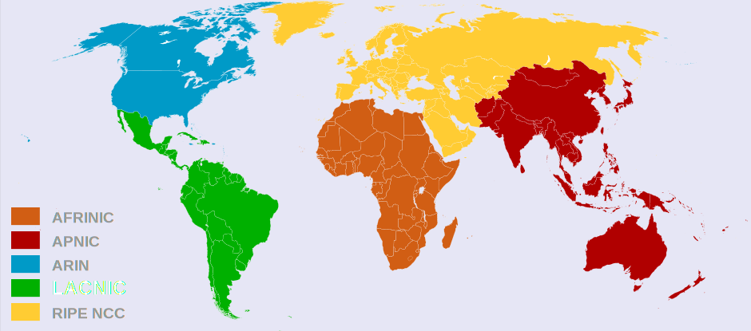

# Telematics

<code>Fundamentos de Telemática</code>

Creado por <code>Giancarlo Ortiz</code> para explicar los fundamentos de los <code>Sistemas de comunicaciones</code> en los cursos de telemática y redes de computadores.

## Fundamentos
Internet​ es un conjunto descentralizado y heterogéneo de redes de comunicaciones interconectadas, que utilizan la familia de protocolos TCP/IP y un conjunto de dispositivos físicos y virtuales para garantizar la transferencia de información y proporcionar servicios en una red lógica única de alcance mundial.

## Agenda
1. [Dispositivos](#1-dispositivos).
1. [Protocolos](#2-protocolos).
1. [Organizaciones](#3-organizaciones-de-internet).
1. [Redes](#4-redes).

 

---
# 1. [Dispositivos](#agenda)
Un [dispositivo de red][1] es cualquier dispositivo físico (computadora, laptop, teléfono inteligente, impresora) que se conecta a una red para enviar y recibir datos.

[1]:https://es.wikipedia.org/wiki/Red_de_computadoras#Dispositivos_de_red

* > <i>"Las redes de computadoras, como la imprenta hace 500 años, permiten que el ciudadano común distribuya sus puntos de vista en diversos modos y a audiencias diferentes, lo cual antes no era posible. Este nuevo fondo de libertad ofrece consigo muchos temas sociales, políticos y morales sin resolver."</i> 
<cite style="display:block; text-align: right">[Andrew S. Tanenbaum](https://es.wikipedia.org/wiki/Andrew_S._Tanenbaum)</cite>

## 1.1. Tipos de dispositivos por funcionalidad ✔
* Cliente ([__CLIENT__][11_1]).
* Servidor ([__SERVER__][11_2]).  
* De interconexión ([__ETCD__][11_2]). 

[11_1]:https://es.wikipedia.org/wiki/Cliente_(inform%C3%A1tica)/
[11_2]:https://es.wikipedia.org/wiki/Servidor
[11_2]:https://es.wikipedia.org/wiki/ETCD

## 1.2. Dispositivos de interconexión ✔
* Concentrador de red ([__HUB__][12_1]).
* Puente de red ([__BRIDGE__][12_2]).
* Enrutador ([__ROUTER__][12_3]).

[12_1]:https://es.wikipedia.org/wiki/Concentrador
[12_2]:https://es.wikipedia.org/wiki/Puente_de_red
[12_3]:https://es.wikipedia.org/wiki/R%C3%BAter

## 1.3. Tipos de Puentes de red ✔
* Punto de acceso ([__AP__][13_1]).
* Conmutador ([__SWITCH__][13_2]).

[13_1]:https://es.wikipedia.org/wiki/Punto_de_acceso_inal%C3%A1mbrico
[13_2]:https://es.wikipedia.org/wiki/Conmutador_(dispositivo_de_red)/

## 1.4. Gestión de Dispositivos ✔
La gestión de los servicios que ofrece un sistema de comunicaciones digital, pueden estar distribuidos en diferentes componentes de hardware y de software, los conocimientos para configurar estos componentes dependen del fabricante pero conociendo la base técnica es posible adaptar las soluciones a la perspectiva de las diferentes marcas.

 

# 2. [Protocolos](#agenda)
Un [protocolo de comunicaciones][2] es un conjunto de reglas que permite que los dispositivos de red se comuniquen entre ellas para transmitir información por medio de cualquier tipo de variación de una magnitud física.

[2]:https://es.wikipedia.org/wiki/Protocolo_de_comunicaciones

* > <i>"Imagina un mundo en donde cada persona del planeta pueda tener acceso libre a la suma total de todo el conocimiento humano. Eso es lo que estamos haciendo."</i> 
<cite style="display:block; text-align: right">[Jimmy Wales](https://es.wikipedia.org/wiki/Jimmy_Wales)</cite>

## 2.1. Componentes ✔
Un protocolo podría incluir:
* Detección de portadora.
* Saludo - [__HANDSHAKE__][21_1].
* Autenticación - [__AUTH__][21_2].
* Negociación de condiciones (Formato, cifrado, corrección de errores).
* Inicio de Tx.
* Comprobación de errores - [__EDAC__][21_1].
* Finalización.

[21_1]:https://es.wikipedia.org/wiki/Establecimiento_de_comunicaci%C3%B3n
[21_2]:https://es.wikipedia.org/wiki/Detecci%C3%B3n_y_correcci%C3%B3n_de_errores
[21_3]:https://es.wikipedia.org/wiki/Detecci%C3%B3n_y_correcci%C3%B3n_de_errores

 

## 2.2. Capas (Modelo OSI) ✔
|Capa|Nombre|Unidad de Datos|
|:--:|:--|:--:|
|7|[Aplicación][22_7]| Dato APDU |
|6|[Presentación][22_6]| Dato PPDU |
|5|[Sesión][22_5]| Dato SPDU |
|4|[Transporte][22_4]| Segmento |
|3|[Red][22_3]| Paquete |
|2|[Enlace][22_2]| Trama |
|1|[Física][22_1]| Bit |

[22_1]:https://es.wikipedia.org/wiki/Capa_f%C3%ADsica
[22_2]:https://es.wikipedia.org/wiki/Capa_de_enlace_de_datos
[22_3]:https://es.wikipedia.org/wiki/Capa_de_red
[22_4]:https://es.wikipedia.org/wiki/Capa_de_transporte
[22_5]:https://es.wikipedia.org/wiki/Capa_de_sesi%C3%B3n
[22_6]:https://es.wikipedia.org/wiki/Capa_de_presentaci%C3%B3n
[22_7]:https://es.wikipedia.org/wiki/Capa_de_aplicaci%C3%B3n

 

## 2.3. Modelo TCP/IP ✔
| Nombre | Capas | Dispositivo |
|--|:--:|--:|
|__Aplicación__|5-7|[HTTP][23_11] - [IMAP][23_12]- [SSH][23_13]|
|Transporte|4|[TCP][23_8] - [UDP][23_9] - [ICMP][23_10]|
|Red|3|[IP][23_6] - [RIP][23_5] -  [IPsec][23_7]|
|__Enlace__ Física|1-2|[Ethernet][23_4] - [ARP][23_3] [1000BASE-T][23_1] - [802.11][23_2]|

[23_1]:https://es.wikipedia.org/wiki/1000BASE-T
[23_2]:https://es.wikipedia.org/wiki/IEEE_802.11
[23_3]:https://es.wikipedia.org/wiki/Protocolo_de_resoluci%C3%B3n_de_direcciones
[23_4]:https://es.wikipedia.org/wiki/Ethernet
[23_5]:https://es.wikipedia.org/wiki/Routing_Information_Protocol
[23_6]:https://es.wikipedia.org/wiki/Protocolo_de_internet
[23_7]:https://es.wikipedia.org/wiki/IPsec
[23_8]:https://es.wikipedia.org/wiki/Protocolo_de_control_de_transmisi%C3%B3n
[23_9]:https://es.wikipedia.org/wiki/Protocolo_de_datagramas_de_usuario
[23_10]:https://es.wikipedia.org/wiki/Protocolo_de_control_de_mensajes_de_Internet
[23_11]:https://es.wikipedia.org/wiki/Protocolo_de_transferencia_de_hipertexto
[23_12]:https://es.wikipedia.org/wiki/Protocolo_de_acceso_a_mensajes_de_Internet
[23_13]:https://es.wikipedia.org/wiki/Secure_Shell

 

## 2.4. Modelo IEEE ✔
* Los estándares de comunicación [IEEE 802][24_1] son desarrollados por LMSC.
* El comité de redes locales y metropolitanas [LMSC][24_2] es un grupo de IEEE.
* [IEEE][24_3] es una asociación de ingenieros dedicada a la estandarización.
* En 2023 trabajan en 7 grupos incluido [802.3][24_4] o Ethernet Working Group.
* Algunos grupos como [802.16][24_5] se encuentran suspendidos.
* 802.16 (WIMAX) compitió con [3GPP][24_6] (LTE).
* Algunos grupos como [802.20][24_7] se encuentran disueltos.

[24_1]:https://es.wikipedia.org/wiki/IEEE_802
[24_2]:https://www.ieee802.org/es-ecsg/
[24_3]:https://es.wikipedia.org/wiki/Institute_of_Electrical_and_Electronics_Engineers
[24_4]:https://es.wikipedia.org/wiki/Ethernet
[24_5]:https://es.wikipedia.org/wiki/IEEE_802.16
[24_6]:https://es.wikipedia.org/wiki/3GPP
[24_7]:https://es.wikipedia.org/wiki/IEEE_802.20

 

### 2.4.1. Comités de estudio en IEEE 802
|Grupo de trabajo|Estudio|
|--:|--|
|802.1&nbsp;&nbsp;|Protocolos LAN de capa superior|
|802.3&nbsp;&nbsp;|Grupo de trabajo de [Ethernet][241_2]|
|802.11|LAN inalámbrica - [WIFI][241_3]|
|802.15|Red de área personal inalámbrica - [Bluetooth][241_4]|
|802.18|TAG reglamentario de radio|
|802.19|Grupo de trabajo de coexistencia inalámbrica|
|802.24|TAG de aplicaciones verticales|

[241_2]:https://es.wikipedia.org/wiki/Ethernet
[241_3]:https://es.wikipedia.org/wiki/IEEE_802.11
[241_4]:https://es.wikipedia.org/wiki/IEEE_802.15

 

# 3. [Organizaciones de Internet](#agenda)
En internet existen [organismos][3] internacionales que se encargan de gestionar los identificadores de protocolo y otros elementos técnicos que permiten la comunicación entre las distintas redes que conforman Internet.

[3]:https://es.wikipedia.org/wiki/Categor%C3%ADa:Organizaciones_de_Internet

* > <i>"Internet no es una red única, sino una red de redes, y Web es un sistema distribuido que se ejecuta sobre Internet."</i> 
<cite style="display:block; text-align: right">[Andrew S. Tanenbaum](https://es.wikipedia.org/wiki/Andrew_S._Tanenbaum)</cite>

## 3.1. ICANN ✔
La [Corporación de Internet para la Asignación de Nombres y Números][31] es una organización internacional sin fines de lucro e incluye organizaciones de apoyo, comités y departamentos como:

* Asignación de números - [IANA][31_1].
* Dominios de nivel Superior o gTLDs - [GNSO][31_2].
* Códigos de países o ccTLDs - [ccNSO][31_3].
* Soporte a direcciones - [ASO][31_4].

[31]:https://es.wikipedia.org/wiki/Corporaci%C3%B3n_de_Internet_para_la_Asignaci%C3%B3n_de_Nombres_y_N%C3%BAmeros
[31_1]:https://es.wikipedia.org/wiki/Internet_Assigned_Numbers_Authority
[31_2]:https://es.wikipedia.org/wiki/Dominio_de_nivel_superior_gen%C3%A9rico
[31_3]:https://en.wikipedia.org/wiki/Country_Code_Names_Supporting_Organization
[31_4]:https://es.wikipedia.org/wiki/Organismo_de_Soporte_a_Direcciones_(ASO)/

## 3.2. Registros Regionales de Internet ✔
Un Regional Internet Registry ([__RIR__][32]), es una organización que supervisa la asignación y el registro de números de Internet en una región del mundo. Los recursos incluyen direcciones IP (tanto IPv4 como IPv6) y números de sistemas autónomos (para su uso en encaminamiento BGP).

[32]:https://es.wikipedia.org/wiki/Registro_Regional_de_Internet

## 3.3. Otras organizaciones relevantes para Internet ✔
* Telecomunicaciones - [UIT][33_1].
* Fomento I+D - [NSRC][33_2].
* Puntos de intercambio - [IXP][33_3].

[33_1]:https://es.wikipedia.org/wiki/Uni%C3%B3n_Internacional_de_Telecomunicaciones
[33_2]:https://en.wikipedia.org/wiki/Network_Startup_Resource_Center
[33_3]:https://es.wikipedia.org/wiki/Anexo:Puntos_de_intercambio_de_Internet

# 4. [Redes](#agenda)
Una [red informática][2] es un conjunto de nodos conectados entre sí por medio de dispositivos físicos que envían y reciben impulsos eléctricos, ondas electromagnéticas o cualquier otro medio para el transporte de datos, con el propósito de permitir a muchos equipos informáticos compartir información, recursos y ofrecer servicios.

## 3.1. Tipos de redes ✔

### 3.1.1. Redes por capa 
* Red conectada por concentradores - [Dominio de colisión][311_1].
* Red conectada por conmutadores - [Dominio de difusión][311_2].  
* Red conectada por enrutadores - [Dominio de encaminamiento][311_3]. 

[311_1]:https://es.wikipedia.org/wiki/Dominio_de_colisi%C3%B3n
[311_2]:https://es.wikipedia.org/wiki/Dominio_de_difusi%C3%B3n
[311_3]:https://es.wikipedia.org/wiki/Encaminamiento

### 3.1.2. Redes por tecnología
* Red Gpon - sobre [Fibra óptica][312_1].
* Red Ethernet - sobre [Par trenzado][312_2].  
* Red HFC - sobre [Coaxial][312_3] y fibra.  
* Red ADSL - sobre [Red telefónica conmutada][312_4].

[312_1]:https://es.wikipedia.org/wiki/Fibra_%C3%B3ptica
[312_2]:https://es.wikipedia.org/wiki/Cable_de_par_trenzado
[312_3]:https://es.wikipedia.org/wiki/Cable_coaxial
[312_4]:https://es.wikipedia.org/wiki/Red_telef%C3%B3nica_conmutada

### 3.1.3. Redes por nivel
El [nivel de una red][13] o proveedor de internet indica como participa esta con acuerdos de interconexión o peering en internet asi:

* __Red de nivel 1:__ ISP de mayor nivel cuya red que se empareja de forma gratuita con todas las redes de internet, sin comprar tránsito IP o pagar por interconexión.
* __Red de nivel 2:__ una red que se empareja de forma gratuita con algunas redes, pero compra tránsito IP o paga por emparejamiento para alcanzar al menos una parte de Internet.
* __Red de nivel 3:__ Una red que únicamente compra tránsito/peering de otras redes para participar en Internet.

[13]:https://es.wikipedia.org/wiki/Red_tier_1

---
## Mas Recursos
- [Punto neutro](https://es.wikipedia.org/wiki/Punto_neutro) (Wiki)
- [Wiki Mikrotik](https://wiki.mikrotik.com/wiki/Main_Page) (Wiki)