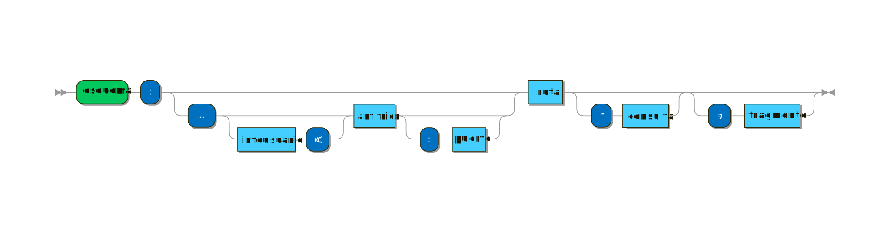

# Telematics

<code>Fundamentos de Telemática</code>

Creado por <code>Giancarlo Ortiz</code> para explicar los fundamentos de los <code>Sistemas de comunicaciones</code> en los cursos de telemática y redes de computadores.

## Direccionamiento
A cada dispositivo o host que se conecta a una red IP como Internet se le asigna al menos una dirección única en esa red. Esta dirección es utilizada por los protocolos de internet de la capa tres y superiores para garantizar una comunicación segura y sin errores.

## Agenda
1. [Nombres usados en redes](#1-nombres-usados-en-redes).
1. [Etiquetas numéricas](#2-etiquetas-numéricas).
1. [Sub-redes](#3-sub-redes).

 

---
# 1. [Nombres usados en redes](#agenda)
Un [Dominio][1] es un nombre que identifica un area dentro de una red, en internet existen distintos tipos de dominios.

[1]:https://es.wikipedia.org/wiki/Dominio_de_internet

* ><i>"Afectas al mundo por lo que navegas."</i> 
<cite style="display:block; text-align: right">[Tim Berners-Lee](https://es.wikipedia.org/wiki/Tim_Berners-Lee)</cite>

## 1.1. Niveles de Dominio ✔
En internet existen subdominios de dentro de un dominio y dominios de nivel superior que agrupan dominios, esto se agrupa en el nombre de 

<code>Nombre de un host:</code>
... [subdominio][11_1] . [dominio][1] . [dominio_de_nivel_superior][11_2] ...

<code>Ejemplos:</code>
* https://mikrotik.com/
    * https://help.mikrotik.com/docs/
    * https://wiki.mikrotik.com/wiki/
    * https://mum.mikrotik.com/

[11_1]:https://es.wikipedia.org/wiki/Subdominio
[11_2]:https://es.wikipedia.org/wiki/Dominio_de_nivel_superior

## 1.2. Identificador de recursos uniforme ✔
Una [URI][12_1] o identificador de recursos uniforme es una cadena de caracteres que identifica los recursos físicos o virtuales de una red de forma unívoca.

[12_1]:https://es.wikipedia.org/wiki/Identificador_de_recursos_uniforme

### 1.2.1. Componentes.
Algunos elementos posibles son:
* __Esquema:__ identificador de una especificación o protocolo.
* __Autoridad de nombres:__ estructura jerárquico de nombres (dominio).
* __Ruta:__ Información jerárquica, que identifica un recurso.
* __Consulta:__ Información no jerárquica que identifica un recurso.
* __Fragmento:__ identificador de una parte del recurso.

### 1.2.2. Ejemplos
Algunos ejemplos de recursos son:
* https://es.wikipedia.org/wiki/Localizador_de_recursos_uniforme
* https://www.youtube.com/watch?v=4IuNKK2y49s
* [ftp://ftp.rediris.es/sites/releases.ubuntu.com/23.04][11_3]
* http://ftp.ufanet.ru/pub/firmware/

[11_3]:ftp://ftp.rediris.es/sites/releases.ubuntu.com/23.04

# 2. [Etiquetas numéricas](#agenda)
Existen varias [etiquetas][2_1] numéricas que identifican recursos en una red, posiblemente una [interfaz][2_2] en un dispositivo o incluso un subsistema de red.

[2_1]:https://es.wikipedia.org/wiki/Encaminamiento
[2_2]:https://es.wikipedia.org/wiki/Tarjeta_de_red

* ><i>"El Internet reside en que cualquier persona puede acceder a él."</i> 
<cite style="display:block; text-align: right">[Vinton Cerf](https://es.wikipedia.org/wiki/Vinton_Cerf)</cite>

## 2.1. Dirección IP ✔
Una dirección IP es una etiqueta numérica que identifica de manera lógica y jerárquica a una interfaz que utiliza el [protocolo de internet][21_1] para conectar un dispositivo a una red.

[21_1]:https://es.wikipedia.org/wiki/Protocolo_de_internet

### 2.1.1. Direcciones IPv4
Las direcciones [IPV4][211] se expresan mediante un número binario de 32 bits (4 bytes) permitiendo un espacio de $2^{32}$ direcciones únicas posibles, aproximadamente 4.294 Millones.

<code>Ejemplo:</code> representar la ip [__192.168.254.172__](#) en formato binario.

|Octeto| 1 byte | 2 byte  | 3 byte  | 4 byte |
|--|:--:|:--:|:--:|:--:|
|__Decimal__ | 192 | __168__ | 254 | __172__ |
|__Binario__ | 11000000 | __10101000__ | 11111110 | __10101100__ |
|__Bites__   | 8 | 16 | 24 | 32 |

[211]:https://es.wikipedia.org/wiki/Direcci%C3%B3n_IP

### 2.1.2. Direcciones IPv6
Las direcciones [IPV6][212] se expresan mediante un número binario de 128 bits (16 bytes) permitiendo un espacio de $2^{128}$ direcciones posibles, aproximadamente 340 sextillones.

<code>Ejemplo:</code> representar los primeros 64 bits de la ip [__2001:0DB8:AC10:FE01:1319:8A2E:0370:7334__](#) en formato binario.

|Octeto| 2 byte | 4 byte  | 6 byte  | 8 byte |
|--|:--:|:--:|:--:|:--:|
|__Hexadecimal__ | 2001 | __0DB8__ | AC10 | __FE01__ |
|__Binario__ | 0010 0000 0000 0001 | __0000 1101 1011 1000__ | 1010 1100 0001 0000 | __1111 1110 0000 0001__ |
|__Bites__   | 16 | 32 | 48 | 64 |

[212]:https://es.wikipedia.org/wiki/Direcci%C3%B3n_IPv6

# 3. [Sub-redes](#agenda)
En sistemas de comunicación digital, una [sub-red][3] es un subsistema que tiene algún grado de independencia pero que pertenece a otro grupa mas grande y dentro de ese conjunto opera con otros subsistemas. Todos los dispositivos conectados a internet pertenecen a diferentes tipos de redes según su tamaño, alcance o tecnología.

[3]:https://es.wikipedia.org/wiki/Subred

* ><i>"No puedes mirar en la bola de cristal y ver el futuro. Lo que Internet será en el futuro es lo que la sociedad haga de él.."</i> 
<cite style="display:block; text-align: right">[Robert Kahn](https://es.wikipedia.org/wiki/Robert_Kahn)</cite>

## 3.1. Tipos de sub-redes ✔

### 3.1.1. Redes por capa 
* Red conectada por concentradores - Dominio de colisión.
* Red conectada por conmutadores - dominio de difusión.  
* Red conectada por enrutadores - dominio de broadcast. 

### 3.1.2. Redes por tecnología
* Red Gpon - sobre Fibra óptica.
* Red Ethernet - sobre UTP.  
* Red HFC - Coaxial y fibra.  
* Red ADSL - sobre par trenzado telefónico.

## 3.1. Mascara de Red ✔
Una técnica para dividir redes locales es tomando una porción 

#### 2.1.1.1 Tipo de direcciones IPv4
De las $2^{32}$ 
De estas direcciones 16 Millones son privadas y 268 Millones de multidifusión

 un rango de direcciones lógicas
Cuando una red se vuelve muy grande, conviene dividirla en sub-redes, esta técnica de direccionamiento ayuda a optimizar las  
Existen varias [etiquetas][2_1] numéricas que identifican recursos en una red, posiblemente una [interfaz][2_2] en un dispositivo o incluso un subsistema de red.

---
## Mas Recursos
- [Registro Regional de Internet](https://es.wikipedia.org/wiki/Registro_Regional_de_Internet) (Wiki)
- [Protocolo de internet](https://es.wikipedia.org/wiki/Protocolo_de_internet) (Wiki)
- [Protocolo IPv4](https://es.wikipedia.org/wiki/IPv4) (Wiki)
- [Protocolo IPv6](https://es.wikipedia.org/wiki/IPv6) (Wiki)
- [Tarjeta de red](https://es.wikipedia.org/wiki/Tarjeta_de_red) (Wiki)
- [Dirección MAC](https://es.wikipedia.org/wiki/Direcci%C3%B3n_MAC) (Wiki)
- [Wiki Mikrotik](https://wiki.mikrotik.com/wiki/Main_Page) (Wiki)

