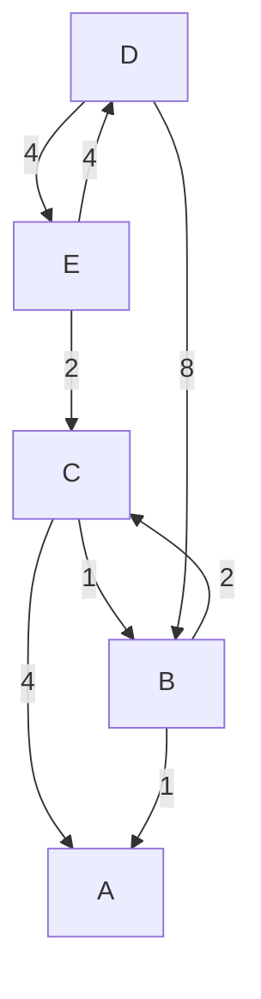
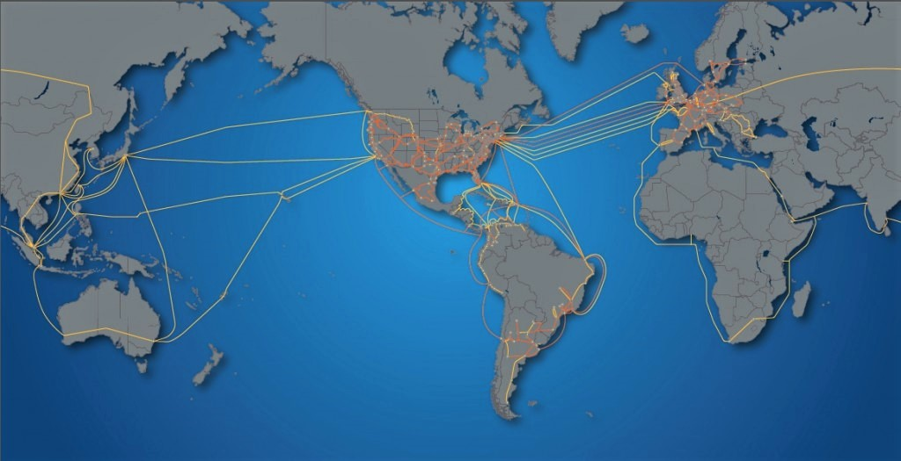

# Telematics

<code>Fundamentos de Telemática</code>

Creado por <code>Giancarlo Ortiz</code> para explicar los fundamentos de los <code>Sistemas de comunicaciones</code> en los cursos de telemática y redes de computadores.

## Enrutamiento
La gestión de los servicios que ofrece un sistema de comunicaciones digital, pueden estar distribuidos en diferentes componentes de hardware y de software, los conocimientos para configurar estos componentes dependen del fabricante pero conociendo la base técnica es posible adaptar las soluciones a la perspectiva de las diferentes marcas. 

## Agenda
1. [Encaminamiento](#1-encaminamiento-de-paquetes).
1. [Sistemas Autónomos](#2-sistemas-autónomos).

 

---
# 1. Encaminamiento de paquetes
El [Encaminamiento][1] o enrutamiento es la función de buscar el camino mas optimo entre dos posibles nodos en un red formada por sistema de nodos interconectados.

[1]:https://es.wikipedia.org/wiki/Encaminamiento

* ><i>"Muchos matemáticos derivan parte de su autoestima sintiéndose orgullosos herederos de una larga tradición de pensamiento racional, me temo que idealizan sus ancestros culturales."</i> 
<cite style="display:block; text-align: right">[Edsger Dijkstra](https://es.wikipedia.org/wiki/Edsger_Dijkstra)</cite>

## 1.1. Métricas ✔
Las métricas que se puede tener en cuenta para encontrar el camino mas optimo de comunicación entre dos nodos del sistema pueden ser:
* Numero de saltos (menor)
* Costo o distancia (menor)
* Tiempo de retardo (menor)
* Ancho de banda (menor)

## 1.2. Métodos de encaminamiento ✔
Los métodos de encaminamiento puedes ser:
* __Estáticos o deterministas:__ la cuantificación de todas las métricas se hace fuera de linea y se mantiene inalterada ante un cambio de estado del sistema.
* __Dinámicos o adaptativos:__ la valoración de las métricas se modifica continuamente según los cambios de estado del sistema, cuantificando en cada iteración una solución del problema buscando que en un número de iteraciones converja a la solución optima.

### 1.2.1 Basados en vector de distancias
* El [vector de distancias][121] resuelve el problema de la ruta mas corta.
* Cambios en la topología de red no se reflejan rápidamente
* No escala bien en sistemas demasiado grandes.
* Calcula el costo entre el origen y los demás nodos del sistema.
* Consigna estos valores en una tabla.
* Comparte la tabla de encaminamiento con sus vecinos.

[121]:https://es.wikipedia.org/wiki/Vector_de_distancias

### 1.2.2 Basados en el estado del enlace
* El [estado del enlace][122] resuelve la ruta mas optima.
* Este método converge rápidamente
* Escala bien en sistemas de muchos nodos.
* Calcula el costo entre el origen y sus vecinos.
* Consigna estos valores en una tabla.
* Comparte la tabla de encaminamiento con todos los nodos de la red.

[122]:https://es.wikipedia.org/wiki/Estado_de_enlace

## 1.3. Algoritmos de encaminamiento ✔
Son secuencias de instrucciones iterativas que convergen a encontrar el camino optimo entre cada nodo de una red.

### 1.3.1 Algoritmo de Bellman-Ford
* Genera el camino mas corto en un grafo dirigido ponderado.
* El peso o ponderación de las aristas puede ser negativo.
* Se usa en protocolos de encaminamiento basados en [vector de distancias][121]:

### 1.3.2 Algoritmo de Dijkstra
* Converge mas rápidamente que el algoritmo de de Bellman-Ford.
* El peso o ponderación de las aristas no puede ser negativo.
* Se usa en protocolos de encaminamiento basados en el [estado del enlace][122]:

# 2. Sistemas Autónomos
Un [Sistema autónomo][2] se define como un grupo de redes IP bajo control de una misma entidad con un numero único que la identifica y que posee una política de encaminamiento propia e independiente.

[2]:https://es.wikipedia.org/wiki/Sistema_aut%C3%B3nomo

* ><i>"Si decides hacer solo las cosas que sabes que van a funcionar, dejaras un montón de oportunidades encima de la mesa."</i> 
<cite style="display:block; text-align: right">[Jeff Bezos](https://es.wikipedia.org/wiki/Jeff_Bezos)</cite>

## 2.1. Protocolos de encaminamiento ✔
* Son un conjunto de reglas que permiten a las entidades de red intercambiar información de forma segura.
* Permiten a los routers (nodos) en una red intercambiar métricas como el número de saltos acumulados.
* También permiten intercambiar información de la calidad de los canales adyacentes con sus vecinos.
* Permiten a los conjuntos de redes (AS) intercambiar rutas con otros subconjuntos de internet. 

### 2.1.1. Protocolos de enlace interior (IGP)
Al interior de un único sistema autónomo las redes informan sus rutas optimas por medio de protocolos de enlace interior como los mencionados anteriormente:

| Protocolo | Nombre | Tipo de Algoritmo |
|---:|:---|---:|
|[__RIP__][131_1] | Routing Information Protocol | Estado del enlace|
|[__IGRP__][131_2] | Interior Gateway Routing Protocol (CISCO) | Estado del enlace|
|[__EIGRP__][131_3] | Enhanced Interior Gateway Routing Protocol (CISCO) | Estado del enlace|
|[__IS-IS__][132_1] | Intermediate System to Intermediate System | Vector de distancias|
|[__OSPF__][132_2] | Open Shortest Path First | Vector de distancias|

[131_1]:https://es.wikipedia.org/wiki/Routing_Information_Protocol
[131_2]:https://es.wikipedia.org/wiki/Interior_Gateway_Routing_Protocol
[131_3]:https://es.wikipedia.org/wiki/Enhanced_Interior_Gateway_Routing_Protocol

[132_1]:https://es.wikipedia.org/wiki/IS-IS
[132_2]:https://es.wikipedia.org/wiki/Open_Shortest_Path_First

### 2.1.2. Protocolos de enlace exterior (EGP)
Los sistemas autónomos de redes intercambian rutas con otros sistemas por medio de protocolos de borde como:

* [__EGP:__][212_1] Exterior Gateway Protocol.
* [__BGP:__][212_2] Border Gateway Protocol.

[212_1]:https://es.wikipedia.org/wiki/Exterior_Gateway_Protocol
[212_2]:https://es.wikipedia.org/wiki/Border_Gateway_Protocol

## 2.2. Intercambio de Rutas por EGP ✔
* Los EGP no registran el número de saltos acumulados.
* Los EGP no usan métricas de calidad cono el ancho de banda o el retardo.
* EGP toma decisiones de encaminamiento basándose en políticas de la red. 
* Las políticas son reglas que utilizan varios atributos de la ruta.

## 2.3. Mensajes BGP ✔
* Según el Center for Applied Internet Data Analysis [CAIDA][23_1] en internet existen aproximadamente 75K AS.
* Los AS intercambian rutas de encaminamiento via [BGP][212_2] y dar accesibilidad a otros subconjuntos de internet.
* Los AS intercambian rutas usando mensajes [BGP][212_2] en una session activa, garantizando una elección de rutas libres de bucles.

[23_1]:https://asrank.caida.org/

## 2.4. Número de redes en la tabla BGP ✔
| Rank | AS | Compañía | Sede| Tier | Tamaño| Redes |
|:--:|--:|--|:--:|:--:|--:|--:|
|1| 3356|Lumen Technologies|EE.UU.|1|885.139|49.212|
|2| 1299|Arelion|Suecia|1|65.000|41.512|
|3|  174|Cogent Communications|EE.UU.|2|129.990|36.870|
|4| 6939|Hurricane Electric LLC|EE.UU.|2|80.467|23.822|
|5| 6762|Gruppo TIM|Italia|1|560.000|21.151|
|6| 2914|NTT, Inc.|Japón|1|?|19.815|
|7| 3257|GTT Communications Inc.|EE.UU.|1|232.934|18.336|
|8| 6461|Zayo Bandwidth|EE.UU.|1|196.339|17.522|
|9| 6453|Tata Communications|India|1|700.000|16.785|
|10|3491|PCCW Global, Inc.|China|1|664.000|11.409|

## 2.5. Redes BGP ✔

El sistema autónomo [AS3356][25_1] y [AS3549][25_2] pertenecen a una red de [40 Sistemas Autónomos][25_3] de la compañía Lumen Technologies ([CenturyLinK][25_4]) con un alcance global ([TIER 1][25_5]) que comparte 49.245 rutas BGP en una red de 885.139 Km que es la mas grande en internet.

[25_1]:https://asrank.caida.org/asns/3356
[25_2]:https://asrank.caida.org/asns/3549
[25_3]:https://asrank.caida.org/orgs/589f9199b0
[25_4]:https://es.wikipedia.org/wiki/Lumen_Technologies
[25_5]:https://es.wikipedia.org/wiki/Red_tier_1

---
## Mas Recursos
- [Teoría de grafos](https://es.wikipedia.org/wiki/Teor%C3%ADa_de_grafos) (Wikipedia)
- [Algoritmo de Bellman-Ford](https://es.wikipedia.org/wiki/Algoritmo_de_Bellman-Ford) - [Ejemplo](https://es.wikipedia.org/wiki/Anexo:Ejemplo_de_Algoritmo_de_Bellman_-_Ford) - [Video](https://www.youtube.com/watch?v=zvPToo1QP3c) (Wikipedia, YouTube) 
- [Algoritmo de Dijkstra](https://es.wikipedia.org/wiki/Algoritmo_de_Dijkstra) - [Ejemplo](https://es.wikipedia.org/wiki/Anexo:Ejemplo_de_Algoritmo_de_Dijkstra) - [Video](https://www.youtube.com/watch?v=eGJRnwrTC5g) (Wikipedia, YouTube) 