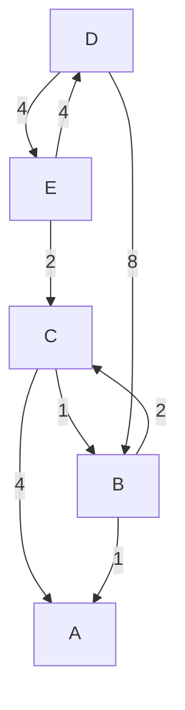

# Telematics

<code>Fundamentos de Telemática</code>

Creado por <code>Giancarlo Ortiz</code> para explicar los fundamentos de los <code>Sistemas de comunicaciones</code> en los cursos de telemática y redes de computadores.

## Fundamentos
La gestión de los servicios que ofrece un sistema de comunicaciones digital, pueden estar distribuidos en diferentes componentes de hardware y de software, los conocimientos para configurar estos componentes dependen del fabricante pero conociendo la base técnica es posible adaptar las soluciones a la perspectiva de las diferentes marcas. 

## Agenda
1. [Encaminamiento](#2-sistema-descentralizados).
1. [Sistemas Autónomos](#1-sistemas-centralizados).
1. [Seguridad](#3-seguridad).
1. [Redes](#3-redes).

 

---
# 1. Encaminamiento
El [Encaminamiento][1] o enrutamiento es la función de buscar el camino mas optimo entre dos posibles nodos en un red formada por sistema de nodos interconectados.

[1]:https://es.wikipedia.org/wiki/Encaminamiento

* ><i>"Muchos matemáticos derivan parte de su autoestima sintiéndose orgullosos herederos de una larga tradición de pensamiento racional, me temo que idealizan sus ancestros culturales."</i> 
<cite style="display:block; text-align: right">[Edsger Dijkstra](https://es.wikipedia.org/wiki/Edsger_Dijkstra)</cite>

## 1.1. Métricas ✔
Las métricas que se puede tener en cuenta para encontrar el camino mas optimo de comunicación entre dos nodos del sistema pueden ser:
* Numero de saltos (menor)
* Costo o distancia (menor)
* Tiempo de retardo (menor)
* Ancho de banda (menor)

## 1.2. Métodos de encaminamiento ✔
Los métodos de encaminamiento puedes ser:
* __Estáticos o deterministas:__ la cuantificación de todas las métricas se hace fuera de linea y se mantiene inalterada ante un cambio de estado del sistema.
* __Dinámicos o adaptativos:__ la valoración de las métricas se modifica continuamente según los cambios de estado del sistema, cuantificando en cada iteración una solución del problema buscando que en un número de iteraciones converja a la solución optima.

### 1.2.1 Basados en vector de distancias ✔
El [vector de distancias][121] es un método que resuelve el problema de la ruta mas corta, calculando el costo entre cada nodo origen y los demás nodos del sistema consignando estos valores en una tabla que luego comparte con sus vecinos. Este método se usa para sistemas con un numero reducido de nodos porque no escala bien en sistemas demasiado grandes.

[121]:https://es.wikipedia.org/wiki/Vector_de_distancias

### 1.2.2 Basados en el estado del enlace ✔
El [estado del enlace][122] es un método que resuelve el problema de la ruta mas corta, calculando el costo entre el y sus vecinos y lo comunica a todos los nodos de la red. Este método converge rápidamente y escala bien en sistemas de muchos nodos.

[122]:https://es.wikipedia.org/wiki/Estado_de_enlace

## 1.3. Algoritmos de encaminamiento ✔
Son secuencias de instrucciones iterativas que convergen a encontrar el camino optimo entre cada nodo de una red.

### 1.3.1 Algoritmo de Bellman-Ford ✔
Se usa en protocolos de encaminamiento basados en [vector de distancias][121]:

* [__RIP:__][131_1] Routing Information Protocol
* [__IGRP:__][131_2] Interior Gateway Routing Protocol (CISCO)
* [__IGRP:__][131_3] Interior Gateway Routing Protocol (CISCO)

[131_1]:https://es.wikipedia.org/wiki/Routing_Information_Protocol
[131_2]:https://es.wikipedia.org/wiki/Interior_Gateway_Routing_Protocol
[131_3]:https://es.wikipedia.org/wiki/Enhanced_Interior_Gateway_Routing_Protocol

### 1.3.2 Algoritmo de Dijkstra ✔
Se usa en protocolos de encaminamiento basados en el [estado del enlace][122]:

* [__IS-IS:__][132_1] Intermediate System to Intermediate System
* [__OSPF:__][132_2] Open Shortest Path First

[132_1]:https://es.wikipedia.org/wiki/IS-IS
[132_2]:https://es.wikipedia.org/wiki/Open_Shortest_Path_First

# 2. Sistemas Autónomos
Un [Sistema autónomo][2] se define como un grupo de redes IP bajo control de una misma entidad con un numero único que la identifica y que posee una política de encaminamiento propia e independiente.

[2]:https://es.wikipedia.org/wiki/Sistema_aut%C3%B3nomo

* ><i>"Si decides hacer solo las cosas que sabes que van a funcionar, dejaras un montón de oportunidades encima de la mesa."</i> 
<cite style="display:block; text-align: right">[Jeff Bezos](https://es.wikipedia.org/wiki/Jeff_Bezos)</cite>

## 2.1. Intercambio de Rutas ✔
Los sistemas autónomos de redes intercambian rutas con otros sistemas por medio de protocolos de borde como:

* [__EGP:__][21_1] Exterior Gateway Protocol.
* [__BGP:__][21_2] Border Gateway Protocol.

[21_1]:https://es.wikipedia.org/wiki/Exterior_Gateway_Protocol
[21_2]:https://es.wikipedia.org/wiki/Border_Gateway_Protocol

## 2.2. Rutas BGP ✔
Segun indica n internet existen aproximadamente 75K sistemas autónomos que intercambian rutas BGP garantizando una elección de rutas libres de bucles. 
 
>__Ejemplo:__ El sistema autónomo AS3356 corresponde a la red de Lumen Technologies ([CenturyLinK](https://es.wikipedia.org/wiki/Lumen_Technologies)) con alcance global (TIER 1) que comparte 49.212 rutas BGP en una red de 885.139 Km.

---
## Mas Recursos
- [Teoría de grafos](https://es.wikipedia.org/wiki/Teor%C3%ADa_de_grafos) (Wikipedia)
- [Algoritmo de Bellman-Ford](https://es.wikipedia.org/wiki/Algoritmo_de_Bellman-Ford) (Wikipedia)
- [Algoritmo de Dijkstra](https://es.wikipedia.org/wiki/Algoritmo_de_Dijkstra) (Wikipedia)
