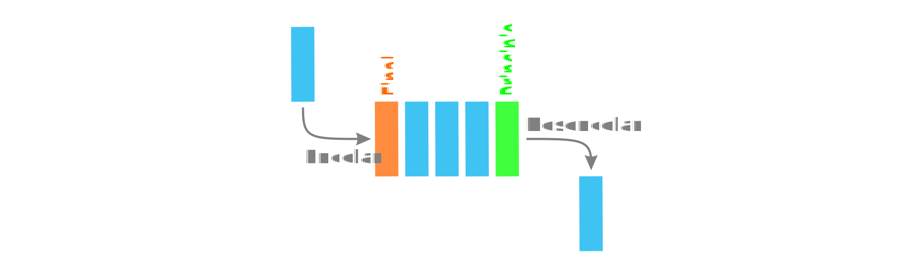

# Telematics

<code>Fundamentos de Telemática</code>

Creado por <code>Giancarlo Ortiz</code> para explicar los fundamentos de los <code>Sistemas de comunicaciones</code> en los cursos de telemática y redes de computadores.

## Control de colas
En el contexto de gestionar la calidad de servicio QoS de redes de computadoras (gestión de ancho de banda, retraso de la transmisión, disponibilidad, ...) las colas de prioridad se usan para controlar el trafico (limitar y priorizar).

## Agenda
1. [Colas](#1-colas).
1. [Canal de comunicaciones](#2-canal-de-comunicaciones).
1. [Calidad de servicio](#3-calidad-de-servicio).

 

---
# 1. [Colas](#agenda)
Una fila o [Cola][1] es un tipo de dato abstracto, caracterizada por ser una secuencia de elementos en la que la operación de inserción push se realiza por un extremo y la operación de extracción pull por el otro; de modo que el primero en entrar sea el primero en salir (FIFO).

[1]:https://es.wikipedia.org/wiki/Cola_(inform%C3%A1tica)/

* ><i>"Vivimos en una sociedad profundamente dependiente de la ciencia y la tecnología y en la que nadie sabe nada de estos temas. Ello constituye una fórmula segura para el desastre."</i> 
<cite style="display:block; text-align: right">[Carl Sagan](https://es.wikipedia.org/wiki/Carl_Sagan)</cite>

## 1.1. Operaciones ✔
* Crear/eliminar cola.
* Añadir elemento (encolar).
* Eliminar elemento (desencolar).
* Consultar elemento.

## 1.2. Colas de prioridad ✔
* Una [cola de prioridades][11_1] es una cola especial.
* Los elementos de la cola tienen una prioridad asignada.
* Se agrega a las operaciones básicas operaciones con prioridad. 
* Añadir con prioridad agrega un elemento con prioridad.
* Eliminar con prioridad elimina el elemento mas antiguo de mayor prioridad.

[11_1]:https://es.wikipedia.org/wiki/Cola_de_prioridades

## 1.3. Representación ✔

# 2. [Canal de comunicaciones](#agenda)
Un [canal de comunicaciones][2] es un medio de transmisión por el que pasan las señales portadoras de información que pretenden intercambiar un emisor y un receptor.

[2]:https://es.wikipedia.org/wiki/Canal_de_comunicaci%C3%B3n

* ><i>"La fusión de las computadoras y las comunicaciones ha tenido una influencia profunda en la manera en que están organizados los sistemas computacionales."</i> 
<cite style="display:block; text-align: right">[Andrew S. Tanenbaum](https://es.wikipedia.org/wiki/Andrew_S._Tanenbaum)</cite>

## 2.1. Ancho de Banda de un canal de comunicaciones ✔
* El [ancho de banda][21_1] es una rango de frecuencias.
* Mide las [frecuencias][21_2] que un medio puede transmitir a una distancia dada.
* Este rango concentra la mayor [potencia de la señal][21_3].
* Los limites se establecen a 3 [dB][21_4] menos que la amplitud maxima.
* Se calcula empleando el [análisis de Fourier][21_5].
* Se mide en [Hercios][21_6] (Hz)

[21_1]:https://es.wikipedia.org/wiki/Ancho_de_banda
[21_2]:https://es.wikipedia.org/wiki/Dominio_de_la_frecuencia
[21_3]:https://es.wikipedia.org/wiki/Densidad_espectral
[21_4]:https://es.wikipedia.org/wiki/Decibelio
[21_5]:https://es.wikipedia.org/wiki/Transformada_de_Fourier
[21_6]:https://es.wikipedia.org/wiki/Hercio

### 2.1.1. Representación

## 2.2. Capacidad del canal de comunicaciones ✔
* Maxima información que un [canal][22_1] puede transmitir de forma fiable.
* Fiable significa que la [probabilidad de error][22_2] es despreciable. 
* Está limitada por su [ancho de banda][22_3] (B)
* Está limitada por su [relación señal a ruido][22_4] (SNR)

[22_1]:https://es.wikipedia.org/wiki/Canal_de_comunicaci%C3%B3n
[22_2]:https://es.wikipedia.org/wiki/Teorema_de_Shannon-Hartley
[22_3]:https://es.wikipedia.org/wiki/Ancho_de_banda_(inform%C3%A1tica)/
[22_4]:https://es.wikipedia.org/wiki/Relaci%C3%B3n_se%C3%B1al/ruido

### 2.2.1. Ecuaciones

$$
\begin{aligned}
C = B \cdot log_{2}\left(1+SNR\right) &= B \cdot log_{2}\left(1+ \frac{P_S}{P_N}\right) \\
&= B \cdot log_{2}\left(1+ \frac{E_b \cdot R_b}{N_o \cdot B}\right) \\ 
\end{aligned}
$$

### 2.2.2. Representación

### 2.1.2. Ejemplos UTP
|Categoría|Ancho de banda|Velocidad|Distancia|
|:--|--:|--:|--:|
|UTP - Cat 5e|100 MHz|100 Mbps|100 mts|
|UTP - Cat 6|250 MHz|1 Gbps|55 mts|
|UTP - Cat 6A|500 MHz|10 Gbps|100 mts|

# 3. [Calidad de servicio](#agenda)
la calidad de servicio o [QoS][3] mide la calidad de los servicios que son considerados por el cliente en un servicio de red, tales como tasas de errores, ancho de banda, rendimiento, retraso en la transmisión, disponibilidad, fluctuación del retardo o jitter.

[3]:https://es.wikipedia.org/wiki/Calidad_de_servicio

* ><i>"Si usted proporciona la tecnología adecuada para mantenerse en contacto y para mantener una comunicación regular, así como conseguir el equilibrio adecuado entre el trabajo a distancia y la oficina, la gente se sentirá motivada a trabajar de manera responsable, de forma rápida y con gran calidad."</i> 
<cite style="display:block; text-align: right">[Richard Branson](https://es.wikipedia.org/wiki/Richard_Branson)</cite>

## 3.1. Soluciones ✔
* [improve Network throughput][31_1] - mejorar el rendimiento en la transmisión de datos.
* [Traffic shaping][31_2] - conformado de trafico.
* [Network congestion avoidance][31_3] - evitar la congestión.
* [Bandwidth management][31_4] - gestionar el ancho de banda disponible.
* [Channel capacity limitation][31_5] - Limitación de la capacidad del canal

[31_1]:https://en.wikipedia.org/wiki/Network_throughput
[31_2]:https://en.wikipedia.org/wiki/Traffic_shaping
[31_3]:https://en.wikipedia.org/wiki/Network_congestion#Mitigation
[31_4]:https://en.wikipedia.org/wiki/Bandwidth_management
[31_5]:https://en.wikipedia.org/wiki/Rate_limiting

## 3.2. Algoritmos de conformado de trafico ✔
* [Token bucket][32_1] - 
* [Leaky bucket][32_2] - 

[32_1]:https://en.wikipedia.org/wiki/Token_bucket
[32_2]:https://en.wikipedia.org/wiki/Leaky_bucket

---
## Mas Recursos
- [Wiki Mikrotik](https://wiki.mikrotik.com/wiki/Main_Page) (MikroTik - Wiki)