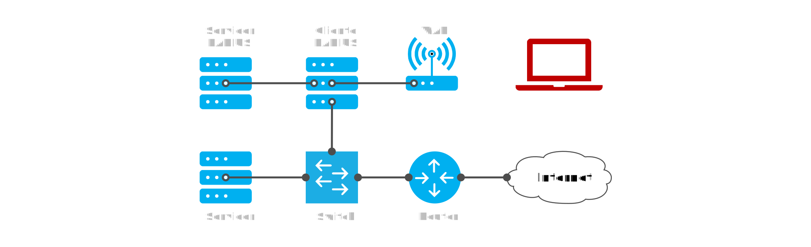

# Telematics

<code>Fundamentos de Telemática</code>

Creado por <code>Giancarlo Ortiz</code> para explicar los fundamentos de los <code>Sistemas de comunicaciones</code> en los cursos de telemática y redes de computadores.

## Autentificación
En el contexto de seguridad de redes de datos, la autenticación es el proceso de verificar la identidad digital del remitente de una comunicación como una petición para conectarse.

## Agenda
1. [Hotspot](#1-hotspot).
1. [Servidor radius](#2-servidor-radius).
1. [Cookies](#3-cookies).

 

---
# 1. [Hotspot](#agenda)
El [punto caliente][1] o hotspot es un lugar que ofrece acceso a Internet a través de un punto de acceso inalámbrico y un router conectado a un proveedor de servicios de Internet.

[1]:https://es.wikipedia.org/wiki/Hotspot_(telecomunicaciones)#

* ><i>"Los clientes insatisfechos son la mejor fuente de aprendizaje."</i> 
<cite style="display:block; text-align: right">[Bill Gates](https://es.wikipedia.org/wiki/Bill_Gates)</cite>

## 1.1. Punto de acceso inalámbrico ✔
* Un wireless access point, [WAP][11_1] es un puente de red heterogéneo.
* Conecta una red inalámbrica con una red cableaba ([Par trenzado][11_2], [Coaxial][11_3], [Fibra óptica][11_4], ...)
* Permite que clientes se conecten a el y formen parte de la [red inalámbrica][11_5].
* Dependiendo de la tecnología inalámbrica los clientes tienen diferentes [grados de movilidad][11_6].

[11_1]:https://es.wikipedia.org/wiki/Punto_de_acceso_inal%C3%A1mbrico
[11_2]:https://es.wikipedia.org/wiki/Cable_de_par_trenzado
[11_3]:https://es.wikipedia.org/wiki/Cable_coaxial
[11_4]:https://es.wikipedia.org/wiki/Fibra_%C3%B3ptica
[11_5]:https://es.wikipedia.org/wiki/Red_inal%C3%A1mbrica
[11_6]:https://es.m.wikipedia.org/wiki/Telefon%C3%ADa_m%C3%B3vil

## 1.2. Portal cautivo ✔
* Un [portal cautivo][12_1] es un software que restringe el acceso a internet.
* El trafico se limita agregando reglas al [cortafuegos][12_2] del router.
* El objetivo es [autenticarse][12_3] para obtener acceso a los servicios.
* Las credenciales se ingresan en una [pagina de login][12_4].
* Es posible limitar el [tiempo de la session][12_5].
* Es posible limitar los parámetros de [calidad del servicio][12_6] (Ancho de banda, re-uso, ...). 

[12_1]:https://es.wikipedia.org/wiki/Portal_cautivo
[12_2]:https://es.wikipedia.org/wiki/Cortafuegos_(inform%C3%A1tica)#
[12_3]:https://es.wikipedia.org/wiki/Autenticaci%C3%B3n
[12_4]:https://es.wikipedia.org/wiki/Login
[12_5]:https://es.wikipedia.org/wiki/Sesi%C3%B3n_(inform%C3%A1tica)#
[12_6]:https://es.wikipedia.org/wiki/Calidad_de_servicio

## 1.3. Cortafuegos ✔
* Es [firewall][13_1] un subsistema del sistema o red informática.
* El subsistema esta diseñado para bloquear el [acceso no autorizado][13_2].
* La implementación puede ser por software como en [ufw][13_3] [ipfw][13_4] en las computadores.
* La implementación puede ser por hardware como en las [UTM][13_5].
* Las ultimas generaciones pueden incluir herramientas de [inteligencia artificial][13_6] para detectar amenazas.

[13_1]:https://es.wikipedia.org/wiki/Cortafuegos_(inform%C3%A1tica)#
[13_2]:https://es.wikipedia.org/wiki/Acceso
[13_3]:https://es.wikipedia.org/wiki/Uncomplicated_Firewall
[13_4]:https://es.wikipedia.org/wiki/Ipfw
[13_5]:https://es.wikipedia.org/wiki/Unified_Threat_Management
[13_6]:https://es.wikipedia.org/wiki/Inteligencia_artificial

## 1.4. Arquitectura ✔

# 2. [Servidor radius](#agenda)
El servicio [Radius][2] es proporcionado por un protocolo de autenticación y autorización que utiliza el puerto UDP/1812 para enviar credenciales de autentificación a aplicaciones en redes de acceso IP.

[2]:https://es.wikipedia.org/wiki/RADIUS

* ><i>"La tecnología es importante, pero lo único que realmente importa es qué hacemos con ella."</i> 
<cite style="display:block; text-align: right">[Muhammad Yunus](https://es.wikipedia.org/wiki/Muhammad_Yunus)</cite>

## 2.1. Características ✔
* Existen implementaciones comerciales y de código abierto del [protocolo radius][21_1].
* Existen diferentes dialectos implementados ([Extensible][21_2]).
* Capacidad para gestionar los usuarios desde ([archivos de texto][21_3], [LDAP][21_4], [DB][21_5], ...)
* Capacidad para gestionar [sesiones][21_6] informando tiempos y consumo.
* Capacidad de monitorear el servicio via [SNMP][21_7].

[21_1]:https://datatracker.ietf.org/doc/html/rfc2138
[21_2]:https://en.wikipedia.org/wiki/Extensibility
[21_3]:https://es.wikipedia.org/wiki/Archivo_de_texto
[21_4]:https://es.wikipedia.org/wiki/Protocolo_ligero_de_acceso_a_directorios
[21_5]:https://es.wikipedia.org/wiki/Base_de_datos
[21_6]:https://es.wikipedia.org/wiki/Sesi%C3%B3n_(inform%C3%A1tica)#
[21_7]:https://es.wikipedia.org/wiki/Protocolo_simple_de_administraci%C3%B3n_de_red

## 2.2. Login ✔
* Soporta protocolos de contraseña no cifrados como [PAP][22_1] (inseguro)
* Soporta protocolos de contraseña cifrados como [CHAP][22_2]
* Soporta protocolos con certificado TLS como [EAP][22_3]
* Soporta protocolos con certificado SSL como [HTTPS][22_4]

[22_1]:https://es.wikipedia.org/wiki/Password_Authentication_Protocol
[22_2]:https://es.wikipedia.org/wiki/CHAP7
[22_3]:https://es.wikipedia.org/wiki/Extensible_Authentication_Protocol
[22_4]:https://es.wikipedia.org/wiki/Protocolo_seguro_de_transferencia_de_hipertexto

## 2.3. Implementaciones ✔
* [FREERadius][23_1] de código abierto
* [UM][23_2] o User-manager de MikroTik
* [IAS][23_3] o Internet Authentication Service de Microsoft

[23_1]:https://en.wikipedia.org/wiki/FreeRADIUS
[23_2]:https://wiki.mikrotik.com/wiki/Manual:User_Manager
[23_3]:https://es.wikipedia.org/wiki/Internet_Authentication_Service

# 3. [Cookies](#agenda)
Una [galleta informática][3] o cookie hace referencia a una pequeña información enviada por un sitio web y almacenada en el navegador del usuario.

[3]:https://es.wikipedia.org/wiki/Cookie_(inform%C3%A1tica)#

* ><i>"Argumentar que no te importa el derecho a la privacidad porque no tienes nada que ocultar no es diferente a decir que no te importa la libertad de expresión porque no tienes nada que decir."</i> 
<cite style="display:block; text-align: right">[Edward Snowden](https://es.wikipedia.org/wiki/Edward_Snowden)</cite>

## 3.1. Características ✔
* Almacenar autentificación.
* Almacenar hábitos de navegación.
* Almacenar elecciones del cliente.

---
## Mas Recursos
- [Wiki MikroTik](https://wiki.mikrotik.com/wiki/Main_Page) (MikroTik - Wiki)
- [Instalar FreeRadius](https://wiki.freeradius.org/building/Home) (FreeRadius - Docs)
- [Instalar IAS](https://learn.microsoft.com/es-es/security-updates/security/guadegeneracinimplementacindelainfraestructuraderadius#efaa) (MS - Docs)
- [Hotspot - Https](https://wiki.mikrotik.com/wiki/Manual:Hotspot_HTTPS_example) (MikroTik - Wiki)
- [Hotspot - Modificar la pagina de Login](https://wiki.mikrotik.com/wiki/Manual:Customizing_Hotspot) (MikroTik - Wiki)
- [Hotspot - Usuarios Prueba](https://wiki.mikrotik.com/wiki/Manual:Trial_user_limits) (MikroTik - Wiki)