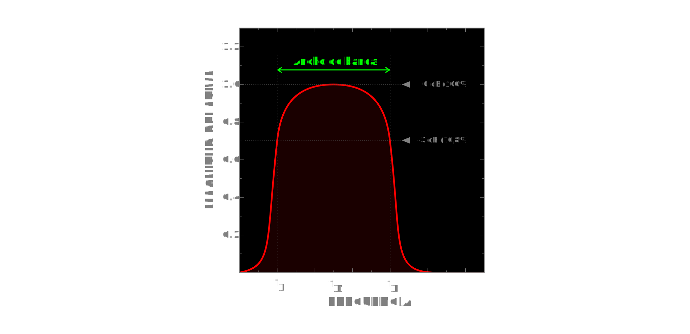

# Telematics

<code>Fundamentos de Telemática</code>

Creado por <code>GncDev</code> para explicar los fundamentos de los <code>Sistemas de comunicaciones</code> en los cursos de telemática y redes de computadores.

## Control de colas
En el contexto de gestionar la calidad de servicio QoS de redes de computadoras (gestión de ancho de banda, retraso de la transmisión, disponibilidad, ...) las colas de prioridad se usan para controlar el trafico (limitar y priorizar).

## Agenda
1. [Colas](#1-colas).
1. [Canal de comunicaciones](#2-canal-de-comunicaciones).
1. [Calidad de servicio](#3-calidad-de-servicio).

 

---
# 1. [Colas](#agenda)
Una fila o [Cola][1] es un tipo de dato abstracto, caracterizada por ser una secuencia de elementos en la que la operación de inserción push se realiza por un extremo y la operación de extracción pull por el otro; de modo que el primero en entrar sea el primero en salir (FIFO).

[1]:https://es.wikipedia.org/wiki/Cola_(inform%C3%A1tica)/

* ><i>"Vivimos en una sociedad profundamente dependiente de la ciencia y la tecnología y en la que nadie sabe nada de estos temas. Ello constituye una fórmula segura para el desastre."</i> 
<cite style="display:block; text-align: right">[Carl Sagan](https://es.wikipedia.org/wiki/Carl_Sagan)</cite>

## 1.1. Operaciones ✔
* Crear/eliminar cola.
* Añadir elemento (encolar).
* Eliminar elemento (desencolar).
* Consultar elemento.

## 1.2. Colas de prioridad ✔
* Una [cola de prioridades][11_1] es una cola especial.
* Los elementos de la cola tienen una prioridad asignada.
* Se agrega a las operaciones básicas operaciones con prioridad. 
* Añadir con prioridad agrega un elemento con prioridad.
* Eliminar con prioridad elimina el elemento mas antiguo de mayor prioridad.

[11_1]:https://es.wikipedia.org/wiki/Cola_de_prioridades

## 1.3. Colas en MikroTik ✔
* [RED][13_1] - random early drop.
* [BFIFO][13_2] - bytes first-in first-out.
* [PFIFO][13_2] - package first-in first-out.
* [MQ-PFIFO][13_2] - multiple package first-in first-out.
* [SFQ][13_3] - stochastic fairness queuing.
* [PCQ][13_4] - per connection queue.

[13_1]:https://wiki.mikrotik.com/wiki/Manual:Queue#RED
[13_2]:https://wiki.mikrotik.com/wiki/Manual:Queue#PFIFO.2C_BFIFO_and_MQ_PFIFO
[13_3]:https://wiki.mikrotik.com/wiki/Manual:Queue#SFQ
[13_4]:https://wiki.mikrotik.com/wiki/Manual:Queue#PCQ

## 1.3.1. Colas simples.
* Por origen/destino de red.
* Dirección IP de cliente.
* Interfase.

## 1.3.2. Árbol de colas.
* Por protocolo. 
* Por puerto.
* Por tipo de conexión.

## 1.4. Representación ✔

# 2. [Canal de comunicaciones](#agenda)
Un [canal de comunicaciones][2] es un medio de transmisión por el que pasan las señales portadoras de información que pretenden intercambiar un emisor y un receptor.

[2]:https://es.wikipedia.org/wiki/Canal_de_comunicaci%C3%B3n

* ><i>"La fusión de las computadoras y las comunicaciones ha tenido una influencia profunda en la manera en que están organizados los sistemas computacionales."</i> 
<cite style="display:block; text-align: right">[Andrew S. Tanenbaum](https://es.wikipedia.org/wiki/Andrew_S._Tanenbaum)</cite>

## 2.1. Ancho de Banda (B) ✔
* El [ancho de banda][21_1] es una rango de frecuencias.
* Mide las [frecuencias][21_2] que un medio puede transmitir a una distancia dada.
* Este rango concentra la mayor [potencia de la señal][21_3].
* Puede caracterizar señales, [filtros][21_4], canales y medios.
* En señales y filtro los limites se establecen a 3 [dB][21_5] menos que la amplitud maxima.
* En canales y medios depende que relación señal a ruido ([SNR][21_6]) > 3 dB
* Se calcula empleando el [análisis de Fourier][21_7].
* Se mide en [Hercios][21_8] (Hz).

[21_1]:https://es.wikipedia.org/wiki/Ancho_de_banda
[21_2]:https://es.wikipedia.org/wiki/Dominio_de_la_frecuencia
[21_3]:https://es.wikipedia.org/wiki/Densidad_espectral
[21_4]:https://es.wikipedia.org/wiki/Filtro_paso_banda
[21_5]:https://es.wikipedia.org/wiki/Decibelio
[21_6]:https://es.wikipedia.org/wiki/Relaci%C3%B3n_se%C3%B1al/ruido
[21_7]:https://es.wikipedia.org/wiki/Transformada_de_Fourier
[21_8]:https://es.wikipedia.org/wiki/Hercio

### 2.1.1. Ejemplo de señales.
|Señal [(1)][211] |F. minima|F. maxima|Ancho de banda|
|:--|--:|:--|--:|
| [__Voz__][211_1]   | 300 Hz | 3.4 KHz | 3.1 Khz|
| [__Audio__][211_2] | 20 Hz  | 20 KHz | 20 KHz |
| [__Luz__][211_3]   | 399 THz | 788 THz | 389 THz |

>Nota: 1:[Las señales de la tabla son características a la fisiología humana][211].

[211]:https://es.wikipedia.org/wiki/Sentido_(percepción)#
[211_1]:https://es.wikipedia.org/wiki/Frecuencia_de_voz
[211_2]:https://es.wikipedia.org/wiki/Audici%C3%B3n
[211_3]:https://es.wikipedia.org/wiki/Espectro_visible

### 2.1.2. Ejemplo medios de Tx - UTP.
|Medio - Categoría [(1)][211] |Ancho de banda|Distancia|
|:--|:--:|--:|
|[UTP - Cat 3][212_1]|16 MHz|100 mts|
|[UTP - Cat 5e][212_2]|100 MHz|100 mts|
|[UTP - Cat 6][212_3]|250 MHz|55 mts|
|[UTP - Cat 6A][212_4]|500 MHz|100 mts|

[212]:https://es.wikipedia.org/wiki/Red_de_%C3%A1rea_local
[212_1]:https://en.wikipedia.org/wiki/Category_3_cable
[212_2]:https://en.wikipedia.org/wiki/Category_5e_cable
[212_3]:https://en.wikipedia.org/wiki/Category_6_cable
[212_4]:https://en.wikipedia.org/wiki/Category_6a_cable

>Nota: 1:[Los medios de la tabla son característicos de las redes de area local][212].

### 2.1.3. Representación.

## 2.2. Capacidad (C) ✔
* Maxima [información][22_1] que un canal puede transmitir de forma fiable.
* Fiable significa que la [probabilidad de error][22_2] es despreciable. 
* Está limitada por su [relación señal a ruido][22_3] (SNR) y el ancho de banda.
* Se calcula empleando el [teorema de Shannon-Hartley][22_4].
* Se mide en [bits por segundo][22_5] (b/s). 

[22_1]:https://es.wikipedia.org/wiki/Informaci%C3%B3n
[22_2]:https://es.wikipedia.org/wiki/Teorema_de_Shannon-Hartley
[22_3]:https://es.wikipedia.org/wiki/Relaci%C3%B3n_se%C3%B1al/ruido
[22_4]:https://es.wikipedia.org/wiki/Teorema_de_Shannon-Hartley
[22_5]:https://es.wikipedia.org/wiki/Bits_por_segundo

### 2.2.1. Ecuaciones de Shannon - Hartley.

$$
\begin{aligned}
C = B \cdot log_{2}\left(1+SNR\right) &= B \cdot log_{2}\left(1+ \frac{P_S}{P_N}\right) \\
&= B \cdot log_{2}\left(1+ \frac{E_b \cdot R_b}{N_o \cdot B}\right) \\ 
\end{aligned}
$$

### 2.2.2. Representación.

# 3. [Calidad de servicio](#agenda)
La calidad de servicio o [QoS][3] mide la calidad de las prestaciones que provee un sistema de red, considerando parámetros de servicio, tales como tasas de errores, ancho de banda, rendimiento, retraso en la transmisión, disponibilidad, fluctuación del retardo o jitter.

[3]:https://es.wikipedia.org/wiki/Calidad_de_servicio

* ><i>"Si usted proporciona la tecnología adecuada para mantenerse en contacto y para mantener una comunicación regular, así como conseguir el equilibrio adecuado entre el trabajo a distancia y la oficina, la gente se sentirá motivada a trabajar de manera responsable, de forma rápida y con gran calidad."</i> 
<cite style="display:block; text-align: right">[Richard Branson](https://es.wikipedia.org/wiki/Richard_Branson)</cite>

## 3.1. SLA ✔
* [ANS][31_1] - Acuerdo de nivel de servicio.
* [KPI]31[_2] - Indicador clave de rendimiento.
* [Velocidad][31_3] - [Latencia][31_4] - [Disponibilidad][31_5]

[31_1]:https://es.wikipedia.org/wiki/Acuerdo_de_nivel_de_servicio
[31_2]:https://es.wikipedia.org/wiki/Indicador_clave_de_rendimiento
[31_3]:https://es.wikipedia.org/wiki/Velocidad_de_conexi%C3%B3n
[31_4]:https://es.wikipedia.org/wiki/Latencia
[31_5]:https://es.wikipedia.org/wiki/Alta_disponibilidad

## 3.2. Otras soluciones ✔
* [improve Network throughput][32_1] - mejorar el rendimiento en la transmisión de datos.
* [Traffic shaping][32_2] - conformado de trafico.
* [Network congestion avoidance][32_3] - evitar la congestión.
* [Bandwidth management][32_4] - gestionar el ancho de banda disponible.
* [Channel capacity limitation][32_5] - Limitación de la capacidad del canal

[32_1]:https://en.wikipedia.org/wiki/Network_throughput
[32_2]:https://en.wikipedia.org/wiki/Traffic_shaping
[32_3]:https://en.wikipedia.org/wiki/Network_congestion#Mitigation
[32_4]:https://en.wikipedia.org/wiki/Bandwidth_management
[32_5]:https://en.wikipedia.org/wiki/Rate_limiting

## 3.3. Arquitecturas ✔
* [IntServ][33_1] - Servicios integrados
* [DiffServ][33_2] - Servicios diferenciados

[33_1]:https://es.wikipedia.org/wiki/Servicios_integrados
[33_2]:https://es.wikipedia.org/wiki/Servicios_Diferenciados

## 3.4. Algoritmos de conformado de trafico ✔
* [Token bucket][34_1] - Cubo de Fichas.
* [Leaky bucket][34_2] - Cubeta con goteo.

[34_1]:https://en.wikipedia.org/wiki/Token_bucket
[34_2]:https://en.wikipedia.org/wiki/Leaky_bucket

## 3.5. Protocolos ✔
* [RSVP][35_1] - Protocolo de reserva de recursos
* [MPLS][35_2] - Protocolo de conmutación de etiquetas
* [VPLS][35_3] - Servicio de LAN privada virtual
* [SD-WAN][35_4] - red de área amplia definida por software
* [SASE][35_5] - Borde de servicio de acceso seguro

[35_1]:https://es.wikipedia.org/wiki/Protocolo_de_reserva_de_recursos
[35_2]:https://es.wikipedia.org/wiki/Multiprotocol_Label_Switching
[35_3]:https://es.wikipedia.org/wiki/Virtual_Private_LAN_Service
[35_4]:https://en.wikipedia.org/wiki/SD-WAN
[35_5]:https://en.wikipedia.org/wiki/Secure_access_service_edge

 

---
## Mas Recursos
- [Wiki Mikrotik](https://wiki.mikrotik.com/wiki/Main_Page) (MikroTik - Wiki)
- [Fluid queue](https://en.wikipedia.org/wiki/Fluid_queuee) (Wikipedia - En)
- [Bulk queue](https://en.wikipedia.org/wiki/Bulk_queue) (Wikipedia - En)
