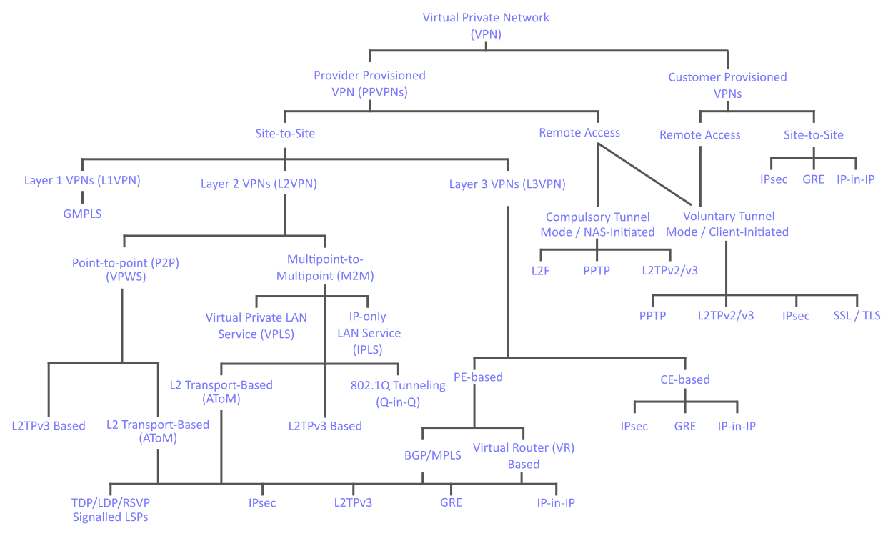

# Telematics

<code>Fundamentos de Telemática</code>

Creado por <code>Giancarlo Ortiz</code> para explicar los fundamentos de los <code>Sistemas de comunicaciones</code> en los cursos de telemática y redes de computadores.

## Túneles
Un túnel en el contexto de las redes de ordenadores es un protocolo que encapsula otros protocolos y permite la comunicación segura entre dos puntos separados por una red pública o no controlada como Internet.

## Agenda
1. [Tunneling PtP](#1-tunneling-ptp).
1. [Tunneling PtMP orientado a datagramas](#2-tunneling-ptmp-arientado-a-datagramas).
1. [Tunneling PtMP orientado a flujo](#3-tunneling-ptmp-arientado-a-flujo).
1. [VPN](#4-vpn).

 

---
# 1. [Tunneling PtP](#agenda)
La técnica de [Tunneling][1] en un enlace [PtP][1_] consiste en encapsular un protocolo de red sobre otro dentro de una red de computadoras para aislar la conexión entre dos puntos.

[1]:https://es.wikipedia.org/wiki/T%C3%BAnel_(inform%C3%A1tica)#
[1_]:https://es.wikipedia.org/wiki/Red_punto_a_punto

* ><i>"Muchos matemáticos derivan parte de su autoestima sintiéndose orgullosos herederos de una larga tradición de pensamiento racional, me temo que idealizan sus ancestros culturales."</i> 
<cite style="display:block; text-align: right">[Edsger Dijkstra](https://es.wikipedia.org/wiki/Edsger_Dijkstra)</cite>

## 1.1. Características ✔
* Se utiliza en redes [WAN][11_1] de largo alcance.
* Habituales para conectar la [ISP][11_2] con sus clientes.
* Mayor velocidad que otros.
* Fáciles de configurar pero inseguros.
* Administración descentralizada.

[11_1]:https://es.wikipedia.org/wiki/Red_de_%C3%A1rea_amplia
[11_2]:https://es.wikipedia.org/wiki/Proveedor_de_servicios_de_internet

## 1.2. Mecanismos de autentificación ✔
* [PPA][12_1] - password authentication protocol 1992.
* [PPP][12_2] - point-to-point Protocol - 1994.
* [CHAP][12_3] - challenge handshake authentication Protocol - 1996.

[12_1]:https://es.wikipedia.org/wiki/Password_Authentication_Protocol
[12_2]:https://es.wikipedia.org/wiki/Point-to-Point_Protocol
[12_3]:https://es.wikipedia.org/wiki/CHAP

## 1.3. Ejemplos ✔
* [PPPoA][13_1] - point-to-point protocol over ATM - 1998.
* [PPTP][13_2] - point-to-Point tunneling protocol - 1999.
* [PPPoE][13_3] - point-to-point protocol over Ethernet - 1999.

[13_1]:https://es.wikipedia.org/wiki/PPPoA
[13_2]:https://es.wikipedia.org/wiki/PPTP
[13_3]:https://es.wikipedia.org/wiki/PPPoE

# 2. [Tunneling PtMP orientado a datagramas](#agenda)
La técnica de [Tunneling][1] en un enlace [PtMP][2_] consiste en encapsular un protocolo de red sobre otro dentro de una red de computadoras para conectar uno o varios puntos separados en una LAN segura.

[2_]:https://es.wikipedia.org/wiki/Red_multipunto

* ><i>"Muchos matemáticos derivan parte de su autoestima sintiéndose orgullosos herederos de una larga tradición de pensamiento racional, me temo que idealizan sus ancestros culturales."</i> 
<cite style="display:block; text-align: right">[Edsger Dijkstra](https://es.wikipedia.org/wiki/Edsger_Dijkstra)</cite>

## 2.1. Características ✔
* Se utiliza para conectar redes [LAN][21_1].
* Habituales para conectar [CPE][22_2] con seguridad.
* Administración centralizada.
* Difíciles de configurar pero seguros.

[21_1]:https://es.wikipedia.org/wiki/Red_de_%C3%A1rea_local
[21_2]:https://es.wikipedia.org/wiki/Customer_Premises_Equipment

## 2.2. Mecanismos de autentificación ✔
* [GRE][22_1] - generic routing encapsulation - 1994.
* [PPP][12_2] - point-to-point Protocol - 1994.
* [MS-CHAP][22_3] - challenge handshake authentication Protocol - 1998.
* [Radius][22_4] - Remote Authentication Dial-In User Service - 1997.

[22_1]:https://es.wikipedia.org/wiki/GRE
[22_3]:https://es.wikipedia.org/wiki/MS-CHAP
[22_4]:https://es.wikipedia.org/wiki/RADIUS

## 2.3. Ejemplos ✔
* [L2F][23_2] - layer 2 forwarding - 1998.
* [L2TP][23_3] - layer 2 tunneling protocol - 1999.

[23_2]:https://es.wikipedia.org/wiki/L2F
[23_3]:https://es.wikipedia.org/wiki/L2TP

# 3. [Tunneling PtMP orientado a flujo](#agenda)
La técnica de [Tunneling][1] en un enlace [PtMP][3_] consiste en encapsular un protocolo de red sobre otro dentro de una red de computadoras para uno o varios puntos separados a una LAN segura.

[3_]:https://es.wikipedia.org/wiki/Red_multipunto

* ><i>"Muchos matemáticos derivan parte de su autoestima sintiéndose orgullosos herederos de una larga tradición de pensamiento racional, me temo que idealizan sus ancestros culturales."</i> 
<cite style="display:block; text-align: right">[Edsger Dijkstra](https://es.wikipedia.org/wiki/Edsger_Dijkstra)</cite>

## 3.1. Características ✔
* Se utiliza para crear [VPN][31_1].
* Habituales para conexiones seguras entre redes.
* Autentificación con certificado.
* Administración centralizada.
* Difíciles de configurar pero seguros.
* Transmisión continua.

[31_1]:https://es.wikipedia.org/wiki/Red_privada_virtual

## 3.2. Mecanismos de autentificación ✔
* Certificado [SSL][32_1] - secure sockets layer - 1998.
* Certificado [TLS][32_2] - transport layer security - 1999.
* [EAP-TLS][32_3] - EAP Transport Layer Security - 2008.

[33_1]:https://es.wikipedia.org/wiki/Seguridad_de_la_capa_de_transporte
[33_1]:https://es.wikipedia.org/wiki/Seguridad_de_la_capa_de_transporte
[33_1]:https://en.wikipedia.org/wiki/Extensible_Authentication_Protocol#EAP-TLS

## 3.3. Ejemplos ✔
* [IKEv2][33_1] - Internet key exchange version 2 - 2005.
* [SSTP][33_2] - Secure Socket Tunneling Protocol - 2007.
* [IPsec][33_3] - internet protocol security (Modo túnel) - 1995.
* [OVPN][33_4] - OpenVPN - 2002.

[33_1]:https://es.wikipedia.org/wiki/L2F
[33_2]:https://es.wikipedia.org/wiki/L2TP
[33_3]:https://es.wikipedia.org/wiki/IPsec
[33_4]:https://es.wikipedia.org/wiki/OpenVPN

# 4. [Tunneling PtMP orientado a flujo](#agenda)
Una red privada virtual o [VPN][4] es una tecnología que sirve para autenticar y conectar con seguridad a usuarios conectados mediante una red insegura.

[4]:https://es.wikipedia.org/wiki/Red_privada_virtual

* ><i>"Muchos matemáticos derivan parte de su autoestima sintiéndose orgullosos herederos de una larga tradición de pensamiento racional, me temo que idealizan sus ancestros culturales."</i> 
<cite style="display:block; text-align: right">[Edsger Dijkstra](https://es.wikipedia.org/wiki/Edsger_Dijkstra)</cite>

## 4.1. Características ✔
* Controla el acceso - [mecanismos autentificación][41_1] LDAP - RADIUS.
* Garantiza integridad - [funciones Hash][41_2] SHA - MD5.
* Proporciona confidencialidad - [criptografía][41_3] AES - RSA.

[41_1]:https://es.wikipedia.org/wiki/Autenticaci%C3%B3n
[41_2]:https://es.wikipedia.org/wiki/Funci%C3%B3n_hash
[41_3]:https://es.wikipedia.org/wiki/Criptograf%C3%ADa

## 4.2. Ventajas ✔
* Integridad, confidencialidad y seguridad de datos.
* Reducen los costos y son sencillas de usar.​
* Acceso a contenido no disponible en una región.
* Facilidad de creación de canales privados.

## 4.3. Tipos ✔
* VPN punto a punto (WAN) - (Router a Router).
* VPN punto multi-punto (LAN) - (Router a PC).
* VPN over LAN.
* [mRPV][43] - VPN over Mobile.

[43]:https://es.wikipedia.org/wiki/Red_privada_virtual_m%C3%B3vil

## 4.3. Clasificación ✔

 

---
## Mas Recursos
- [Red privada virtual]() (Wikipedia)
- [Red punto a punto](https://es.wikipedia.org/wiki/Red_punto_a_punto) (Wikipedia)
- [Red multi-punto](https://es.wikipedia.org/wiki/Red_multipunto) (Wikipedia)

