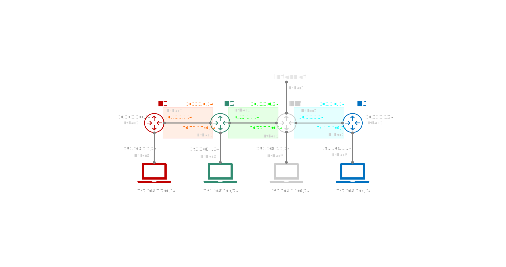

# Telematics

<code>Fundamentos de Telemática</code>

Creado por <code>GncDev</code> para explicar los fundamentos de los <code>Sistemas de comunicaciones</code> en los cursos de telemática y redes de computadores.

# Practica de laboratorio 03 - Enrutamiento estático

## Objetivos 

### Objetivo General
Proporcionar el conocimiento y generar las habilidades necesarias en la configuración y gestión de dispositivos de redes.

### Objetivos Específicos:
- Conocer configuraciones básicas de enrutamiento estático con MikroTik. :+1:

---

## Parámetros:
Para todos los efectos:
* la letra G  de se reemplaza por el número de grupo de laboratorio.
* la letra C  de se reemplaza por el ultimo número de cédula del estudiante..

## 1. [Configurar el entorno de trabajo](#) ✔
1. Cree si no existe el repositorio llamado <code>Redes-dos</code>.
1. Crear una carpeta en este repositorio llamado <code>Laboratorio-tres</code>.
1. Invite a los compañeros de grupo como colaboradores en este repositorio.
1. Documente cada uno de los items a continuación con capturas de pantalla y código .

>Nota: recuerde que los [parámetros](#parámetros) son validos en todo el laboratorio.

## 2. [Preguntas reflexivas de ambientación](#) ✔

<ol type="a">
<li>¿Que es y como se configura la ruta por defecto?</li>
<li>¿Que es la distancia administrativa?.</li>
<li>¿Que es una red directamente conectada y cual es su distancia administrativa?.</li>
<li>¿Que es una ruta estática?.</li>
<li>¿Que es una ruta dinámica?.</li>
</ol>

## 3. [Configuración básica MikroTik-01](#) ✔
1. Conecte los equipos a la red eléctrica.
1. [Reinicie][3_1] los dispositivos a la configuración de fabrica.
1. Conecte la ultima interfaz [RJ45][rj45] del router al PC de configuración.
1. [Acceder][3_2] al dispositivo por el puerto 8291 via Winbox.
1. Cambiar el nombre del dispositivo para [identificarlo][3_3] como <code>R1</code>.
1. Etiquetar las [interfaces][3_4] a utilizar (2 WAN y una LAN).
1. Conecte las interfaces [Ethernet][3_5] etiquetadas a los equipos vecinos.
1. Agregar un [bridge][3_6] y sus interfaces para la red LAN.
1. Agregar el direccionamiento para las dos redes externas WAN y la red interna LAN.
    1. Agregar la [dirección][5_1] de la interfaz externa que conecta con R2 en el segmento IP 10.11.1.0/24.
    1. Agregar la [dirección][5_1] de la interfaz externa que conectara redes futuras en el segmento IP 10.10.1.0/24.
    1. Agregar la [dirección][5_1] del bridge (interna) con una IP 192.168.1.1 privada, clase C.
1. Agregar un [Pool][5_2] en el segmento de la LAN que asigne direcciones entre 192.168.1.100-192.168.1.200.
1. Agregar un servidor [DHCP][5_3] y la información de puerta de enlace y DNS que enviara a los PC conectados a la LAN. 
1. Agregar la [ruta por defecto][5_4] 0.0.0.0/0.

## 4. [Configurar enrutamiento MikroTik-01](#) ✔
1. Agregar las [rutas estáticas][8_1] necesarias para que los tres router conozcan la ruta a los otros dos.
1. Realizar pruebas de diagnostico [PING][8_2] y [TRACEROUTE][8_3] desde el router a los otros router.
1. Realizar pruebas de diagnostico [PING][ping] y [TRACERTE][tracert] desde un computador conectado via UTP a los otros router.
1. Realizar un [backup][8_4] de la configuración del equipo.

## 5. [Configuración básica MikroTik-02](#) ✔
1. Conecte los equipos a la red eléctrica.
1. [Reinicie][3_1] los dispositivos a la configuración de fabrica.
1. Conecte la ultima interfaz [RJ45][rj45] del router al PC de configuración.
1. [Acceder][3_2] al dispositivo por el puerto 8291 via Winbox.
1. Cambiar el nombre del dispositivo para [identificarlo][3_3] como <code>R2</code>.
1. Etiquetar las [interfaces][3_4] a utilizar (2 WAN y una LAN).
1. Conecte las interfaces [Ethernet][3_5] etiquetadas a los equipos vecinos.
1. Agregar un [bridge][3_6] y sus interfaces para la red LAN.
1. Agregar el direccionamiento para las dos redes externas WAN y la red interna LAN.
    1. Agregar la [dirección][5_1] de la interfaz externa que conecta con R1 en el segmento IP 10.11.1.0/24.
    1. Agregar la [dirección][5_1] de la interfaz externa que conecta con R3 en el segmento IP 10.22.1.0/24.
    1. Agregar la [dirección][5_1] del bridge (interna) con una IP 192.168.1.1 privada, clase C.
1. Agregar un [Pool][5_2] en el segmento de la LAN que asigne direcciones entre 192.168.1.100-192.168.1.200.
1. Agregar un servidor [DHCP][5_3] y la información de puerta de enlace y DNS que enviara a los PC conectados a la LAN. 
1. Agregar la [ruta por defecto][5_4] 0.0.0.0/0.

## 6. [Configurar enrutamiento MikroTik-02](#) ✔
1. Agregar las [rutas estáticas][8_1] necesarias para que los tres router conozcan la ruta a los otros dos.
1. Realizar pruebas de diagnostico [PING][8_2] y [TRACEROUTE][8_3] desde el router a los otros router.
1. Realizar pruebas de diagnostico [PING][ping] y [TRACERTE][tracert] desde un computador conectado via UTP a los otros router.
1. Realizar un [backup][8_4] de la configuración del equipo.

## 7. [Configuración básica MikroTik-03](#) ✔
1. Conecte los equipos a la red eléctrica.
1. [Reinicie][3_1] los dispositivos a la configuración de fabrica.
1. Conecte la ultima interfaz [RJ45][rj45] del router al PC de configuración.
1. [Acceder][3_2] al dispositivo por el puerto 8291 via Winbox.
1. Cambiar el nombre del dispositivo para [identificarlo][3_3] como <code>R3</code>.
1. Etiquetar las [interfaces][3_4] a utilizar (2 WAN y una LAN).
1. Conecte las interfaces [Ethernet][3_5] etiquetadas a los equipos vecinos.
1. Agregar un [bridge][3_6] y sus interfaces para la red LAN.
1. Agregar el direccionamiento para las dos redes externas WAN y la red interna LAN.
    1. Agregar la [dirección][5_1] de la interfaz externa que conecta con RM en el segmento IP 10.1.1.0/24.
    1. Agregar la [dirección][5_1] de la interfaz externa que conectara redes futuras en el segmento IP 10.33.1.0/24.
    1. Agregar la [dirección][5_1] del bridge (interna) con una IP 192.168.1.1 privada, clase C.
1. Agregar un [Pool][5_2] en el segmento de la LAN que asigne direcciones entre 192.168.1.100-192.168.1.200.
1. Agregar un servidor [DHCP][5_3] y la información de puerta de enlace y DNS que enviara a los PC conectados a la LAN. 
1. Agregar la [ruta por defecto][5_4] 0.0.0.0/0.

## 8. [Configurar enrutamiento MikroTik-03](#) ✔
1. Agregar las [rutas estáticas][8_1] necesarias para que los tres router conozcan la ruta a los otros dos.
1. Realizar pruebas de diagnostico [PING][8_2] y [TRACEROUTE][8_3] desde el router a los otros router.
1. Realizar pruebas de diagnostico [PING][ping] y [TRACERTE][tracert] desde un computador conectado via UTP a los otros router.
1. Realizar un [backup][8_4] de la configuración del equipo.

## 9. [Diagrama de Red](#) ✔
- Realice un diagrama topológico de cada uno de los casos de estudio.
- Incluya todos los detalles de la red de area local a la que se encuentra conectado.
- Incluya los saltos conocidos incluyendo el equipo de borde de su ISP.

## 10. [Preguntas de conocimiento](#) ✔
1. ¿Por qué desde un router no se puede ingresar a las redes LAN de los otros router?
1. ¿Es posible lograr que los PC conectados a R1 encuentren la ruta a los PC conectados en R3? (procedimiento)
1. ¿Cual es la puerta de enlace a internet para R1?
1. ¿Cuantos saltos internos hace un computador conectado en cada una de las redes LAN a internet? (Justifique)

[rj45]:https://es.wikipedia.org/wiki/RJ-45
[ping]:https://learn.microsoft.com/en-us/windows-server/administration/windows-commands/ping
[tracert]:https://learn.microsoft.com/en-us/windows-server/administration/windows-commands/tracert

[3_1]:https://wiki.mikrotik.com/wiki/Manual:Reset
[3_2]:https://wiki.mikrotik.com/wiki/Manual:Winbox
[3_3]:https://wiki.mikrotik.com/wiki/Manual:System/identity
[3_4]:https://wiki.mikrotik.com/wiki/Manual:Interface
[3_5]:https://wiki.mikrotik.com/wiki/Manual:Interface/Ethernet
[3_6]:https://wiki.mikrotik.com/wiki/Manual:Interface/Bridge

[5_1]:https://wiki.mikrotik.com/wiki/Manual:IP/Address
[5_2]:https://wiki.mikrotik.com/wiki/Manual:IP/Pools
[5_3]:https://wiki.mikrotik.com/wiki/Manual:IP/DHCP_Server
[5_4]:https://wiki.mikrotik.com/wiki/Manual:IP/Route#Default_route

[8_1]:https://wiki.mikrotik.com/wiki/Manual:IP/Route
[8_2]:https://wiki.mikrotik.com/wiki/Manual:Tools/Ping
[8_3]:https://wiki.mikrotik.com/wiki/Manual:Troubleshooting_tools
[8_4]:https://wiki.mikrotik.com/wiki/Manual:System/Backup

---
## Mas Recursos
- [Wiki MikroTik](https://wiki.mikrotik.com/wiki/Main_Page) (MikroTik - Wiki)
- [Rutas estáticas en MikroTik](https://wiki.mikrotik.com/wiki/Manual:Simple_Static_Routing) (MikroTik - Wiki)
- [Video-Curso MikroTik](https://www.youtube.com/watch?v=SLAPzl-LSc0&list=PLf0g2cV4iCkH19_UhaVt0vDn1f9ObumjF) (Wiki)
- [Direccionamiento IP](https://es.wikipedia.org/wiki/Direcci%C3%B3n_IP) (Wikipedia)
- [DHCP](https://es.wikipedia.org/wiki/Protocolo_de_configuraci%C3%B3n_din%C3%A1mica_de_host) (Wikipedia)
- [Calculadora IP](https://www.calculator.net/ip-subnet-calculator.html) (Wikipedia)

---
## Evaluación y rúbrica
- Fecha máximo entrega: 05 de Mayo de 2023
- Hora de entrega: 11:59pm	
- Nota máxima: 5.0 
- Número de actividades: 10
- Valor de cada actividad: 0.5
- Ponderación: 20%
- $\color{#DD69DD}{\text{...Carpe Diem}}$