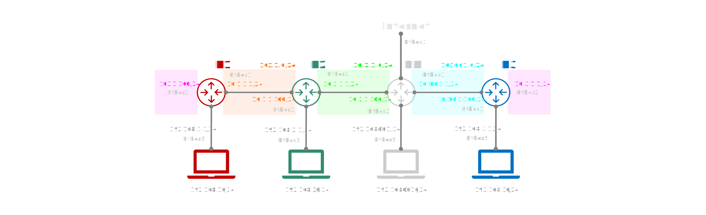

# Telematics
<p><code>Fundamentos de Telemática</code></p>
<p>Creado por <code>GncDev</code> para explicar los fundamentos de los <code>Sistemas de comunicaciones</code> en los cursos de telemática y redes de computadores.</p>

# Practica de laboratorio 05 - Enrutamiento Dinámico OSPF

## Objetivos 

### Objetivo General
Proporcionar el conocimiento y generar las habilidades necesarias en la configuración y gestión de dispositivos de redes.

### Objetivos Específicos:
- Conocer configuraciones básicas de enrutamiento dinámico con MikroTik. :+1:

---

## Parámetros:
Para todos los efectos:
* la letra G  de se reemplaza por el número de grupo de laboratorio.
* la letra C  de se reemplaza por el ultimo número de cédula del estudiante..


## 1. [Configurar el entorno de trabajo](#) ✔
1. Cree si no existe el repositorio llamado <code>Redes-dos</code>.
1. Crear una carpeta en este repositorio llamado <code>Laboratorio-cinco</code>.
1. Invite a los compañeros de grupo como colaboradores en este repositorio.
1. Documente cada uno de los items a continuación con capturas de pantalla y código.

>Nota: recuerde que los [parámetros](#parámetros) son validos en todo el laboratorio.

[1_2]:https://github.com/GiancarloBenavides

## 2. [Preguntas reflexivas de ambientación](#) ✔

<ol type="a">
<li>¿Como funcionan los servidores HTTP?</li>
<li>¿Que son las interfaces virtuales y de loopback?.</li>
<li>¿Cual es el algoritmo y la métrica que implementa OSPF?.</li>
<li>¿Que diferencias hay entre RIP y OSPF?. (Ventajas y Desventajas)</li>
<li>¿Que diferencias hay entre un area OSPF y un sistema autónomo?.</li>

</ol>

## 3. [Configuración básica MikroTik-01](#) ✔
1. Conecte los equipos a la red eléctrica.
1. [Reinicie][3_1] los dispositivos a la configuración de fabrica.
1. Conecte la ultima interfaz [RJ45][rj45] del router al PC de configuración.
1. [Acceder][3_2] al dispositivo por el puerto 8291 via WinBox.
1. Cambiar el nombre del dispositivo para [identificarlo][3_3] como <code>R1</code>.
1. Etiquetar las [interfaces][3_4] a utilizar (2 WAN y una LAN).
1. Conecte las interfaces [Ethernet][3_5] etiquetadas a los equipos vecinos.
1. Agregar un [bridge][3_6] y sus interfaces para la red LAN.
1. Agregar el direccionamiento para las dos redes externas WAN y la red interna LAN.
    1. Agregar la [dirección][5_1] de la interfaz externa que conecta con R2 en el segmento IP 10.1.1.0/24.
    1. Agregar la [dirección][5_1] de la interfaz externa que conecta con R3 en el segmento IP 10.3.1.0/24.
    1. Agregar la [dirección][5_1] del bridge (interna) con una IP 192.168.1.1 privada, clase C.
1. Agregar un [Pool][5_2] en el segmento de la LAN que asigne direcciones entre 192.168.1.100-192.168.1.150.
1. Agregar un servidor [DHCP][5_3] y la información de puerta de enlace y DNS que enviara a los PC conectados a la LAN. 
1. Convertir a [estático][5_4] el arrendamiento DHCP para la MAC del PC de configuración.
1. Cambiar la ip estática del pc de configuración a 192.168.1.10.
1. Agregar una regla NAT en el cortafuegos para garantizar el enrutamiento en sistemas de IP publica como internet.
    1. Crear una regla [source NAT][5_5] en el cortafuegos para los paquetes IP que salen hacia la WAN.
    1. Agregar una acción para que la regla anterior permita enmascarar la ip de origen.
1. Agregar una regla NAT en el cortafuegos para mapear ([Port Forwarding][fwd]) un servicio web de la red LAN. 
    1. Crear una regla [destination NAT][5_6] para el protocolo TCP para los paquetes que llegan desde la WAN por el puerto HTTP 80 .
    1. Agregar una acción para que la regla anterior permita redirigir la solicitud a 192.168.1.10:8080.
    1. levantar un [servicio Web][web] en el pc 192.168.1.10 en el puerto 8080
1. Agregar la [ruta por defecto][5_7] 0.0.0.0/0.

```bash
# El servidor HTTP DEV puede servir para ejecutar un servicio de prueba
# En Win32 para servir el contenido de la carpeta public en el puerto 8080
.\devd.exe -aol --port=8080 .\public
```

## 4. [Configurar enrutamiento MikroTik-01](#) ✔
1. Agregar una [dirección de bucle invertido][8_1] (Virtual) que esta siempre activa para identificar el router en la red OSPF.
    1. Crear un puente de red llamado "loopback"
    1. Agregar una dirección 10.255.255.1/32 a ese puente
1. Habilitar una instancia [OSPF][8_2] identificada con la IP de "loopback"
1. Agregar las [interfaces][8_3] que compartirán rutas OSPF y configurar las métricas.
1. Publicar las [redes][8_4] que las interfaces OSPF deben compartir en el area "Backbone" para que los tres router conozcan la ruta a los otros dos y a sus redes LAN.
1. Realizar pruebas de diagnostico [PING][8_5] y [TRACEROUTE][8_6] desde el router a los otros router.
1. Realizar pruebas de diagnostico [PING][ping] y [TRACERTE][tracert] desde un computador conectado via UTP a los otros router.
1. Realizar un [backup][8_7] de la configuración del equipo.

## 5. [Configuración básica MikroTik-02](#) ✔
1. Conecte los equipos a la red eléctrica.
1. [Reinicie][3_1] los dispositivos a la configuración de fabrica.
1. Conecte la ultima interfaz [RJ45][rj45] del router al PC de configuración.
1. [Acceder][3_2] al dispositivo por el puerto 8291 via Winbox.
1. Cambiar el nombre del dispositivo para [identificarlo][3_3] como <code>R2</code>.
1. Etiquetar las [interfaces][3_4] a utilizar (2 WAN y una LAN).
1. Conecte las interfaces [Ethernet][3_5] etiquetadas a los equipos vecinos.
1. Agregar un [bridge][3_6] y sus interfaces para la red LAN.
1. Agregar el direccionamiento para las dos redes externas WAN y la red interna LAN.
    1. Agregar la [dirección][5_1] de la interfaz externa que conecta con R1 en el segmento IP 10.1.1.0/24.
    1. Agregar la [dirección][5_1] de la interfaz externa que conecta con R3 en el segmento IP 10.2.1.0/24.
    1. Agregar la [dirección][5_1] del bridge (interna) con una IP 192.168.2.1 privada, clase C.
1. Agregar un [Pool][5_2] en el segmento de la LAN que asigne direcciones entre 192.168.2.200-192.168.2.250.
1. Agregar un servidor [DHCP][5_3] y la información de puerta de enlace y DNS que enviara a los PC conectados a la LAN.
1. Convertir a [estático][5_4] el arrendamiento DHCP para la MAC del PC de configuración. 
1. Cambiar la ip estática del pc de configuración a 192.168.2.10.
1. Agregar una regla NAT en el cortafuegos para garantizar el enrutamiento en sistemas de IP publica como internet.
    1. Crear una regla [source NAT][5_5] en el cortafuegos.
    1. Agregar una acción para enmascarar la ip de origen.
1. Agregar una regla NAT en el cortafuegos para mapear ([Port Forwarding][fwd]) un servicio web de la red LAN. 
    1. Crear una regla [destination NAT][5_6] para el protocolo TCP por el puerto HTTP 80.
    1. Agregar una acción para la regla anterior para redirigir la solicitud a 192.168.2.10:8080.
    1. levantar un [servicio Web][web] en el pc 192.168.2.10 en el puerto 8080
1. Agregar la [ruta por defecto][5_7] 0.0.0.0/0.

```bash
# El servidor HTTP DEV puede servir para ejecutar un servicio de prueba
# En Win32 para servir el contenido de la carpeta public en el puerto 8080
.\devd.exe -aol --port=8080 .\public
```

## 6. [Configurar enrutamiento MikroTik-02](#) ✔
1. Agregar una [dirección de bucle invertido][8_1] (Virtual) que esta siempre activa para identificar el router en la red OSPF.
    1. Crear un puente de red llamado "loopback"
    1. Agregar una dirección 10.255.255.2/32 a ese puente
1. Habilitar una instancia [OSPF][8_2] identificada con la IP de "loopback"
1. Agregar las [interfaces][8_3] que compartirán rutas OSPF y configurar las métricas.
1. Publicar las [redes][8_4] que las interfaces OSPF deben compartir en el area "Backbone" para que los tres router conozcan la ruta a los otros dos y a sus redes LAN.
1. Realizar pruebas de diagnostico [PING][8_5] y [TRACEROUTE][8_6] desde el router a los otros router.
1. Realizar pruebas de diagnostico [PING][ping] y [TRACERTE][tracert] desde un computador conectado via UTP a los otros router.
1. Realizar un [backup][8_7] de la configuración del equipo.

## 7. [Configuración básica MikroTik-03](#) ✔
1. Conecte los equipos a la red eléctrica.
1. [Reinicie][3_1] los dispositivos a la configuración de fabrica.
1. Conecte la ultima interfaz [RJ45][rj45] del router al PC de configuración.
1. [Acceder][3_2] al dispositivo por el puerto 8291 via Winbox.
1. Cambiar el nombre del dispositivo para [identificarlo][3_3] como <code>R3</code>.
1. Etiquetar las [interfaces][3_4] a utilizar (2 WAN y una LAN).
1. Conecte las interfaces [Ethernet][3_5] etiquetadas a los equipos vecinos.
1. Agregar un [bridge][3_6] y sus interfaces para la red LAN.
1. Agregar el direccionamiento para las dos redes externas WAN y la red interna LAN.
    1. Agregar la [dirección][5_1] de la interfaz externa que conecta con RM en el segmento IP 10.1.1.0/24.
    1. Agregar la [dirección][5_1] de la interfaz externa que conecta con R1 en el segmento IP 10.3.1.0/24.
    1. Agregar la [dirección][5_1] del bridge (interna) con una IP 192.168.3.1 privada, clase C.
1. Agregar un [Pool][5_2] en el segmento de la LAN que asigne direcciones entre 192.168.3.150-192.168.3.200.
1. Agregar un servidor [DHCP][5_3] y la información de puerta de enlace y DNS que enviara a los PC conectados a la LAN. 
1. Convertir a [estático][5_4] el arrendamiento DHCP para la MAC del PC de configuración.
1. Cambiar la ip estática del pc de configuración a 192.168.3.10.
1. Configurar la [WLAN][wlan] de nombre "REDES_42" para proveer conectividad inalámbrica.
1. Agregar una regla NAT en el cortafuegos para garantizar el enrutamiento en sistemas de IP publica como internet.
    1. Crear una regla [source NAT][5_5] en el cortafuegos para los paquetes IP que salen hacia la WAN.
    1. Agregar una acción para que la regla anterior permita enmascarar la ip de origen.
1. Agregar una regla NAT en el cortafuegos para mapear ([Port Forwarding][fwd]) un servicio web de la red LAN. 
    1. Crear una regla [destination NAT][5_6] para el protocolo TCP para los paquetes que llegan desde la WAN por el puerto HTTP 80 .
    1. Agregar una acción para que la regla anterior permita redirigir la solicitud a 192.168.3.10:8080.
    1. levantar un [servicio Web][web] en el pc 192.168.3.10 en el puerto 8080
1. Agregar la [ruta por defecto][5_7] 0.0.0.0/0.

```bash
# El servidor HTTP DEV puede servir para ejecutar un servicio de prueba
# En Win32 para servir el contenido de la carpeta public en el puerto 8080
.\devd.exe -aol --port=8080 .\public
```

## 8. [Configurar enrutamiento MikroTik-03](#) ✔
1. Agregar una [dirección de bucle invertido][8_1] (Virtual) que esta siempre activa para identificar el router en la red OSPF.
    1. Crear un puente de red llamado "loopback"
    1. Agregar una dirección 10.255.255.3/32 a ese puente
1. Habilitar una instancia [OSPF][8_2] identificada con la IP de "loopback"
1. Agregar las [interfaces][8_3] que compartirán rutas OSPF y configurar las métricas.
1. Publicar las [redes][8_4] que las interfaces OSPF deben compartir en el area "Backbone" para que los tres router conozcan la ruta a los otros dos y a sus redes LAN.
1. Realizar pruebas de diagnostico [PING][8_5] y [TRACEROUTE][8_6] desde el router a los otros router.
1. Realizar pruebas de diagnostico [PING][ping] y [TRACERTE][tracert] desde un computador conectado via UTP a los otros router.
1. Realizar un [backup][8_7] de la configuración del equipo.

## 9. [Diagrama de Red](#) ✔
- Realice un diagrama topológico de cada uno de los casos de estudio.
- Incluya todos los detalles de la red de area local a la que se encuentra conectado.
- Incluya los saltos conocidos incluyendo el equipo de borde de su ISP.



## 10. [Preguntas de conocimiento](#) ✔
1. ¿Cuantas rutas OSPF deberían aparecer en cada uno de los routers? 
1. ¿Cuantos vecinos OSPF aparecen en cada uno de los routers?
1. ¿Cuantos router internos RI, de borde ABR y de sistema autónomo ASBR hay en el esquema? (identifique)
1. ¿Cuantas areas multi-acceso (broadcast) y punto a punto (PtP) hay en el esquema? (identifique)

[psk]:https://es.wikipedia.org/wiki/Pre-shared_key
[dhcp]:https://es.wikipedia.org/wiki/Protocolo_de_configuraci%C3%B3n_din%C3%A1mica_de_host
[wlan]:https://es.wikipedia.org/wiki/Red_de_%C3%A1rea_local_inal%C3%A1mbrica

[rj45]:https://es.wikipedia.org/wiki/RJ-45
[ping]:https://learn.microsoft.com/en-us/windows-server/administration/windows-commands/ping
[tracert]:https://learn.microsoft.com/en-us/windows-server/administration/windows-commands/tracert
[web]:https://www.downloadcrew.com/download/35276/devd
[fwd]:https://es.wikipedia.org/wiki/Redirecci%C3%B3n_de_puertos

[3_1]:https://wiki.mikrotik.com/wiki/Manual:Reset
[3_2]:https://wiki.mikrotik.com/wiki/Manual:Winbox
[3_3]:https://wiki.mikrotik.com/wiki/Manual:System/identity
[3_4]:https://wiki.mikrotik.com/wiki/Manual:Interface
[3_5]:https://wiki.mikrotik.com/wiki/Manual:Interface/Ethernet
[3_6]:https://wiki.mikrotik.com/wiki/Manual:Interface/Bridge

[5_1]:https://wiki.mikrotik.com/wiki/Manual:IP/Address
[5_2]:https://wiki.mikrotik.com/wiki/Manual:IP/Pools
[5_3]:https://wiki.mikrotik.com/wiki/Manual:IP/DHCP_Server
[5_4]:https://wiki.mikrotik.com/wiki/Manual:IP/DHCP_Server#Menu_specific_commands_2
[5_5]:https://wiki.mikrotik.com/wiki/Manual:IP/Firewall/NAT#Source_NAT
[5_6]:https://wiki.mikrotik.com/wiki/Manual:IP/Firewall/NAT#Destination_NAT
[5_7]:https://wiki.mikrotik.com/wiki/Manual:IP/Route#Default_route

[8_1]:https://es.wikipedia.org/wiki/Loopback
[8_2]:https://wiki.mikrotik.com/wiki/Manual:Routing/OSPF#Instance
[8_3]:https://wiki.mikrotik.com/wiki/Manual:Routing/OSPF#Interface
[8_4]:https://wiki.mikrotik.com/wiki/Manual:Routing/OSPF#Network
[8_5]:https://wiki.mikrotik.com/wiki/Manual:Tools/Ping
[8_6]:https://wiki.mikrotik.com/wiki/Manual:Troubleshooting_tools
[8_7]:https://wiki.mikrotik.com/wiki/Manual:System/Backup

---
## Mas Recursos
- [Wiki Mikrotik](https://wiki.mikrotik.com/wiki/Main_Page) (MikroTik - Wiki)
- [Video-Curso Mikrotik](https://www.youtube.com/watch?v=SLAPzl-LSc0&list=PLf0g2cV4iCkH19_UhaVt0vDn1f9ObumjF) (Wiki)
- [Encaminamiento](https://es.wikipedia.org/wiki/Encaminamiento) (Wikipedia)
- [OSPF](https://es.wikipedia.org/wiki/Open_Shortest_Path_Firstl) (Wikipedia)
- [Calculadora IP](https://www.calculator.net/ip-subnet-calculator.html) (Wikipedia)

---
## Evaluación y rúbrica
- Fecha máximo entrega: 05 de Mayo de 2023
- Hora de entrega: 11:59pm	
- Nota máxima: 5.0 
- Número de actividades: 10
- Valor de cada actividad: 0.5
- Ponderación: 20%
- $\color{#DD69DD}{\text{...Carpe Diem}}$