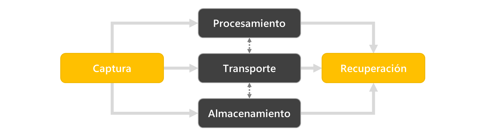

# Sistemas operativos

<code>Fundamentos de sistemas operativos</code>

Creado por <code>Giancarlo Ortiz</code> para explicar los fundamentos de los <code>Sistemas operativos</code>

---
## Sistemas de Información
Un SI es una entidad cuyos múltiples y diversos componentes materiales o conceptuales permiten el procesamiento de información y así cubrir una necesidad o un objetivo especifico.

* ><i>"Es indigno que hombres notables pierdan su tiempo como esclavos del cálculo cuando podrían dejar ese trabajo en manos de cualquiera si se usaran las máquinas."</i> 
<cite style="display:block; text-align: right">[Gottfried Leibniz](https://es.wikipedia.org/wiki/Gottfried_Leibniz)</cite>

## Procesos en un SI

## Componentes de un SI
* __Usuarios:__ personas que desarrollan, mantienen y utilizan el sistema.
* __Infraestructura:__ la red que permite compartir la información y los recursos entre dispositivos.
* [__Software:__][11] procedimientos lógicos utilizados para transformar y extraer información.
* [__Hardware:__][12] equipo físico utilizado para procesar y almacenar la información.
* __Datos:__ representación de la información.

[11]:https://es.wikipedia.org/wiki/Software
[12]:https://es.wikipedia.org/wiki/Hardware

## Capas en un SI

## Sistema de procesamiento digital
Es una maquina que se puede programar para realizar secuencias e operaciones lógicas o aritméticas, que organizadas convenientemente permiten realizar tareas de complejidad cada ves mayor.

[__Hardware:__][12]
* Componentes procesamiento.
* Componentes de almacenamiento.
* Componentes de control.

[__Software:__][11]
* Sistema operativo.
* Aplicaciones.

## Estructura del hardware - Teoría de autómatas

## Elementos de procesamiento un sistema digital
* [__CPU:__][13] Unidad central de procesamiento.
* [__FPU:__][14] Unidad de coma flotante.
* [__ALU:__][15] Unidad aritmético lógica.
* [__DSP:__][16] Unidad de procesamiento de señales.

[13]:https://es.wikipedia.org/wiki/Unidad_central_de_procesamiento
[14]:https://es.wikipedia.org/wiki/Unidad_de_coma_flotante
[15]:https://es.wikipedia.org/wiki/Unidad_aritm%C3%A9tica_l%C3%B3gica
[16]:https://es.wikipedia.org/wiki/Procesador_de_se%C3%B1ales_digitales

## Elementos de almacenamiento un sistema digital
* [__HDD__][171]/[__SSD:__][172] Memoria persistente
* [__MM:__][18] Memoria principal
* [__L1/L2/L3:__][19] Cache
* [__GPR:__][20] Registros

[171]:https://es.wikipedia.org/wiki/Unidad_de_disco_duro
[172]:https://es.wikipedia.org/wiki/Unidad_de_estado_s%C3%B3lido
[18]:https://es.wikipedia.org/wiki/Memoria_principal
[19]:https://es.wikipedia.org/wiki/Cach%C3%A9_(inform%C3%A1tica)#
[20]:https://es.wikipedia.org/wiki/Registro_(hardware)#

## Periféricos
Dispositivos auxiliares e independientes que se encuentran conectados por una interface al hardware interno de un sistema de procesamiento digital.

## Estructura del software - Teoría del núcleo

## Elementos de software se un sistema digital
* Drivers 
* API

---
emulador vs simulador 

---
### Clasificación de tipos
Las plataformas o arquitecturas de computadores y los lenguajes de programación disponen de tipos similares a la clasificación matemática de los números y pueden tener tipos como:
* __Entero__ (Int)
* __Real__ (Float)
* __lógico__ (Bool)
* __Complejo__ (Complex)
* __Carácter__ (Char)

---
#### Colecciones de datos 
Los lenguajes de programación definen colecciones de datos como un tipo de dato, de forma que un lenguaje también puede incluir tipos como:
* __Listas__ (List)
* __Arreglos__ (Array)
* __Secuencias__ (Float)
* __Tuplas__ (Bool)
* __Diccionarios__ (Complex)
* __Cadenas de caracteres__ (Str)

---
#### Datos compuestos
Algunos lenguajes de programación definen conjuntos estructurados de datos que a su vez son otro tipo de dato, de forma que un lenguaje también puede incluir tipos complejos como:
* __Clases__ (Class)
* __Objetos__ (Obj)
* __Funciones__ (Function)

---
#### Datos abstractos
Algunos lenguajes de programación permiten al usuario definir nuevos tipos de datos, de forma que el programador pueda crear estructuras de datos o colecciones estructuradas, que se derivan de los tipos incluidos:
* __Arboles__ (Tree)
* __Pilas__ (Stack)
* __Colas__ (Queue)
* __Grafos__ (Graph)

--- 
### Conversión de tipos
* El _type casting_ se refiere a la transformación de un tipo de dato en otro.
* Un lenguaje **fuertemente tipado** permite solo las conversiones de tipo automáticas que no hagan perder información.
* En un lenguaje **débilmente tipado** el programador debe evitar conversiones automáticas que hagan perder información.

---
### Comprobación de tipos
* __Estático:__ cuando la comprobación de tipos se realiza durante la compilación; por tanto los errores de tipo se detectan antes de la ejecución.
    * Ejemplos: C, C++, Java, Go, **Rust**
* __Dinámico:__ cuando la comprobación de tipos se realiza durante la ejecución; por tanto la declaración de tipos no es mas flexible. 
    * Ejemplos: **Python**, Perl, JavaScript, Ruby

---
### Tipos en Python
* Python es un lenguaje de tipado dinámico pero fuertemente tipado. 
* En Python todo es un objeto, incluyendo las variables, esto porque en Python, los tipos de datos son clases.
* Las clases que definen los tipos de datos heredan propiedades de una meta-clase "__object__". 
* En Python existen __14__ tipos de datos básicos con sus operaciones asociadas.

---
### Jerarquía de tipos en Python

---
### Tipos invocables en Python
Adicionalmente a los tipos de datos básicos el interprete de Python permite la definición de otros objetos:
* __Clases:__ se crean mediante definiciones de clase, con el propósito de ser plantillas para la creación de objetos.
* __Funciones:__ se crean mediante definiciones de función, con el propósito de ser invocadas posteriormente.
* __Métodos:__ son funciones que se llaman usando la notación de atributos de clase.

---
## Módulos y paquetes en Python 
* Un __modulo__ es un fichero que contiene instrucciones y definiciones de otros objetos en su interior.
* Para que un modulo se puede importar desde otro modulo para agregar funcionalidad.
* Un __paquete__ es una carpeta especial que contiene varios módulos en su interior.
* Para que una carpeta sea un paquete y se pueda importar desde otros ficheros debe incluir un fichero de especial llamado "**\_\_init\_\_.py**"

---
## Identificadores
Los identificadores son nombres que el programador usa para hacer referencia a los objetos de un programa; estos pueden ser constantes, variables, funciones, clases, etc...

* ><i>"Explícito es mejor que implícito... Simple es mejor que complejo... La legibilidad es importante."</i> 
<cite style="display:block; text-align: right">[Tim Peters, Zen de Python](https://es.wikipedia.org/wiki/Tim_Peters)</cite>

---
### Identificadores en Python
Python distingue mayúsculas de minúsculas y restringe el uso de identificadores con las siguientes reglas:
* No pueden utilizarse [__palabras reservadas__](https://es.wikipedia.org/wiki/Palabra_reservada) del lenguaje, espacios en blanco o símbolos de puntuación.
* El primer carácter debe ser una letra o el carácter de subrayado 
**[a-z, A-Z, _]**
* El segundo y siguientes pueden ser dígitos, letras o caracteres de subrayado **[a-z, A-Z, 1-9, _]**

---
## Palabras reservadas
Es una palabra que tiene un significado gramatical especial para ese lenguaje y no puede ser utilizada como un identificador de objetos en códigos del mismo, como pueden ser las variables.
| Lenguaje | Palabras reservadas |
|---|:---:|
| __Python__        |   35 |
| __JavaScript__    |   46 |
| __Java__          |   48 |
| __C#__            |   77 |
| __C++__           |  124 |
| __COBOL__         | +300 |

---
### Palabras reservadas en Python
| # | Keyword | # | Keyword | # | Keyword | # | Keyword |
|:---:|---|:---:|---|:---:|---|:---:|---|
| 1  | False  | 11 | continue | 21 | if       | 31 | return |
| 2  | None   | 12 | def      | 22 | import   | 32 | try    |
| 3  | True   | 13 | del      | 23 | in       | 33 | while  |
| 4  | and    | 14 |__elif__  | 24 | is       | 34 | with   |
| 5  | as     | 15 | else     | 25 | lambda   | 35 | yield  |
| 6  | assert | 16 | except   | 26 |__nonlocal__| 36 | |
| 7  | async  | 17 | finally  | 27 | not      | 37 | |
| 8  | await  | 18 | for      | 28 | or       | 38 | |
| 9  | break  | 19 | from     | 29 | pass     | 39 | |
| 10 | class  | 20 | global   | 30 | raise    | 40 | |

---
## El ámbito y los espacios de nombres
* El ámbito es el contexto que pertenece un identificador dentro de un programa.
* Un espacio de nombres es una región declarativa y aislada que proporciona un ámbito a un grupo de identificadores en su interior.
* Si un identificador no se declara en un espacio de nombres su ámbito es el espacio de nombres global.
* Es posible usar el mismo identificador en diferentes ámbitos que hacen referencia a objetos distintos.

---
### El ámbito en Python
* En Python al iniciar el interprete se crea un espacio de nombres global.
* En este espacio se incluyen todas las definiciones incorporadas "built-in" para que sean accesibles.
* Al incorporar módulos cada uno de ellos crea un espacio de nombres global.
* Cuando se invoca Las funciones al interior de los módulos, estas crean un espacio de nombres local.
* Las variables definidas en una función son locales a la función y no existen fuera de ella.
* Las funciones dentro de los script son globales y cualquier sentencia puede modificarla. 

---
### Modificadores de ámbito en python
En python se puede modificar el ámbito por defecto en la definición usando las palabras reservadas:
* __nonlocal:__ para definir variables dentro de funciones anidadas, donde esta no debe pertenecer a la función interna.
* __global:__ para definir variables globales dentro de funciones.

---
## Mas Recursos
- [Arboles](https://es.wikipedia.org/wiki/%C3%81rbol_(inform%C3%A1tica)) (Wikipedia)
- [Pilas](https://es.wikipedia.org/wiki/Pila_(inform%C3%A1tica)) (Wikipedia)
- [Colas](https://es.wikipedia.org/wiki/Cola_(inform%C3%A1tica)) (Wikipedia)
- [Grafos](https://es.wikipedia.org/wiki/Grafo_(tipo_de_dato_abstracto)) (Wikipedia)