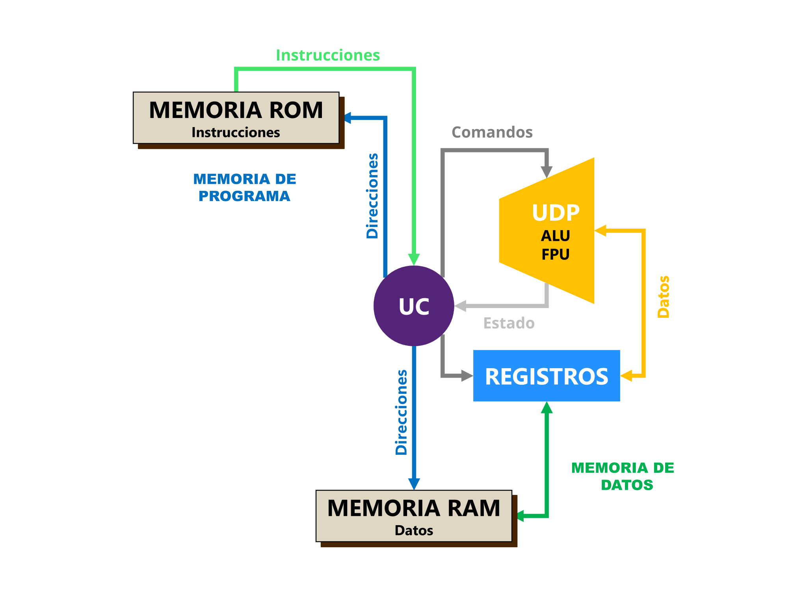
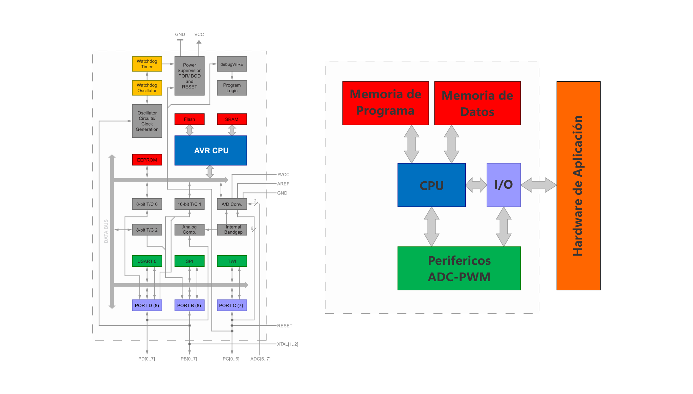
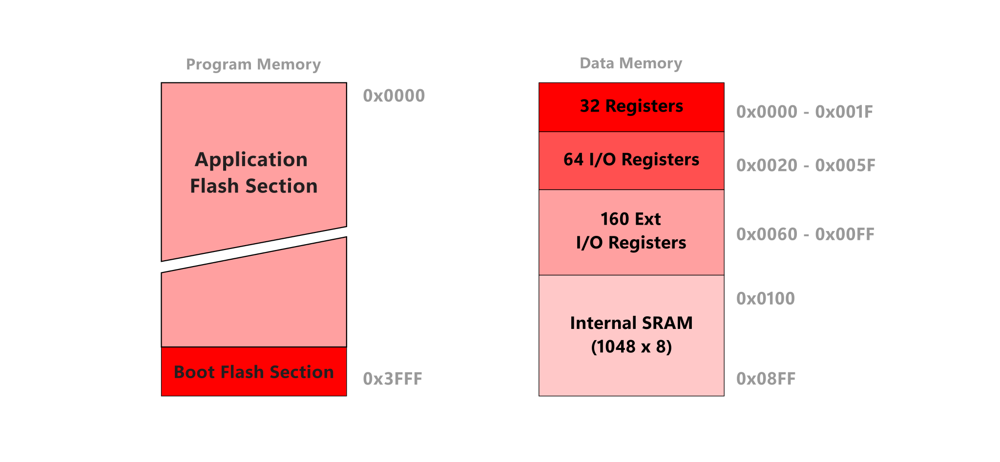

# Sistemas operacionales

<code>Fundamentos de sistemas operativos</code>

Creado por <code>Giancarlo Ortiz</code> para explicar los fundamentos de los <code>Sistemas operativos</code>

## Agenda
1. [Antecedentes de hardware](#1-antecedentes).
1. [Arquitectura Harvard](#2-arquitectura-harvard).
1. [Arquitectura del Z1](#3-arquitectura-z1).
1. [Arquitectura de Arduino](#4-arquitectura-arduino).

---
# 1. Antecedentes
* Antes de [1950][1_0].
* Diseño de [arquitecturas de hardware][1_1] con propósitos muy específicos.
* Interacción directa de los [programas][1_2] y el hardware.
* Procesamiento de instrucciones [secuencial][1_3].
* Típico de las [computadoras serie][1_4].
* Programación en [lenguaje maquina][1_5].
* Ejecución en [tiempo Real][1_6].

# 2. Arquitectura Harvard

# 3. Arquitectura Z1
* Diseñado en 1937 por [Konrad Zuse][11_1].
* Construido en 1938 por [Konrad Zuse][11_1].
* Primer ordenador programable de [lógica booleana][11_2].
* Permitía números de [punto flotante][11_3] binarios.
* 64 palabras de 22 bits como [memoria de programa][11_4].

# 4. Arquitectura Arduino

<table>
	<tr >
	    <td rowspan="9">  </td>
	    <td colspan="2" style="text-align: center;">
            <a href="https://es.wikipedia.org/wiki/Arduino_Uno">
                <b>Arduino UNO</b>
            </a>
        </td>
	</tr>
    <tr >
	    <td>Procesador:</td>
	    <td><a href="https://es.wikipedia.org/wiki/Atmega328">ATmega328</a> </td>
	</tr>
    <tr >
	    <td>Velocidad:</td>
	    <td>16 Mhz</td>
	</tr>
    <tr >
	    <td>Memoria principal:</td>
	    <td>2 KB 
            <a href="https://es.wikipedia.org/wiki/SRAM">SRAM</a>
        </td>
	</tr>
    <tr >
	    <td>Memoria programa:</td>
	    <td>32 KB 
            <a href="https://es.wikipedia.org/wiki/Memoria_flash">Flash</a>
        </td>
	</tr>
    <tr >
	    <td>Voltaje:</td>
	    <td>5 V</td>
	</tr>
        <tr >
	    <td>Potencia:</td>
	    <td>100 mW</td>
	</tr>
    <tr >
	    <td>Comunicación:</td>
	    <td><small>
            <a href="https://es.wikipedia.org/wiki/Universal_Serial_Bus">USB</a> -
            <a href="https://es.wikipedia.org/wiki/Universal_Asynchronous_Receiver-Transmitter">UART</a>
            <a href="https://es.wikipedia.org/wiki/Serial_Peripheral_Interface">SPI</a> -
            <a href="https://es.wikipedia.org/wiki/I%C2%B2C">I²C</a></small>
        </td>
	</tr>
</table>

## 4.1 Arquitectura Arduino

## 4.2 Memoria

## 4.3 flujo de programación 

## 4.4 flujo de ejecución 

[1_0]:https://es.wikipedia.org/wiki/Categor%C3%ADa:Ordenadores_de_la_d%C3%A9cada_de_1940
[1_1]:https://es.wikipedia.org/wiki/Arquitectura_de_computadoras
[1_2]:https://es.wikipedia.org/wiki/Programa_inform%C3%A1tico
[1_3]:https://es.wikipedia.org/wiki/Estructuras_de_control#Ejecuci%C3%B3n_secuencial
[1_4]:https://en.wikipedia.org/wiki/Serial_computer
[1_5]:https://es.wikipedia.org/wiki/Lenguaje_de_m%C3%A1quina
[1_6]:https://es.wikipedia.org/wiki/Tiempo_real
[11_1]:https://es.wikipedia.org/wiki/Konrad_Zuse
[11_2]:https://es.wikipedia.org/wiki/%C3%81lgebra_de_Boole
[11_3]:https://es.wikipedia.org/wiki/Coma_flotante
[11_4]:https://es.wikipedia.org/wiki/Memoria_de_solo_lectura

---
## Mas Recursos
- [Calidad de software](https://es.wikipedia.org/wiki/Calidad_de_software) (Wikipedia)
- [Sistema operativo](https://es.wikipedia.org/wiki/Sistema_operativo) (Wikipedia)
- [Comparación de sistemas operativos](https://es.wikipedia.org/wiki/Anexo:Comparaci%C3%B3n_de_sistemas_operativos) (Wikipedia)
- [Usage share of operating systems](https://en.wikipedia.org/wiki/Usage_share_of_operating_systems) (Wikipedia)

<https://github.com/arduino/ArduinoCore-avr/tree/master/bootloaders>