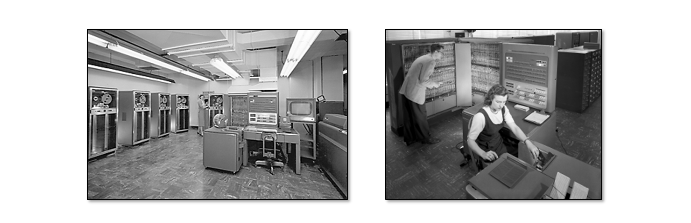
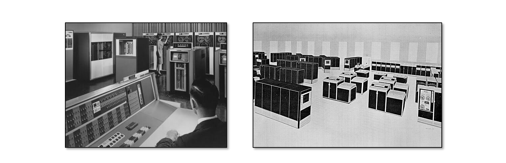

# Sistemas operacionales

<code>Fundamentos de sistemas operativos</code>

Creado por <code>Giancarlo Ortiz</code> para explicar los fundamentos de los <code>Sistemas operativos</code>

## Agenda
1. [Primera generación](#1-primera-generación).
1. [Segunda generación](#2-segunda-generación).
1. [Tercera generación](#3-tercera-generación).
1. [Cuarta generación](#4-cuarta-generación).

---
# 1. Primera generación
* Después de [1950][1_0].
* Enfoque típico en la implementación de [sistemas embebidos][1_1].
* Aparece un cargador de programas o [monitor residente][1_2].
* Aparece el [cargador de arranque][1_3].
* Procesamiento [por lotes][1_4] en un [ciclo continuo][1_5].
* Necesario un temporizador o [perro guardian][1_6].
* Se introduce el [buffering][1_7] para almacenamiento temporal.
* Programación en [lenguaje ensamblador][1_8].
* Ejecución en [tiempo real][1_9].

# 1.1. Ejemplos de primera generación
* __1951:__ [EDSAC][11_1] - construido en [Cambridge][11_2].    
* __1955:__ [UNIVAC][11_3] - construido por [Remington][11_4].
* __1955:__ [IBM-701][11_5] - construido por [GM][11_6].
* __1956:__ [__GM-NAA I/O__][11_7] - por [GM][11_6] para [IBM-704][11_8].
* __1957:__ [BESYS][11_9] - por [Bell Labs][11_10] para [IBM-704][11_8].
* __1959:__ [SOS][11_11] - por [Share User Group][11_12] para [IBM-704][11_8].

# 1.2. Caso de estudio - GM-NAA I/O
* Desarrollado en 1956.
* Financiado por _General Motors Research Laboratories_.
* Desarrollado para [__IBM-704__][11_8] de 36 Bit.
* Basado en el sistema monitor del _IBM 701_.
* Programado en	_lenguaje ensamblador_.
* La función principal era el _monitor residente_.
* Ejecutaba automáticamente un nuevo programa cada vez que  otro terminaba.

# 2. Segunda generación
* Después de [1960][2_0] apoyados en [CI][2_1].
* Enfocado en [mainframes][2_2]. 
* Mas de un programa disponible o [multi-programación][2_3].
* Diseño de [transferencia de control][2_4] y [cambio de contexto][2_5]
* Arquitecturas [multi-procesador][2_6].
* Se introduce el [spooling][2_7] para operación asíncrona.
* Programación en [lenguajes de bajo nivel][2_8].
* Ejecución en [tiempo compartido][2_9].

# 2.1. Ejemplos de segunda generación
* __1962:__ [GECOS][21_1] - construido por [GE][21_2].
* __1963:__ [CTSS][21_3] - construido en [MIT][21_4].  
* __1965:__ [__Multics__][21_5] - en el [MIT][21_4] por [GE][21_2] y [Bell Labs][11_10].
* __1965:__ [DECsys][21_6] - construido por [DEC][21_7] para [PDP-7][21_8]. 
* __1966:__ [OS/360][21_9] - construido por [IBM][21_11] para [S/360][21_12]. 
* __1966:__ [DOS/360][21_10] - construido por [IBM][21_11] para [S/360][21_12].

# 2.2. Dominio de IBM en los Mainframes
* [IBM suministró mainframes][22_0] desde 1952.
* Domino el mercado con su plataforma [S/360][21_12].
* Eventualmente [suministró a sus clientes SO][22_1] según características.
* Suministró [OS/360 y sucesores][22_2] para los [S/360][21_12] mas grandes.
* Suministró [DOS/360 y sucesores][22_3] para los [S/360][21_12] mas pequeños.

# 2.3. Caso de estudio - Multics
* Desarrollado en el [MIT][21_4] desde 1965.
* Financiado por _GM_ y _Bell Labs_.
* Desarrollado para la [__GE-645__][23_0] de 36 Bit.
* Basado en el sistema monitor del _IBM 701_.
* Programado en	[PL/1][23_1] de _IBM_.
* Agrego [__muchas ideas nuevas y valiosas__][23_2].
* Incluía sistema de archivos Jerárquico, ACLs, pilas, Enlace dinámico.

# 3. Tercera generación
* Después de [1970][3_0].
* Enfocado en [mainframes][2_2] y [computadoras personales][3_1].
* Diseño del sistema por [módulos][3_2].
* Sistemas de multiples [modos de operación][3_3].
* Sistemas [multi-usuario][3_4].
* Listas de [control de acceso][3_5].
* Problemas de [rendimiento][3_6] y baja estandarización.
* Programación [lenguajes de medio nivel][2_7] compilados.

# 3.1. Ejemplos de tercera generación
* __1970:__ [Unics][31_1] - por [Thompson][31_2] y [Ritchie][31_3] para [PDP-7][21_8].
* __1971:__ [OS/8][31_4] - construido por [DEC][21_7] para [PDP-8][31_5].
* __1973:__ [RT-11][31_6] - construido por [DEC][21_7] para [PDP-11][31_7].
* __1973:__ [Alto OS][31_8] - construido por [Xerox][21_7] para [Xerox Alto][31_2].
* __1975:__ [__Unix__][31_1] - construido por [DEC][21_7] para [PDP-8][31_2].

Alto OS
CP/M

(later Unix) (AT&T, initially on DEC computers)

[3_6]:https://es.wikipedia.org/wiki/Rendimiento_del_equipo

[23_2]:http://web.mit.edu/Saltzer/www/multics.html
[31_1]:https://en.wikipedia.org/wiki/Unix
[31_2]:https://es.wikipedia.org/wiki/Ken_Thompson
[31_3]:https://es.wikipedia.org/wiki/Dennis_Ritchie
[31_4]:https://en.wikipedia.org/wiki/OS/8
[31_5]:https://es.wikipedia.org/wiki/PDP-8
[31_6]:https://es.wikipedia.org/wiki/RT-11
[31_7]:https://es.wikipedia.org/wiki/PDP-11

[31_2]:
[31_2]:https://en.wikipedia.org/wiki/PARC_(company)#
[31_2]:https://es.wikipedia.org/wiki/Xerox_Alto

# 3.2. Caso de estudio - CP/M
* Desarrollado en 1956 por _General Motors Research Laboratories_.
* Desarrollado para [__IBM-704__][11_8] de 36 Bit.
* Basado en el sistema monitor del _IBM 701_.
* Programado en	_lenguaje ensamblador_.
* La función principal era el _monitor residente_.
* Ejecutaba automáticamente un nuevo programa cada vez que  otro terminaba.

# 4. Cuarta generación
* Después de [1980][4_0] apoyados en [LSI][4_1].
* Shell interactivo GUI.
* Gestores de ventanas.
* Gestión de redes y procesamiento distribuido.
* interfaces de programación estándar.
* Programación en C y otros [lenguajes de medio nivel][36].

# 4.1. Caso de estudio - Unix
* Desarrollado en 1956 por _General Motors Research Laboratories_.
* Desarrollado para [__IBM-704__][11_8] de 36 Bit.
* Basado en el sistema monitor del _IBM 701_.
* Programado en	_lenguaje ensamblador_.
* La función principal era el _monitor residente_.
* Ejecutaba automáticamente un nuevo programa cada vez que  otro terminaba.

---
* Procesamiento [por lotes][22] en un [ciclo continuo][23].
* Hoy típico de [sistemas embebidos][26].
* Necesario un temporizador o [perro guardian][29].

[1_0]:https://es.wikipedia.org/wiki/Categor%C3%ADa:Ordenadores_de_la_d%C3%A9cada_de_1950
[1_1]:https://es.wikipedia.org/wiki/Sistema_embebido
[1_2]:https://es.wikipedia.org/wiki/Monitor_residente
[1_3]:https://es.wikipedia.org/wiki/Cargador_de_arranque
[1_4]:https://es.wikipedia.org/wiki/Procesamiento_por_lotes
[1_5]:https://es.wikipedia.org/wiki/Bucle_(programaci%C3%B3n)#
[1_6]:https://es.wikipedia.org/wiki/Perro_guardi%C3%A1n_(electr%C3%B3nica)#
[1_7]:https://es.wikipedia.org/wiki/B%C3%BAfer_de_datos
[1_8]:https://es.wikipedia.org/wiki/Lenguaje_ensamblador
[1_9]:https://es.wikipedia.org/wiki/Tiempo_real
[11_1]:https://es.wikipedia.org/wiki/EDSAC
[11_2]:https://es.wikipedia.org/wiki/Universidad_de_Cambridge
[11_3]:https://es.wikipedia.org/wiki/UNIVAC_1103
[11_4]:https://es.wikipedia.org/wiki/Remington_Rand
[11_5]:https://es.wikipedia.org/wiki/IBM_701
[11_6]:https://es.wikipedia.org/wiki/General_Motors
[11_7]:https://es.wikipedia.org/wiki/GM-NAA_I/O
[11_8]:https://es.wikipedia.org/wiki/IBM_704
[11_9]:https://en.wikipedia.org/wiki/BESYS
[11_10]:https://es.wikipedia.org/wiki/Bell_Labs
[11_11]:https://es.wikipedia.org/wiki/SHARE_Operating_System
[11_12]:https://en.wikipedia.org/wiki/SHARE_(computing)#

[2_0]:https://es.wikipedia.org/wiki/Categor%C3%ADa:Ordenadores_de_la_d%C3%A9cada_de_1960
[2_1]:https://es.wikipedia.org/wiki/Circuito_integrado
[2_2]:https://es.wikipedia.org/wiki/Unidad_central
[2_3]:https://es.wikipedia.org/wiki/Multiprogramaci%C3%B3n
[2_4]:https://es.wikipedia.org/wiki/Estructuras_de_control#Transferencia_de_control
[2_5]:https://es.wikipedia.org/wiki/Cambio_de_contexto
[2_6]:https://es.wikipedia.org/wiki/Multiprocesador
[2_7]:https://es.wikipedia.org/wiki/Spooling
[2_8]:https://es.wikipedia.org/wiki/Lenguaje_de_bajo_nivel
[2_9]:https://es.wikipedia.org/wiki/Tiempo_compartido_(inform%C3%A1tica)#
[21_1]:https://es.wikipedia.org/wiki/GCOS
[21_2]:https://es.wikipedia.org/wiki/General_Electric
[21_3]:https://es.wikipedia.org/wiki/Compatible_Time-Sharing_System
[21_4]:https://es.wikipedia.org/wiki/Instituto_de_Tecnolog%C3%ADa_de_Massachusetts
[21_5]:https://es.wikipedia.org/wiki/Multics
[21_6]:https://en.wikipedia.org/wiki/PDP-7#Software
[21_7]:https://es.wikipedia.org/wiki/Digital_Equipment_Corporation
[21_8]:https://es.wikipedia.org/wiki/PDP-7
[21_9]:https://es.wikipedia.org/wiki/OS/360
[21_10]:https://es.wikipedia.org/wiki/OS/360
[21_11]:https://es.wikipedia.org/wiki/IBM
[21_12]:https://es.wikipedia.org/wiki/IBM_S/360
[22_0]:https://es.wikipedia.org/wiki/Sistema_IBM_de_gran_porte_(mainframe)#
[22_1]:https://en.wikipedia.org/wiki/History_of_IBM_mainframe_operating_systems
[22_2]:https://en.wikipedia.org/wiki/DOS/360_and_successors
[22_3]:https://en.wikipedia.org/wiki/OS/360_and_successors
[23_0]:https://es.wikipedia.org/wiki/Serie_GE-600
[23_1]:https://es.wikipedia.org/wiki/PL/1

[3_0]:https://es.wikipedia.org/wiki/Anexo:Cronolog%C3%ADa_de_los_sistemas_operativos#1970
[3_1]:https://es.wikipedia.org/wiki/Computadora_personal
[3_2]:https://es.wikipedia.org/wiki/Programaci%C3%B3n_modular
[3_3]:-
[3_4]:https://es.wikipedia.org/wiki/Multiusuario
[3_5]:https://es.wikipedia.org/wiki/ACL
[3_6]:-
---
[11_]:https://es.wikipedia.org/wiki/Cargador_de_arranque
[26]:https://es.wikipedia.org/wiki/Sistema_embebido
[29]:https://es.wikipedia.org/wiki/Perro_guardi%C3%A1n_(electr%C3%B3nica)#

---
## Mas Recursos
- [Calidad de software](https://es.wikipedia.org/wiki/Calidad_de_software) (Wikipedia)
- [Sistema operativo](https://es.wikipedia.org/wiki/Sistema_operativo) (Wikipedia)
- [Comparación de sistemas operativos](https://es.wikipedia.org/wiki/Anexo:Comparaci%C3%B3n_de_sistemas_operativos) (Wikipedia)
- [Usage share of operating systems](https://en.wikipedia.org/wiki/Usage_share_of_operating_systems) (Wikipedia)