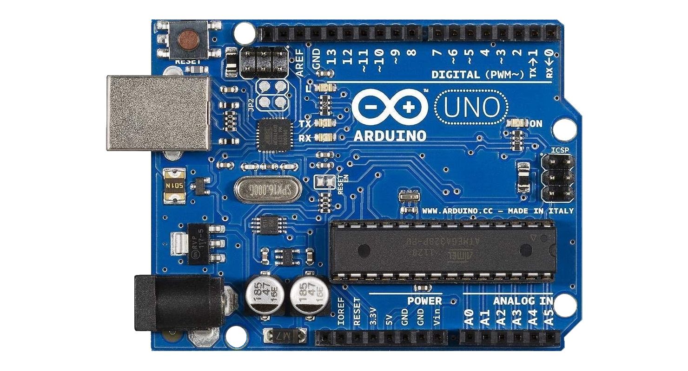

# Sistemas operacionales

<code>Fundamentos de sistemas operativos</code>

Creado por <code>Giancarlo Ortiz</code> para explicar los fundamentos de los <code>Sistemas operativos</code>

## Agenda
1. Antecedentes.
1. Primera generación.
1. Segunda generación.
1. Tercera generación.
1. Cuarta generación.

---
# 1. Antecedentes
* Interacción directa de los [programas][11] y el hardware.
* Procesamiento [ciclo continuo][12].
* Típico de [sistemas embebidos][13].
* Programación en [lenguaje Ensamblador][14].
* Ejecución en [Tiempo Real][15].
* Necesario un gestor de [carga y arranque][16].
* Necesario un temporizador o [perro guardian][17].

[11]:https://es.wikipedia.org/wiki/Programa_inform%C3%A1tico
[12]:https://es.wikipedia.org/wiki/Bucle_(programaci%C3%B3n)#
[13]:https://es.wikipedia.org/wiki/Sistema_embebido
[14]:https://es.wikipedia.org/wiki/Lenguaje_ensamblador
[15]:https://es.wikipedia.org/wiki/Tiempo_real
[16]:https://es.wikipedia.org/wiki/Cargador_de_arranque
[17]:https://es.wikipedia.org/wiki/Perro_guardi%C3%A1n_(electr%C3%B3nica)#

## 1.1. Caso de estudio - Arduino

<table>
	<tr >
	    <td rowspan="9">  </td>
	    <td colspan="2" style="text-align: center;">
            <a href="https://es.wikipedia.org/wiki/Arduino_Uno">
                <b>Arduino UNO</b>
            </a>
        </td>
	</tr>
    <tr >
	    <td>Procesador:</td>
	    <td><a href="https://es.wikipedia.org/wiki/Atmega328">ATmega328</a> </td>
	</tr>
    <tr >
	    <td>Velocidad:</td>
	    <td>16 Mhz</td>
	</tr>
    <tr >
	    <td>Memoria principal:</td>
	    <td>2 KB 
            <a href="https://es.wikipedia.org/wiki/SRAM">SRAM</a>
        </td>
	</tr>
    <tr >
	    <td>Memoria programa:</td>
	    <td>32 KB 
            <a href="https://es.wikipedia.org/wiki/Memoria_flash">Flash</a>
        </td>
	</tr>
    <tr >
	    <td>Voltaje:</td>
	    <td>5 V</td>
	</tr>
        <tr >
	    <td>Potencia:</td>
	    <td>100 mW</td>
	</tr>
    <tr >
	    <td>Comunicación:</td>
	    <td><small>
            <a href="https://es.wikipedia.org/wiki/Universal_Serial_Bus">USB</a> -
            <a href="https://es.wikipedia.org/wiki/Universal_Asynchronous_Receiver-Transmitter">UART</a>
            <a href="https://es.wikipedia.org/wiki/Serial_Peripheral_Interface">SPI</a> -
            <a href="https://es.wikipedia.org/wiki/I%C2%B2C">I²C</a></small>
        </td>
	</tr>
</table>

## 1.1.1 Arquitectura Arduino

## 1.1.2 flujo de programación 

## 1.1.3 flujo de ejecución 

## 1.1.3 Memoria

flow ota program
arquitectura 

## 1.2. Componentes en un SI
* __Usuarios:__ personas que desarrollan, mantienen y utilizan el sistema.
* __Infraestructura:__ la red que permite compartir la información y los recursos entre dispositivos.
* [__Software:__][11] procedimientos lógicos utilizados para transformar y extraer información.
* [__Hardware:__][12] equipo físico utilizado para procesar y almacenar la información.
* __Datos:__ representación de la información.

[11]:https://es.wikipedia.org/wiki/Software
[12]:https://es.wikipedia.org/wiki/Hardware

## 1.3. Capas en un SI

# 2. Sistema de procesamiento digital
Es una maquina que se puede programar para realizar secuencias e operaciones lógicas o aritméticas, que organizadas convenientemente permiten realizar tareas de complejidad cada ves mayor.

[__Hardware:__][12]
* Componentes procesamiento.
* Componentes de almacenamiento.
* Componentes de control.

[__Software:__][11]
* Sistema operativo.
* Utilidades.
* Aplicaciones.

## 2.1. Estructura del hardware - Teoría de autómatas

### 2.1.1. Elementos de procesamiento un sistema digital
* [__CPU:__][13] Unidad central de procesamiento.
* [__FPU:__][14] Unidad de coma flotante.
* [__ALU:__][15] Unidad aritmético lógica.
* [__DSP:__][16] Unidad de procesamiento de señales.

[13]:https://es.wikipedia.org/wiki/Unidad_central_de_procesamiento
[14]:https://es.wikipedia.org/wiki/Unidad_de_coma_flotante
[15]:https://es.wikipedia.org/wiki/Unidad_aritm%C3%A9tica_l%C3%B3gica
[16]:https://es.wikipedia.org/wiki/Procesador_de_se%C3%B1ales_digitales

### 2.1.2. Elementos de almacenamiento en un sistema digital
* [__HDD__][171]/[__SSD:__][172] Memoria persistente
* [__MM:__][18] Memoria principal
* [__L1/L2/L3:__][19] Cache
* [__GPR:__][20] Registros

[171]:https://es.wikipedia.org/wiki/Unidad_de_disco_duro
[172]:https://es.wikipedia.org/wiki/Unidad_de_estado_s%C3%B3lido
[18]:https://es.wikipedia.org/wiki/Memoria_principal
[19]:https://es.wikipedia.org/wiki/Cach%C3%A9_(inform%C3%A1tica)#
[20]:https://es.wikipedia.org/wiki/Registro_(hardware)#

### 2.1.3. Elementos de control en un sistema digital
* [__Chipset:__][20] Registros
* [__Firmware:__][20]

## 2.2. Periféricos
Dispositivos auxiliares e independientes que se encuentran conectados por una interface al hardware interno de un sistema de procesamiento digital.

* ><i>"La única forma de aprender un nuevo lenguaje de programación es escribir programas en él."</i> 
<cite style="display:block; text-align: right">[Dennis Ritchie](https://es.wikipedia.org/wiki/Dennis_Ritchie)</cite>

## 2.3. Estructura del software - Teoría del núcleo

### 2.3.1. Elementos de software se un sistema digital
* [__Scheduler:__][21] Planificador de tareas 
* [__Driver:__][22] Controladores de dispositivo
* [__Library:__][23] Bibliotecas
* [__Shell:__][24] Interpretes de comandos
* [__API:__][25] Interfaces de programación

[21]:https://es.wikipedia.org/wiki/Planificador
[22]:https://es.wikipedia.org/wiki/Controlador_de_dispositivo
[23]:https://es.wikipedia.org/wiki/Biblioteca_(inform%C3%A1tica)#
[24]:https://en.wikipedia.org/wiki/Shell_(computing)#
[25]:https://es.wikipedia.org/wiki/Interfaz_de_programaci%C3%B3n_de_aplicaciones

### 2.3.2. Utilidades en un sistema digital
* [__Assembler:__][26] Ensambladores
* [__Compiler:__][27] Compiladores
* [__Linker:__][28] Enlazadores
* [__Interpreter:__][29] Interpretes

[26]:https://es.wikipedia.org/wiki/Ensamblador
[27]:https://es.wikipedia.org/wiki/Compilador
[28]:https://es.wikipedia.org/wiki/Enlazador
[29]:https://es.wikipedia.org/wiki/Int%C3%A9rprete_(inform%C3%A1tica)#

### 2.3.3. Aplicaciones en un sistema digital
| Tipo | Propietario | Libre |
|--|--:|:--|
| Procesador de Textos | [Word][31] | Writer - Words |
| Hoja de Calculo | Excel | [Calc][32] - Sheets |
| Presentaciones | [PowerPoint][33] | Stage |
| Sistemas de gestión DB | Access | Base - [Kexi][34] |
| Dibujo Vectorial | [Corel Draw][35] | Inkscape - Karbon |
| Edición de imágenes| Photoshop | Gimp - [Krita][36] |

[31]:https://es.wikipedia.org/wiki/Microsoft_Word
[32]:https://es.wikipedia.org/wiki/LibreOffice_Calc
[33]:https://es.wikipedia.org/wiki/Microsoft_PowerPoint
[34]:https://en.wikipedia.org/wiki/Kexi
[35]:https://es.wikipedia.org/wiki/CorelDRAW
[36]:https://es.wikipedia.org/wiki/Krita

# 3. Sistemas Operativos
 Es una colección de software que administra los recursos del sistema proporcionando servicios comunes para otros programas de la computadora.

* ><i>"Un concepto clave en todos los sistemas operativos es el de proceso. Un proceso es básicamente un programa en ejecución."</i> 
<cite style="display:block; text-align: right">[Andrew Tanenbaum](https://es.wikipedia.org/wiki/Andrew_S._Tanenbaum)</cite>

## 3.1 Otras definiciones para SO
* El software y/o firmware que hace utilizable al hardware __(Deitel, 2004)__. [[1]][311]
* Es un programa que controla la ejecución de los programas de aplicación y que actúa como interfaz entre las aplicaciones de usuarios y el hardware __(Satllings, 2017)__. [[2]][312]
* Es un programa que actúa como intermediario entre el usuario y el hardware. El primer objetivo es la comodidad, el segundo la eficiencia __(Silberschatz, 2021)__. [[3]][313]
* Es un programa que tiene encomendada una serie de funciones diferentes cuyo objetivo es simplificar el manejo y utilización de la computadora; haciéndolo seguro y eficiente __(Carballeira, 2021)__. [[4]][314]

---
<small>[1]: [Deitel, H. M., Deitel, P. J., & Choffnes, D. R. (2004). Operating systems. Pearson/Prentice Hall.][311]
[2]: [Stallings, W. (2017). Operating systems: Internals and design principles (9th ed.). Pearson Education.][312]
[3]: [Silberschatz, A., Galvin, P. B., & Gagne, G. (2021). Operating System Concepts (10th ed.). John Wiley & Sons.][313]
[4]: [Garcia Carballeira, F., Perez Costoya, F., & Carretero Perez, J. (2021). Sistemas Operativos: Una Vision Aplicada. 3 Ed.: Volumen I. Independently Published.][314]
</small>

[311]:https://www.amazon.com/-/es/Harvey-M-Deitel/dp/0131828274
[312]:https://www.amazon.com/-/es/William-Stallings/dp/0134670957
[313]:https://www.amazon.com/-/es/Abraham-Silberschatz/dp/1119800366
[314]:https://www.amazon.com/-/es/Abraham-Silberschatz/dp/1119800366

## 3.2 Objetivos SO
* [__Comodidad:__][321] Funcionar como una interfaz entre el usuario y el hardware facilitando su aprovechamiento.
* [__Eficiencia:__][322] Administrar los recursos físicos y lógicos del sistema informático de forma eficiente.
* [__Capacidad de evolución:__][323] Permitir la introducción de nuevas características al sistema sin afectar la experiencia.

[321]:https://es.wikipedia.org/wiki/Experiencia_de_usuario
[322]:https://es.wikipedia.org/wiki/Eficiencia_algor%C3%ADtmica
[323]:https://es.wikipedia.org/wiki/Escalabilidad

## 3.3 Funciones SO
* Asignar recursos a los usuarios y programas.
* Recuperar los recursos asignados y desocupados.
* Permitir el dialogo interactivo de los usuarios con el sistema.
* Asegurar la confidencialidad de la información.
* Garantizar que los programas no interfieran entre sí.
* Detectar y tratar errores.
* Llevar historial de uso.

## 3.4 Calidad SO
* Son aplicables los principios de la [calidad del software][341] 
* Modelo [ISO/IEC 25000][342]

[341]:https://es.wikipedia.org/wiki/Calidad_de_software
[342]:https://es.wikipedia.org/wiki/ISO/IEC_25000

# 3.5. Ejemplos
* [__Unix:__][351] programado en C de los [laboratorios Bell][351_1].
* [__Windows:__][352] programado en C, C++ de [Microsoft][352_1].
* [__macOS:__][353] programado en C, Objetive-C de [Apple][353_1].
* [__Ubuntu:__][354] programado en C, C++ de [Canonical][354_1].
* [__Android:__][355] programado en C, Java de [Google][355_1].
* [__FreeRTOS:__][356] programado en C de [AWS][356_1].

[351]:https://es.wikipedia.org/wiki/Unix
[352]:https://es.wikipedia.org/wiki/Microsoft_Windows
[353]:https://es.wikipedia.org/wiki/MacOS
[354]:https://es.wikipedia.org/wiki/Ubuntu
[355]:https://es.wikipedia.org/wiki/Android
[356]:https://en.wikipedia.org/wiki/FreeRTOS

[351_1]:https://es.wikipedia.org/wiki/Bell_Labs
[352_1]:https://es.wikipedia.org/wiki/Microsoft_Windows
[353_1]:https://es.wikipedia.org/wiki/Apple
[354_1]:https://es.wikipedia.org/wiki/Canonical
[355_1]:https://es.wikipedia.org/wiki/Google
[356_1]:https://es.wikipedia.org/wiki/Amazon_Web_Services

---
## Mas Recursos
- [Calidad de software](https://es.wikipedia.org/wiki/Calidad_de_software) (Wikipedia)
- [Sistema operativo](https://es.wikipedia.org/wiki/Sistema_operativo) (Wikipedia)
- [Comparación de sistemas operativos](https://es.wikipedia.org/wiki/Anexo:Comparaci%C3%B3n_de_sistemas_operativos) (Wikipedia)
- [Usage share of operating systems](https://en.wikipedia.org/wiki/Usage_share_of_operating_systems) (Wikipedia)