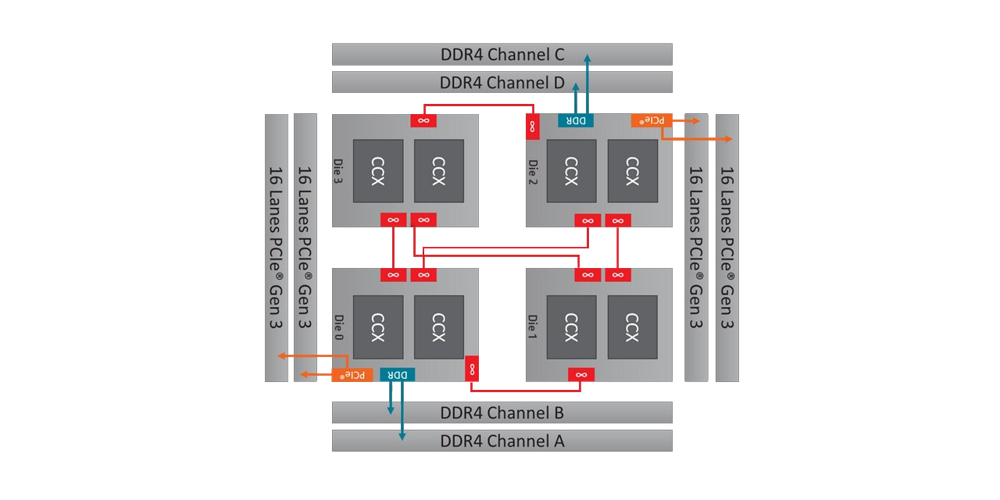

# Sistemas operacionales
<p><code>Fundamentos de sistemas operativos</code></p>
<p>Creado por <code>Giancarlo Ortiz</code> para explicar los fundamentos de los <code>Sistemas operativos</code></p>

## Estructura
Un SO es complejo y solo puede entenderse dividiendo su operación en piezas funcionales mas pequeñas, definiendo cuidadosamente entradas, salidas de cada proceso.

## Agenda
1. [Multi-tarea](#1-multi-tarea).
1. [Jerarquía de Memoria](#2-jerarquía-de-memoria).
1. [Protección de memoria](#3-protección-de-memoria).
1. [Persistencia de datos](#4-persistencia).

<br>

---
# 1. Multi-tarea
La [multi-tarea][1_0] es la característica de los SO que permite que varios procesos o aplicaciones se ejecuten aparentemente al mismo tiempo, compartiendo uno o más procesadores.

* ><i>"Al aumentar nuestra capacidad de obtener, procesar y distribuir información, la demanda de procesamiento de información cada vez más complejo crece incluso con más celeridad."</i><br>
<cite style="display:block; text-align: right">[Andrew S. Tanenbaum](https://es.wikipedia.org/wiki/Andrew_S._Tanenbaum)</cite>

[1_0]:https://es.wikipedia.org/wiki/Multitarea


# 1.1. Requisitos mínimos
* Gestión del hardware.
* Permitir seleccionar entre tareas listas para ejecutar.
* Decidir que procesos pueden interrumpir la ejecución de tareas.
* Asignar memoria a las tareas que lo demandan.
* Permitir acceso a los dispositivos a aquellas tareas que lo requieren.


## 1.2. Gestión del hardware
* [Gestor de dispositivos (entrada/salida)][12_1].
* [Gestor de memoria][12_2].
* [Gestor de procesamiento][12_3]. 

[12_1]:https://es.wikipedia.org/wiki/Arquitectura_del_sistema_de_E/S
[12_2]:https://es.wikipedia.org/wiki/Gesti%C3%B3n_de_memoria
[12_3]:https://es.wikipedia.org/wiki/Proceso_(inform%C3%A1tica)#


## 1.3. Diagrama de estados


## 1.4. Componentes relacionados
* [__Scheduler:__][14_1] Planificador de tareas.
* [__Driver:__][14_2] Controladores de dispositivo.
* [__MMU:__][14_3] Unidad de gestión de memoria.
* [__PCB:__][14_4] Bloque de control del proceso.
* [__SMP:__][14_5] Multi-procesamiento simétrico.

[14_1]:https://es.wikipedia.org/wiki/Planificador
[14_2]:https://es.wikipedia.org/wiki/Controlador_de_dispositivo
[14_3]:https://es.wikipedia.org/wiki/Unidad_de_gesti%C3%B3n_de_memoria
[14_4]:https://es.wikipedia.org/wiki/Bloque_de_control_del_proceso
[14_5]:https://es.wikipedia.org/wiki/Multiprocesamiento_sim%C3%A9trico


## 1.5. Maquina Extendida


# 2. Jerarquía de memoria
La [jerarquía de memoria][2_0] es la organización piramidal de la memoria en niveles de acceso para optimizar el rendimiento y el costo basándose en el principio de cercanía de referencias.

* ><i>"Una buena ingeniería de software requiere la diferenciación entre la especificación y la implementación."</i><br>
<cite style="display:block; text-align: right">[Andrew S. Tanenbaum](https://es.wikipedia.org/wiki/Andrew_S._Tanenbaum)</cite>

[2_0]:https://es.wikipedia.org/wiki/Jerarqu%C3%ADa_de_memoria


## 2.1. Capacidad vs Costo


## 2.2. Componentes relacionados
* [__Coherence:__][22_1] Coherencia de la memoria.
* [__Multi-channel:__][22_6] Arquitectura de memoria multi-canal.
* [__Cluster:__][22_5] Clúster de computadoras.
* [__NUMA:__][22_2] Acceso a memoria no uniforme.
* [__DSM:__][22_3] Memoria distribuida compartida.
* [__DBCC:__][22_4] Coherencia de caché basada en directorios.

[22_1]:https://en.wikipedia.org/wiki/Memory_coherence
[22_2]:https://es.wikipedia.org/wiki/NUMA
[22_3]:https://es.wikipedia.org/wiki/Distributed_Shared_Memory
[22_4]:https://es.wikipedia.org/wiki/Coherencia_de_cach%C3%A9
[22_5]:https://en.wikipedia.org/wiki/Computer_cluster
[22_6]:https://en.wikipedia.org/wiki/Multi-channel_memory_architecture


## 2.3. Caso de uso - [Epyc 73F3][23_1]


[23_1]:https://en.wikipedia.org/wiki/Epyc

<small>Paper: 
1: [Kochhar, G.(2018). AMD EPYC: estudio de rendimiento en STREAM, HPL, InfiniBand y WRF, Dell Technologies](https://www.dell.com/support/kbdoc/es-co/000143393/amd-epyc-stream-hpl-infiniband-and-wrf-performance-study)
2: [Kennedy. P. (2019). Why AMD EPYC Rome 2P Will Have 128-160 PCIe Gen4 Lanes and a Bonus. ServeTheHome](https://www.servethehome.com/why-amd-epyc-rome-2p-will-have-128-160-pcie-gen4-lanes-and-a-bonus/)
3: [. Cutress, I. (2021). AMD 3rd Gen EPYC Milan Review: A Peak vs Per Core Performance Balance. Anandtech](https://www.anandtech.com/show/16529/amd-epyc-milan-review/4)
</small>


# 3. Protección de memoria
La [protección de memoria][3_0] es un método para controlar que las tareas que se ejecutan en multi-tarea no interfieran entre si evitando que un proceso acceda a la memoria que no le ha sido asignada.

* ><i>"Si necesitas más de tres niveles de indentación, estás totalmente jodido, y deberías organizar tu programa."</i><br><cite style="display:block; text-align: right">
[Linus Torvalds](https://es.wikipedia.org/wiki/Linus_Torvalds)</cite>

[3_0]:https://es.wikipedia.org/wiki/Protecci%C3%B3n_de_memoria


## 3.1. Características
* Abreviado como P-Mode.
* Es un modo operacional de las CPUs modernas.
* Segmenta la memoria en paginas antes de asignarlas a un proceso.
* Oculta las direcciones físicas o reales en tablas de direcciones.
* Implementa un sistema de memoria virtual.
* Asigna un espacio de memoria a cada proceso.


## 3.2. Componentes relacionados
* [__Microprocessor modes:__][32_1] Modos de funcionamiento del procesador.
* [__Virtual memory:__][32_2] Memoria virtual.
* [__Memory paging:__][32_3] Paginación de memoria.
* [__Pre-emptive multitasking:__][32_4] Multi-tarea preferente.

[32_1]:https://es.wikipedia.org/wiki/Modos_de_operaci%C3%B3n_de_la_unidad_central_de_procesamiento
[32_2]:https://es.wikipedia.org/wiki/Memoria_virtual
[32_3]:https://es.wikipedia.org/wiki/Paginaci%C3%B3n_de_memoria
[32_4]:https://es.wikipedia.org/wiki/Multitarea_apropiativa


## 3.3. Llamadas al sistema


## 3.4. Paginación de memoria


# 4. la persistencia de datos
La [persistencia de datos][4_0] a nivel de aplicación es la capacidad para que los datos sobrevivan a la ejecución del programa que los ha creado. Sin esta capacidad, los datos solo existen en memoria RAM, y se pierden cuando la memoria pierde energía, como cuando se apaga el computador.

* ><i>"Al aumentar nuestra capacidad de obtener, procesar y distribuir información, la demanda de procesamiento de información cada vez más complejo crece incluso con más celeridad."</i><br><cite style="display:block; text-align: right">
[Andrew S. Tanenbaum](https://es.wikipedia.org/wiki/Andrew_S._Tanenbaum)</cite>

[4_0]:https://es.wikipedia.org/wiki/Persistencia_(inform%C3%A1tica)#


## 4.1. Características
* Almacenamiento secundario no volátil.
* Alta capacidad comparado con memoria principal.
* Baja velocidad comparado con memoria principal.


## 4.2. Tiempos de acceso
| Tipo |  [Ciclos de retardo][42_1] |
|---|---|
| [Cache L1][42_2] | 3-5 |
| [Cache L2][42_2] | 8-20 |
| [Cache L3][42_2] | 30-80 |
| [RAM][42_3] | 50+ |

[42_1]:https://en.wikipedia.org/wiki/Clock_rate
[42_2]:https://en.wikipedia.org/wiki/Cache_hierarchy
[42_3]:https://en.wikipedia.org/wiki/Random-access_memory


## 4.3. Diagrama de estados


## 4.4. Gestión del software
* Gestor de usuarios y permisos.
* Gestor de almacenamiento.
* Gestor de redes.




## 4.5. Usuarios y permisos.
* Crear, modificar y eliminar usuarios.
* Asignar roles a los usuarios.
* Asignar permisos a los roles y usuarios 


### 4.5.1. Algunos ejemplos 

| Comando |	Descripción |
|:---|:---|
| [useradd][man_1] | Agrega un nuevo usuario |
| [userdel][man_2] | Borra un usuario |
| [passwd][man_3]  | Permite cambiar la contraseña |
| [id][man_4] | Muestra identificación del usuario |
| [groupadd][man_5] | Agrega un nuevo grupo de trabajo |
| [groupdel][man_6] | Borra un grupo de trabajo |
| [adduser][man_7] | Agrega usuarios a un grupo |
| [deluser][man_8] | Elimina usuarios a un grupo |


# 4.6. Almacenamiento
* Agregar y eliminar dispositivos del sistema de archivos.
* Crear, leer, modificar y eliminar directorios.
* Crear, leer, modificar y eliminar archivos.
* Modificar propiedades de directorios y archivos.


## 4.6.1. Algunos ejemplos 

| Comando |	Descripción |
|---|---|
| [mount][man_9] | Monta un dispositivo almacenamiento |
| [umount][man_10] | Desmonta un dispositivo almacenamiento |
| [mkfs][man_11] | Da formato a un dispositivo |
| [mkdir][man_12] | Crea un directorio |
| [rmdir][man_13] | Borra directorios vacíos |
| [rm][man_14] | Borra archivos de un directorio |
| [cp][man_15] | Copia archivos entre directorios |
| [mv][man_16] | Mueve archivos y directorios |
| [find][man_17] | Busca archivos en un directorio |

[man_1]:http://www.polarhome.com/service/man/?qf=useradd&af=0&sf=0&of=Ubuntu&tf=2
[man_2]:http://www.polarhome.com/service/man/?qf=userdel&af=0&sf=0&of=Ubuntu&tf=2
[man_3]:http://www.polarhome.com/service/man/?qf=passwd&af=0&sf=0&of=Ubuntu&tf=2
[man_4]:http://www.polarhome.com/service/man/?qf=id&af=0&sf=0&of=Ubuntu&tf=2
[man_5]:http://www.polarhome.com/service/man/?qf=groupadd&af=0&sf=0&of=Ubuntu&tf=2
[man_6]:http://www.polarhome.com/service/man/?qf=groupdel&af=0&sf=0&of=Ubuntu&tf=2
[man_7]:http://www.polarhome.com/service/man/?qf=adduser&af=0&sf=0&of=Ubuntu&tf=2
[man_8]:http://www.polarhome.com/service/man/?qf=deluser&af=0&sf=0&of=Ubuntu&tf=2

[man_9]:http://www.polarhome.com/service/man/?qf=mount&af=0&sf=0&of=Ubuntu&tf=2
[man_10]:http://www.polarhome.com/service/man/?qf=umount&af=0&sf=0&of=Ubuntu&tf=2
[man_11]:http://www.polarhome.com/service/man/?qf=mkfs&af=0&sf=0&of=Ubuntu&tf=2
[man_12]:http://www.polarhome.com/service/man/?qf=mkdir&af=0&sf=0&of=Ubuntu&tf=2
[man_13]:http://www.polarhome.com/service/man/?qf=rmdir&af=0&sf=0&of=Ubuntu&tf=2
[man_14]:http://www.polarhome.com/service/man/?qf=rm&af=0&sf=0&of=Ubuntu&tf=2
[man_15]:http://www.polarhome.com/service/man/?qf=cp&af=0&sf=0&of=Ubuntu&tf=2
[man_16]:http://www.polarhome.com/service/man/?qf=mv&af=0&sf=0&of=Ubuntu&tf=2
[man_17]:http://www.polarhome.com/service/man/?qf=find&af=0&sf=0&of=Ubuntu&tf=2

### 1.2. Caso de uso
```ps
sudo useradd –g "operativos" –d /home/developer –m –s /bin/bash developer
sudo groupadd "operativos"
sudo useradd –g "operativos" –d /home/developer –m –s /bin/bash developer
nano /etc/passwd

adduser {{username}}

 - Create a new user with a default home directory and prompt the user to set a password:
   adduser {{username}}

 - Create a new user without a home directory:
   adduser --no-create-home {{username}}

 - Create a new user with a home directory at the specified path:
   adduser --home {{path/to/home}} {{username}}

 - Create a new user with the specified shell set as the login shell:
   adduser --shell {{path/to/shell}} {{username}}

 - Create a new user belonging to the specified group:
   adduser --ingroup {{group}} {{username}}


```


---
## Mas Recursos
- [Sistema operativo](https://es.wikipedia.org/wiki/Sistema_operativo) (Wikipedia)
- [Historia de los SO](https://es.wikipedia.org/wiki/Historia_de_los_sistemas_operativos) (Wikipedia)
- [Lista de SO](https://es.wikipedia.org/wiki/Anexo:Sistemas_operativos) (Wikipedia)
- [Cronología de los SO](https://es.wikipedia.org/wiki/Anexo:Cronolog%C3%ADa_de_los_sistemas_operativos) (Wikipedia)
- [Comparación de SO](https://es.wikipedia.org/wiki/Anexo:Comparaci%C3%B3n_de_sistemas_operativos) (Wikipedia)
- [Usage share of operating systems](https://en.wikipedia.org/wiki/Usage_share_of_operating_systems) (Wikipedia)