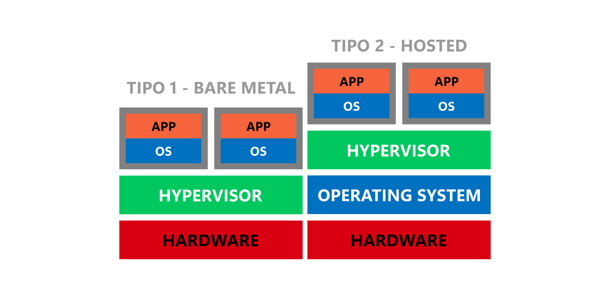

# Sistemas operacionales

<code>Fundamentos de sistemas operativos</code>

Creado por <code>Giancarlo Ortiz</code> para explicar los fundamentos de los <code>Sistemas operativos</code>

## Estructura
Un SO es complejo y solo puede entenderse dividiendo su operación en piezas funcionales mas pequeñas, definiendo cuidadosamente entradas, salidas de cada proceso.

## Agenda
1. [Virtualización](#1-virtualización).
1. [Contenerización](#2-contenerización).
1. [Simulación](#3-simulación).
1. [Emulación](#4-emulación).

 

---
# 1. Virtualización
La [virtualización][1_0] utiliza software para imitar las características de un componente de hardware en un sistema informático y crear un entorno virtual que provea una solución similar.

* ><i>"Siempre encuentro a la gente más inteligente que yo. Entonces mi trabajo es asegurarme de que la gente inteligente pueda trabajar junta. Y es que la gente estúpida puede trabajar junta fácilmente, la gente inteligente no."</i> 
<cite style="display:block; text-align: right">[Jack Ma](https://es.wikipedia.org/wiki/Jack_Ma)</cite>

[1_0]:https://es.wikipedia.org/wiki/Virtualizaci%C3%B3n

## 1.1. Tipos de virtualización
* Virtualización de plataforma
* Virtualización de recursos hardware
* Virtualización de entornos de ejecución
* Virtualización de red
* Virtualización de datos.

## 1.2. Maquinas virtuales
Un [hipervisor][11_0] (en inglés hypervisor) o monitor de máquina virtual (virtual machine monitor)1​ es una capa de software para realizar una virtualización de hardware que permite utilizar, al mismo tiempo, diferentes sistemas operativos (sin modificar o modificados, en el caso de paravirtualización) en una misma computadora.

* ><i>"Puedes tener la mejor tecnología, puedes tener el mejor modelo de negocio, pero si no sabes cómo contar tu historia; nada de eso importará. Nadie te verá."</i> 
<cite style="display:block; text-align: right">[Jeff Bezos](https://es.wikipedia.org/wiki/Jeff_Bezos)</cite>

[11_0]:https://es.wikipedia.org/wiki/Hipervisor

## 1.3. Hipervisor

# 2. Contenerización

# 3. Simulación

# 4. Emulación

---
## Mas Recursos
- [Sistema operativo](https://es.wikipedia.org/wiki/Sistema_operativo) (Wikipedia)
