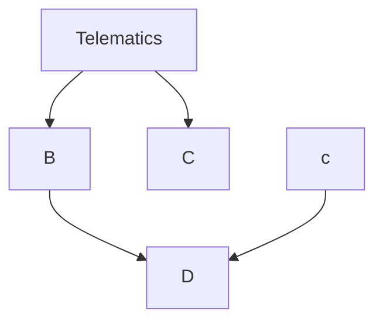

# Telematics
Udenar telematics repository

gantt
  title My Product Roadmap
  dateFormat  YYYY-MM-DD
  section Cool Feature
  A task           :a1, 2022-02-25, 30d
  Another task     :after a1, 20d
  section Rad Feature
  Task in sequence :2022-03-04, 12d
  Task, No. 2      :24d
