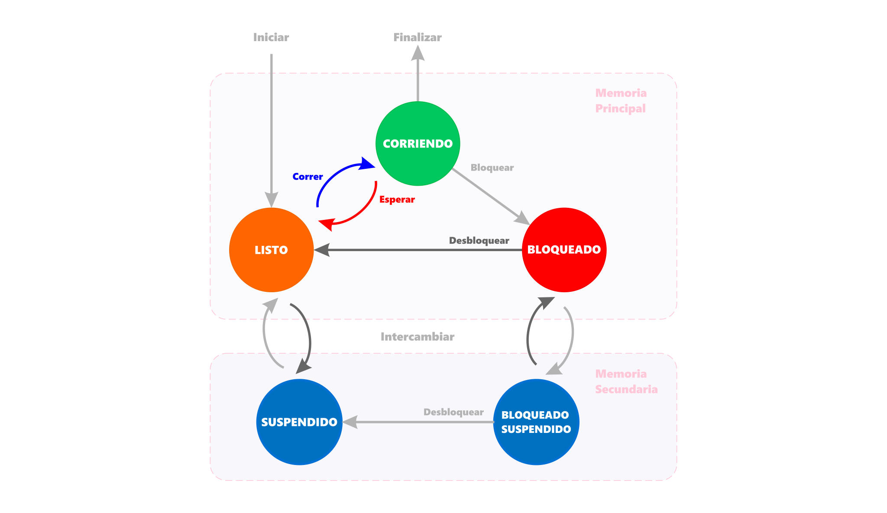
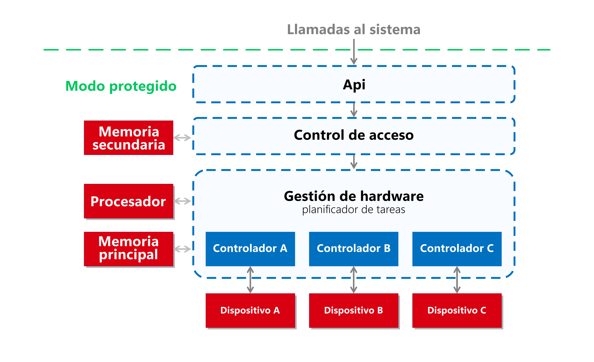

# Sistemas operacionales
<p><code>Fundamentos de sistemas operativos</code></p>
<p>Creado por <code>Giancarlo Ortiz</code> para explicar los fundamentos de los <code>Sistemas operativos</code></p>

## Estructura
Un SO es complejo y solo puede entenderse dividiendo su operación en piezas funcionales mas pequeñas, definiendo cuidadosamente entradas, salidas de cada proceso.

## Agenda
1. [Persistencia de datos](#1-persistencia-de-datos).
1. [Almacenamiento](#2-almacenamiento).
1. [Usuarios y permisos](#3-usuarios-y-permisos).

<br>

---
# 1. La persistencia de datos
La [persistencia de datos][1_0] a nivel de aplicación es la capacidad para que los datos sobrevivan a la ejecución del programa que los ha creado. Sin esta capacidad, los datos solo existen en memoria RAM, y se pierden cuando la memoria pierde energía, como cuando se apaga el computador.

* ><i>"Al aumentar nuestra capacidad de obtener, procesar y distribuir información, la demanda de procesamiento de información cada vez más complejo crece incluso con más celeridad."</i><br><cite style="display:block; text-align: right">
[Andrew S. Tanenbaum](https://es.wikipedia.org/wiki/Andrew_S._Tanenbaum)</cite>

[1_0]:https://es.wikipedia.org/wiki/Persistencia_(inform%C3%A1tica)#


## 1.1. Características
* Almacenamiento secundario no volátil.
* Alta capacidad comparado con memoria principal.
* Baja velocidad comparado con memoria principal.


### 1.1.1. Tiempos de acceso
| Tipo | [Ciclos de retardo][11_1] |
|---|---|
| [Cache L1][11_2] | 3-5 |
| [Cache L2][11_2] | 8-20 |
| [Cache L3][11_2] | 30-80 |
| [RAM][11_3] | 50+ |

[11_1]:https://en.wikipedia.org/wiki/Clock_rate
[11_2]:https://en.wikipedia.org/wiki/Cache_hierarchy
[11_3]:https://en.wikipedia.org/wiki/Random-access_memory


## 1.2. Gestión del software
* Gestor de usuarios y permisos.
* Gestor de almacenamiento.
* Gestor de redes.


## 1.3. Diagrama de estados



## 1.4. Componentes relacionados
* [__File system:__][14_1] Sistema de archivos.
* [__Access control:__][14_2] Lista de control de acceso.
* [__journaling file system:__][14_3] Sistema de seguimiento de archivos.
* [__Driver:__][14_4] Controladores de dispositivo.

[14_1]:https://es.wikipedia.org/wiki/Sistema_de_archivos
[14_2]:https://es.wikipedia.org/wiki/Lista_de_control_de_acceso
[14_3]:https://es.wikipedia.org/wiki/Journaling
[14_4]:https://es.wikipedia.org/wiki/Controlador_de_dispositivo


## 1.5. Maquina Extendida



# 2. Almacenamiento
* Agregar y eliminar dispositivos del sistema de archivos.
* Crear, leer, modificar y eliminar directorios.
* Crear, leer, modificar y eliminar archivos.
* Modificar propiedades de directorios y archivos.


## 2.1. Algunos ejemplos 

| Comando |	Descripción |
|---|---|
| [mount][man_9] | Monta un dispositivo almacenamiento |
| [umount][man_10] | Desmonta un dispositivo almacenamiento |
| [mkfs][man_11] | Da formato a un dispositivo |
| [mkdir][man_12] | Crea un directorio |
| [rmdir][man_13] | Borra directorios vacíos |
| [rm][man_14] | Borra archivos de un directorio |
| [cp][man_15] | Copia archivos entre directorios |
| [mv][man_16] | Mueve archivos y directorios |
| [find][man_17] | Busca archivos en un directorio |

[man_9]:http://www.polarhome.com/service/man/?qf=mount&af=0&sf=0&of=Ubuntu&tf=2
[man_10]:http://www.polarhome.com/service/man/?qf=umount&af=0&sf=0&of=Ubuntu&tf=2
[man_11]:http://www.polarhome.com/service/man/?qf=mkfs&af=0&sf=0&of=Ubuntu&tf=2
[man_12]:http://www.polarhome.com/service/man/?qf=mkdir&af=0&sf=0&of=Ubuntu&tf=2
[man_13]:http://www.polarhome.com/service/man/?qf=rmdir&af=0&sf=0&of=Ubuntu&tf=2
[man_14]:http://www.polarhome.com/service/man/?qf=rm&af=0&sf=0&of=Ubuntu&tf=2
[man_15]:http://www.polarhome.com/service/man/?qf=cp&af=0&sf=0&of=Ubuntu&tf=2
[man_16]:http://www.polarhome.com/service/man/?qf=mv&af=0&sf=0&of=Ubuntu&tf=2
[man_17]:http://www.polarhome.com/service/man/?qf=find&af=0&sf=0&of=Ubuntu&tf=2


### 2.2. Caso de uso 

```ps
# Mostrar todos los sistemas de archivos montados:
mount

# Montar un dispositivo en un directorio:
mount -t {{filesystem_type}} {{path/to/device_file}} {{path/to/target_directory}}

# Monte un dispositivo de solo lectura CD-ROM con el tipo de archivo ISO9660 en /cdrom:
mount -t {{iso9660}} -o ro {{/dev/cdrom}} {{/cdrom}}

# Monte todo el sistema de archivos definido en /etc/fstab:
mount -a

# Monte un sistema de archivos específico descrito en /etc/fstab 
# por ejemplo, /dev/sda1 /my_drive ext2 defaults 0 2):
mount {{/my_drive}}

# Montar un directorio en otro directorio:
mount --bind {{path/to/old_dir}} {{path/to/new_dir}}
```


# 3. Usuarios y permisos
* Crear, modificar y eliminar usuarios.
* Asignar roles a los usuarios.
* Asignar permisos a los roles y usuarios 


## 3.1. Algunos ejemplos 

| Comando |	Descripción |
|:---|:---|
| [useradd][man_1] | Agrega un nuevo usuario |
| [userdel][man_2] | Borra un usuario |
| [passwd][man_3]  | Permite cambiar la contraseña |
| [id][man_4] | Muestra identificación del usuario |
| [groupadd][man_5] | Agrega un nuevo grupo de trabajo |
| [groupdel][man_6] | Borra un grupo de trabajo |
| [adduser][man_7] | Agrega usuarios a un grupo |
| [deluser][man_8] | Elimina usuarios a un grupo |

[man_1]:http://www.polarhome.com/service/man/?qf=useradd&af=0&sf=0&of=Ubuntu&tf=2
[man_2]:http://www.polarhome.com/service/man/?qf=userdel&af=0&sf=0&of=Ubuntu&tf=2
[man_3]:http://www.polarhome.com/service/man/?qf=passwd&af=0&sf=0&of=Ubuntu&tf=2
[man_4]:http://www.polarhome.com/service/man/?qf=id&af=0&sf=0&of=Ubuntu&tf=2
[man_5]:http://www.polarhome.com/service/man/?qf=groupadd&af=0&sf=0&of=Ubuntu&tf=2
[man_6]:http://www.polarhome.com/service/man/?qf=groupdel&af=0&sf=0&of=Ubuntu&tf=2
[man_7]:http://www.polarhome.com/service/man/?qf=adduser&af=0&sf=0&of=Ubuntu&tf=2
[man_8]:http://www.polarhome.com/service/man/?qf=deluser&af=0&sf=0&of=Ubuntu&tf=2


### 3.2. Caso de uso 


```ps
# Cree un nuevo usuario con un directorio de inicio predeterminado y solicite al usuario que establezca una contraseña:
adduser {{username}}

# Crear un nuevo usuario sin un directorio de inicio:
adduser --no-create-home {{username}}

# Cree un nuevo usuario con un directorio de inicio en la ruta especificada:
adduser --home {{path/to/home}} {{username}}

# Cree un nuevo usuario con el conjunto de shell especificado como shell de inicio de sesión:
adduser --shell {{path/to/shell}} {{username}}

# Crear un nuevo usuario perteneciente al grupo especificado:
adduser --ingroup {{group}} {{username}}
```

---
## Mas Recursos
- [Tipos de sistemas de archivos](https://es.wikipedia.org/wiki/Tipos_de_acceso_por_sistema_operativo) (Wikipedia)
- [Inodo](https://es.wikipedia.org/wiki/Inodo) (Wikipedia)
- [Fragmentación de archivos](https://es.wikipedia.org/wiki/Fragmentaci%C3%B3n_de_un_sistema_de_ficheros) (Wikipedia)
- [Permisos del sistema de archivos](https://es.wikipedia.org/wiki/Permisos_de_acceso_a_archivos) (Wikipedia)
- [Identificador de usuario](https://es.wikipedia.org/wiki/Identificador_de_usuario) (Wikipedia)
- [Identificador de grupo](https://es.wikipedia.org/wiki/Identificador_de_grupo) (Wikipedia)
