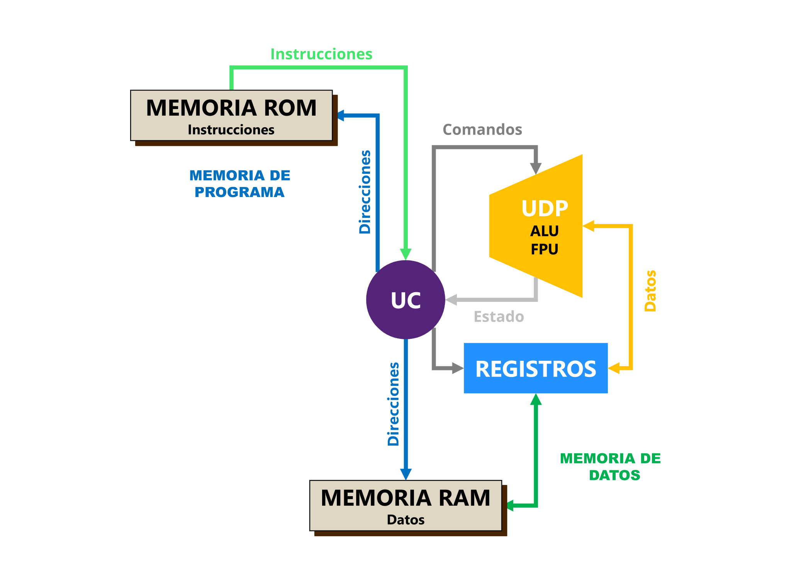
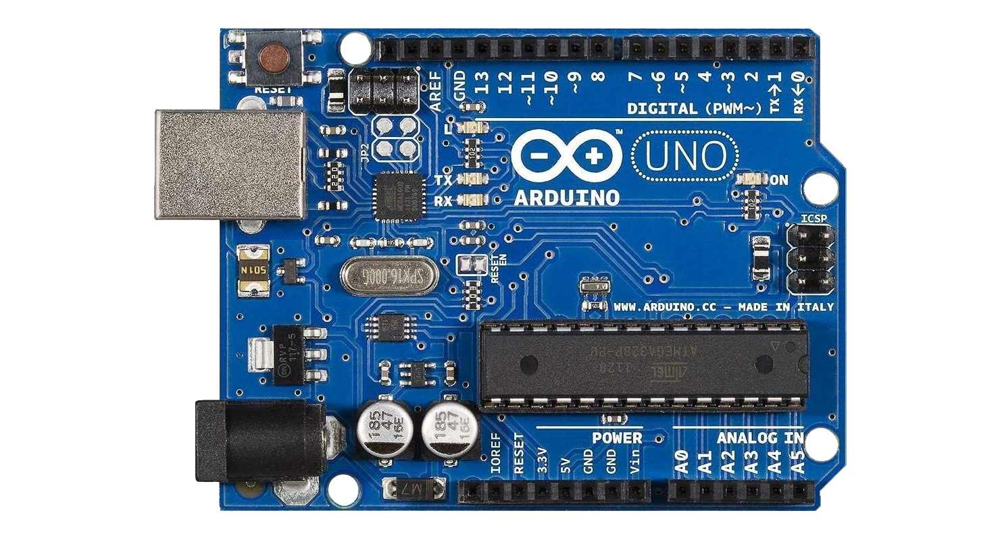
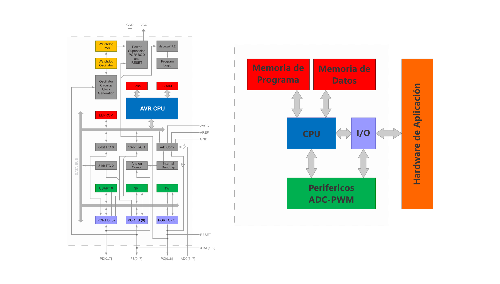
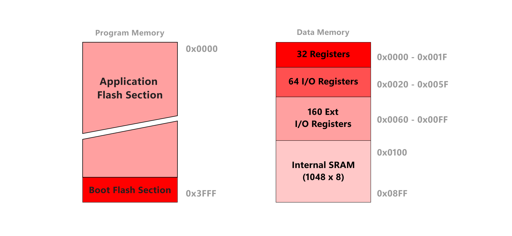
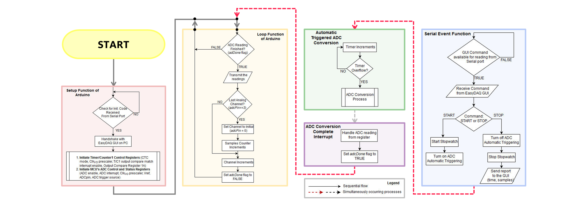
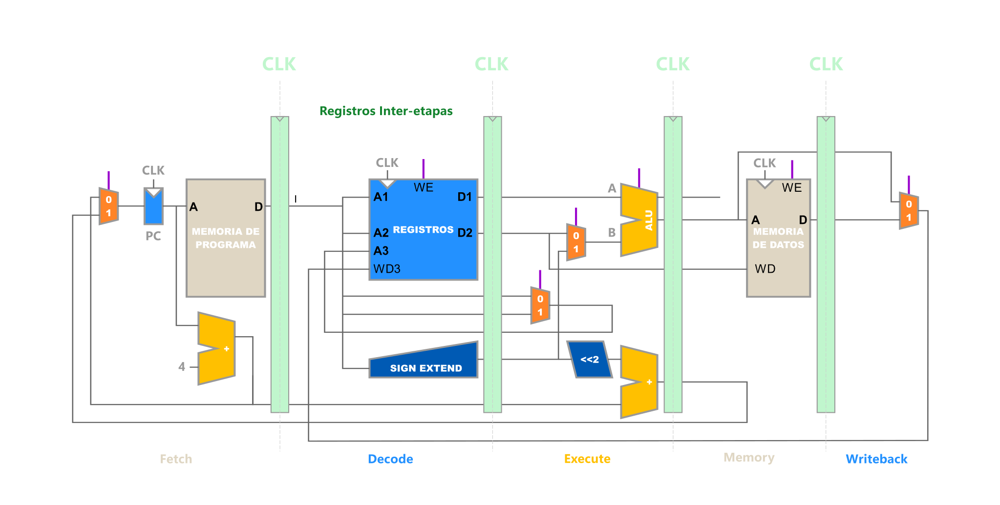

# Sistemas operacionales

<code>Fundamentos de sistemas operativos</code>

Creado por <code>Giancarlo Ortiz</code> para explicar los fundamentos de los <code>Sistemas operativos</code>

## Fundamentos
Los primeros sistemas de procesamiento digital, eran grandes y costosas máquinas operadas desde una consola maestra por los programadores, que carecían de todas las funciones que realiza un sistema operativo, desperdiciando en su funcionamiento un valioso recurso computacional.

## Agenda
1. [Arquitectura de computadores](#1-arquitectura-de-computadores).
1. [Arquitecturas preliminares](#2-arquitecturas-preliminares).
1. [Arquitecturas de micro-controlador](#3-arquitecturas-de-micro-controlador).

 

---
# 1. Arquitectura de computadores
Es un conjunto de reglas, métodos y componentes conceptuales que describen la funcionalidad, la organización y la implementación de los sistema de procesamiento digital.
 
* ><i>"Temo el día en que la tecnología sobrepase nuestra humanidad; el mundo solo tendrá una generación de idiotas."</i> 
<cite style="display:block; text-align: right">[Albert Einstein](https://es.wikipedia.org/wiki/Albert_Einstein)</cite>

# 2. Arquitecturas preliminares
* Antes de [1950][2_0].
* Diseño de [arquitecturas de hardware][2_1] con propósitos muy específicos.
* Interacción directa de los [programas][2_2] y el hardware.
* Procesamiento de instrucciones [secuencial][1_3].
* Típico de las [computadoras serie][2_4].
* Programación en [lenguaje maquina][2_5].
* Ejecución en [tiempo Real][2_6].

# 2.1. Primer ordenador programable
* [Z1][21_0] era un ordenador electromecánico.
* Diseñado en 1937 por [Konrad Zuse][21_1].
* Construido en 1938 por [Konrad Zuse][21_1].
* Primer ordenador programable de [lógica booleana][21_2].
* Permitía números de [punto flotante][21_3] binarios.
* 64 palabras de 22 bits como [memoria de programa][21_4].

# 2.2 Arquitectura Harvard

# 3. Arquitecturas de micro-controlador

<table>
	<tr >
	    <td rowspan="9">  </td>
	    <td colspan="2" style="text-align: center;">
            <a href="https://es.wikipedia.org/wiki/Arduino_Uno">
                <b>Arduino UNO</b>
            </a>
        </td>
	</tr>
    <tr >
	    <td>Procesador:</td>
	    <td><a href="https://es.wikipedia.org/wiki/Atmega328">ATmega328</a> </td>
	</tr>
    <tr >
	    <td>Velocidad:</td>
	    <td>16 Mhz</td>
	</tr>
    <tr >
	    <td>Memoria principal:</td>
	    <td>2 KB 
            <a href="https://es.wikipedia.org/wiki/SRAM">SRAM</a>
        </td>
	</tr>
    <tr >
	    <td>Memoria programa:</td>
	    <td>32 KB 
            <a href="https://es.wikipedia.org/wiki/Memoria_flash">Flash</a>
        </td>
	</tr>
    <tr >
	    <td>Voltaje:</td>
	    <td>5 V</td>
	</tr>
        <tr >
	    <td>Potencia:</td>
	    <td>100 mW</td>
	</tr>
    <tr >
	    <td>Comunicación:</td>
	    <td><small>
            <a href="https://es.wikipedia.org/wiki/Universal_Serial_Bus">USB</a> -
            <a href="https://es.wikipedia.org/wiki/Universal_Asynchronous_Receiver-Transmitter">UART</a>
            <a href="https://es.wikipedia.org/wiki/Serial_Peripheral_Interface">SPI</a> -
            <a href="https://es.wikipedia.org/wiki/I%C2%B2C">I²C</a></small>
        </td>
	</tr>
</table>

## 3.1 Arquitectura Arduino

## 3.2 Memoria

## 3.3 Diafragma de Flujo de operación

## 3.4 Ejecución de instrucciones

[2_0]:https://es.wikipedia.org/wiki/Categor%C3%ADa:Ordenadores_de_la_d%C3%A9cada_de_1940
[2_1]:https://es.wikipedia.org/wiki/Arquitectura_de_computadoras
[2_2]:https://es.wikipedia.org/wiki/Programa_inform%C3%A1tico
[2_3]:https://es.wikipedia.org/wiki/Estructuras_de_control#Ejecuci%C3%B3n_secuencial
[2_4]:https://en.wikipedia.org/wiki/Serial_computer
[2_5]:https://es.wikipedia.org/wiki/Lenguaje_de_m%C3%A1quina
[2_6]:https://es.wikipedia.org/wiki/Tiempo_real
[21_0]:https://es.wikipedia.org/wiki/Z1
[21_1]:https://es.wikipedia.org/wiki/Konrad_Zuse
[21_2]:https://es.wikipedia.org/wiki/%C3%81lgebra_de_Boole
[21_3]:https://es.wikipedia.org/wiki/Coma_flotante
[21_4]:https://es.wikipedia.org/wiki/Memoria_de_solo_lectura

---
## Mas Recursos
- [Arquitectura de computadoras](https://es.wikipedia.org/wiki/Arquitectura_de_computadoras) (Wikipedia)
- [Arquitectura Harvard](https://es.wikipedia.org/wiki/Arquitectura_Harvard) (Wikipedia)
- [Arquitectura de Von Newman](https://es.wikipedia.org/wiki/Arquitectura_de_Von_Neumann) (Wikipedia)
- [Bootloaders para Arduino](https://github.com/arduino/ArduinoCore-avr/tree/master/bootloaders) (Wikipedia)