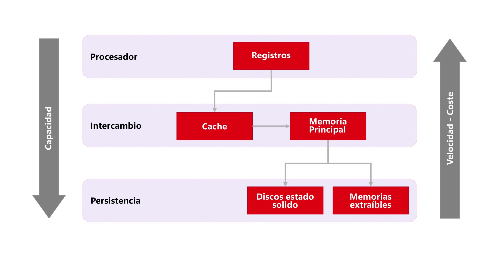
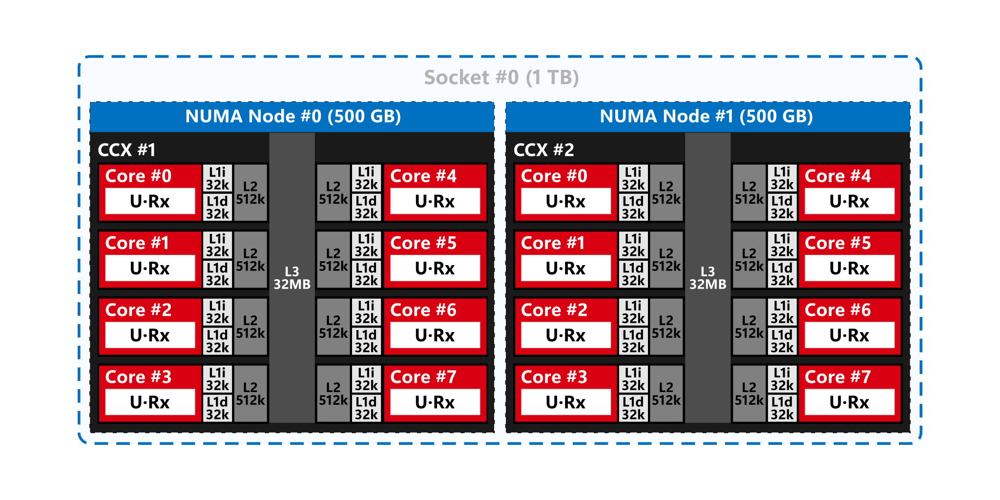
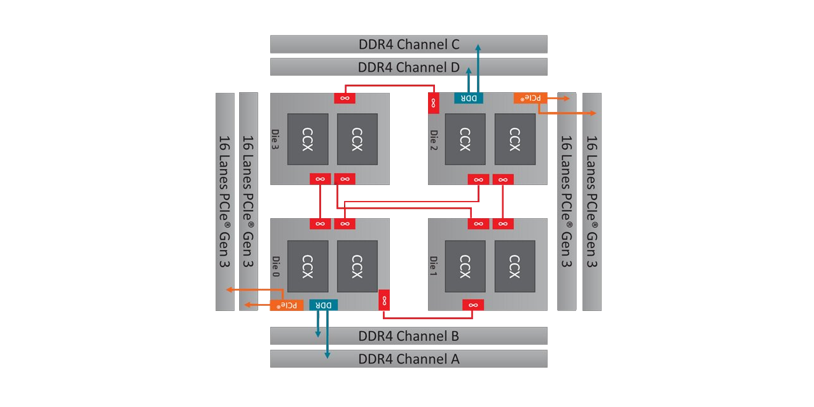
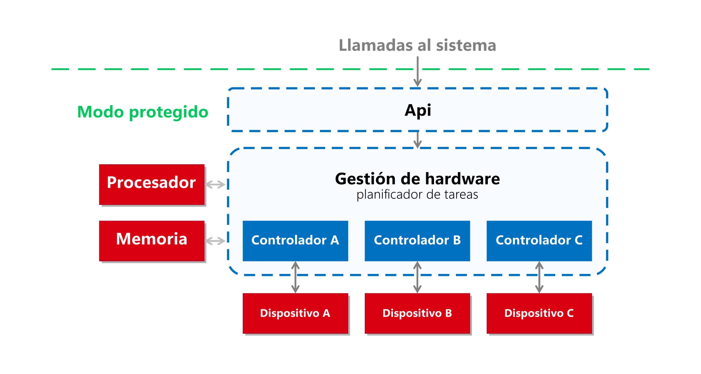
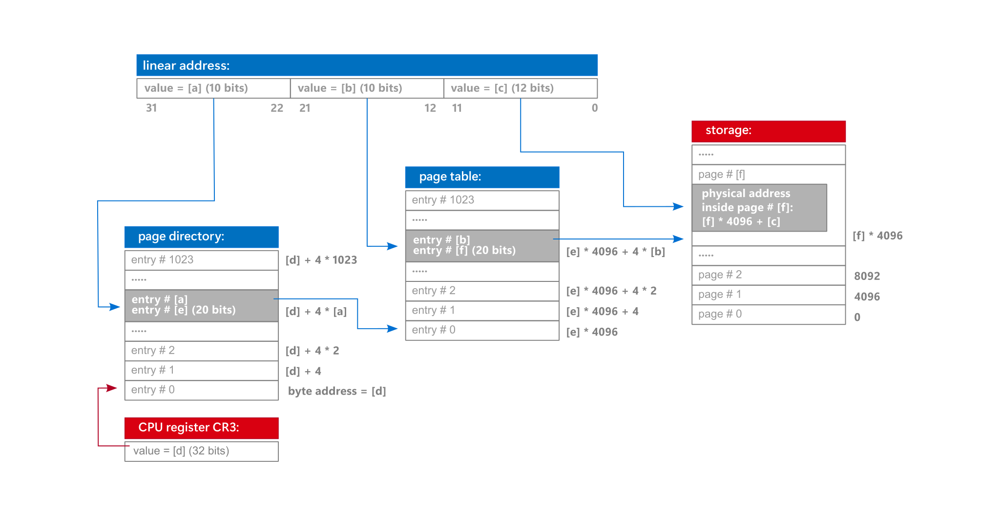

# Sistemas operacionales

<code>Fundamentos de sistemas operativos</code>

Creado por <code>Giancarlo Ortiz</code> para explicar los fundamentos de los <code>Sistemas operativos</code>

## Estructura
Un SO es complejo y solo puede entenderse dividiendo su operación en piezas funcionales mas pequeñas, definiendo cuidadosamente entradas, salidas de cada proceso.

## Agenda
1. [Multi-tarea](#1-multi-tarea).
1. [Jerarquía de Memoria](#2-jerarquía-de-memoria).
1. [Protección de memoria](#3-protección-de-memoria).

 

---
# 1. Multi-tarea
La [multi-tarea][1_0] es la característica de los SO que permite que varios procesos o aplicaciones se ejecuten aparentemente al mismo tiempo, compartiendo uno o más procesadores.

* ><i>"Al aumentar nuestra capacidad de obtener, procesar y distribuir información, la demanda de procesamiento de información cada vez más complejo crece incluso con más celeridad."</i> 
<cite style="display:block; text-align: right">[Andrew S. Tanenbaum](https://es.wikipedia.org/wiki/Andrew_S._Tanenbaum)</cite>

[1_0]:https://es.wikipedia.org/wiki/Multitarea

# 1.1. Requisitos mínimos
* Gestión del hardware.
* Permitir seleccionar entre tareas listas para ejecutar.
* Decidir que procesos pueden interrumpir la ejecución de tareas.
* Asignar memoria a las tareas que lo demandan.
* Permitir acceso a los dispositivos a aquellas tareas que lo requieren.

## 1.2. Gestión del hardware
* [Gestor de dispositivos (entrada/salida)][12_1].
* [Gestor de memoria][12_2].
* [Gestor de procesamiento][12_3]. 

[12_1]:https://es.wikipedia.org/wiki/Arquitectura_del_sistema_de_E/S
[12_2]:https://es.wikipedia.org/wiki/Gesti%C3%B3n_de_memoria
[12_3]:https://es.wikipedia.org/wiki/Proceso_(inform%C3%A1tica)#

## 1.3. Diagrama de estados

## 1.4. Componentes relacionados
* [__Scheduler:__][14_1] Planificador de tareas.
* [__Driver:__][14_2] Controladores de dispositivo.
* [__MMU:__][14_3] Unidad de gestión de memoria.
* [__PCB:__][14_4] Bloque de control del proceso.
* [__SMP:__][14_5] Multi-procesamiento simétrico.

[14_1]:https://es.wikipedia.org/wiki/Planificador
[14_2]:https://es.wikipedia.org/wiki/Controlador_de_dispositivo
[14_3]:https://es.wikipedia.org/wiki/Unidad_de_gesti%C3%B3n_de_memoria
[14_4]:https://es.wikipedia.org/wiki/Bloque_de_control_del_proceso
[14_5]:https://es.wikipedia.org/wiki/Multiprocesamiento_sim%C3%A9trico

## 1.5. Maquina Extendida

# 2. Jerarquía de memoria
La [jerarquía de memoria][2_0] es la organización piramidal de la memoria en niveles de acceso para optimizar el rendimiento y el costo basándose en el principio de cercanía de referencias.

* ><i>"Una buena ingeniería de software requiere la diferenciación entre la especificación y la implementación."</i> 
<cite style="display:block; text-align: right">[Andrew S. Tanenbaum](https://es.wikipedia.org/wiki/Andrew_S._Tanenbaum)</cite>

[2_0]:https://es.wikipedia.org/wiki/Jerarqu%C3%ADa_de_memoria

## 2.1. Capacidad vs Costo

## 2.2. Componentes relacionados
* [__Coherence:__][22_1] Coherencia de la memoria.
* [__Multi-channel:__][22_6] Arquitectura de memoria multi-canal.
* [__Cluster:__][22_5] Clúster de computadoras.
* [__NUMA:__][22_2] Acceso a memoria no uniforme.
* [__DSM:__][22_3] Memoria distribuida compartida.
* [__DBCC:__][22_4] Coherencia de caché basada en directorios.

[22_1]:https://en.wikipedia.org/wiki/Memory_coherence
[22_2]:https://es.wikipedia.org/wiki/NUMA
[22_3]:https://es.wikipedia.org/wiki/Distributed_Shared_Memory
[22_4]:https://es.wikipedia.org/wiki/Coherencia_de_cach%C3%A9
[22_5]:https://en.wikipedia.org/wiki/Computer_cluster
[22_6]:https://en.wikipedia.org/wiki/Multi-channel_memory_architecture

## 2.3. Caso de uso - Zen3 \[[Epyc 73F3][23_1]\]

[23_1]:https://en.wikipedia.org/wiki/Epyc

<small>White papers: 
1: [Kochhar, G.(2018). AMD EPYC: estudio de rendimiento en STREAM, HPL, InfiniBand y WRF, Dell Technologies](https://www.dell.com/support/kbdoc/es-co/000143393/amd-epyc-stream-hpl-infiniband-and-wrf-performance-study)
2: [Kennedy. P. (2019). Why AMD EPYC Rome 2P Will Have 128-160 PCIe Gen4 Lanes and a Bonus. ServeTheHome](https://www.servethehome.com/why-amd-epyc-rome-2p-will-have-128-160-pcie-gen4-lanes-and-a-bonus/)
3: [. Cutress, I. (2021). AMD 3rd Gen EPYC Milan Review: A Peak vs Per Core Performance Balance. Anandtech](https://www.anandtech.com/show/16529/amd-epyc-milan-review/4)
</small>

## 2.4. Caso de uso - Zen3 \[[Ryzen][24_1]\]

[24_1]:https://en.wikipedia.org/wiki/Ryzen

# 3. Protección de memoria
La [protección de memoria][3_0] es un método para controlar que las tareas que se ejecutan en multi-tarea no interfieran entre si evitando que un proceso acceda a la memoria que no le ha sido asignada.

* ><i>"Si necesitas más de tres niveles de indentación, estás totalmente jodido, y deberías organizar tu programa."</i> <cite style="display:block; text-align: right">
[Linus Torvalds](https://es.wikipedia.org/wiki/Linus_Torvalds)</cite>

[3_0]:https://es.wikipedia.org/wiki/Protecci%C3%B3n_de_memoria

## 3.1. Características
* Abreviado como P-Mode.
* Es un modo operacional de las CPUs modernas.
* Segmenta la memoria en paginas antes de asignarlas a un proceso.
* Oculta las direcciones físicas o reales en tablas de direcciones.
* Implementa un sistema de memoria virtual.
* Asigna un espacio de memoria a cada proceso.

## 3.2. Componentes relacionados
* [__Microprocessor modes:__][32_1] Modos de funcionamiento del procesador.
* [__Memory segmentation:__][32_2] Segmentación de memoria.
* [__Memory paging:__][32_3] Paginación de memoria.
* [__Pre-emptive multitasking:__][32_4] Multi-tarea preferente.

[32_1]:https://es.wikipedia.org/wiki/Modos_de_operaci%C3%B3n_de_la_unidad_central_de_procesamiento
[32_2]:https://es.wikipedia.org/wiki/Segmentaci%C3%B3n_de_memoria
[32_3]:https://es.wikipedia.org/wiki/Paginaci%C3%B3n_de_memoria
[32_4]:https://es.wikipedia.org/wiki/Multitarea_apropiativa

## 3.3. Llamadas al sistema

## 3.4. Paginación de memoria

---
## Mas Recursos
- [Multi-tarea](https://es.wikipedia.org/wiki/Multitarea) (Wikipedia)
- [Multi-tarea apropiativa](https://es.wikipedia.org/wiki/Multitarea_apropiativa) (Wikipedia)
- [Memoria virtual](https://es.wikipedia.org/wiki/Memoria_virtual) (Wikipedia)
- [Tabla de paginación](https://es.wikipedia.org/wiki/Tabla_de_paginaci%C3%B3n) (Wikipedia)
- [Paginación anidada](https://es.wikipedia.org/wiki/Paginaci%C3%B3n_anidada) (Wikipedia)